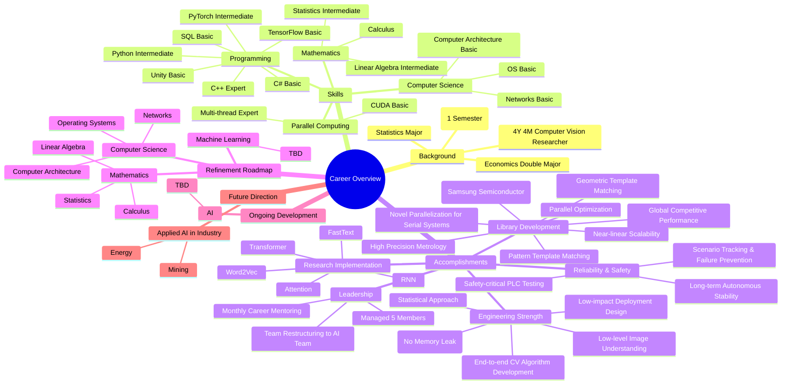

Brief History
MAJOR: Statistics
DOUBLE MAJOR: Economics
MASTER DEGREE: Artificial Intelligence (1 Semester)
4Y 4M CAREER: Computer Vision Researcher

Language: Korean / English(intermediate)
Computer Language: C++(Expert) / Python(intermediate) / Pytorch(intermediate) / Tensorflow(Basic) / SQL(Basic) / C#(Basic) / Unity(Basic)
Parrel Processing: Multi-Thread(Expert) / CUDA(Basic)
Computer Science: Computer Architecture(Basic), Networks(Basic), OS(Basic)
Mathematics: Linear Algebra(intermediate), Statistics(intermediate), Calculus

Accomplishment
1. Library Development
    - Achieved GLOBALLY competitive performance in a challenging and unsolved area of AI
        - Pattern Template Match: GLOBALLY Highest performance(accuracy & processing time) - compared with Halcon, Cognex
        - Geometric Template Match: GLOBALLY Highest performance(accuracy & processing time) - compared with Halcon, Cognex
        - Array Match - With High performance, Developed a previously unavailable, novel methodology to resolve a difficult process challenge in Samsung semiconductor manufacturing.
    - Achieved Highest precision systems.
        - Metorlogy Systems: For precision, advanced process in Point, Line, Circle, Rectangle, Quadrangle, Ellipse metrology systems.
    - Achieved High performance in PARRELEL
        - Most of Algorithm is applied with multi-thread systems
        - Delivered near-linear (100%) scalability with thread count
        , performed aggressive optimization from system-level to function-level
        - Pioneered new parallelization methods for traditionally serial architectures.
    - Statical Approach
        - All of data included image is considered of statical approach like probablity, pricinple of samples
    - C++ Expert
        - NEVER allowed any memory leak and problem in practice with robust coding design
        - Persuit interpretable coding without comment with easily readable code 
        - minimized cost
        - For fast respond when there are issue or additional demand, Design code with minimal-impact changes to ensure stable and seamless deployment
    - Low-level, in-depth expertise in computer vision and image analysis beyond basic usage
        - Owing to computer vision library developer, Bascially all of computer vision alogrithm is developed in end-to-end.
        - During developing matching and metrology systems, high understanding about images features with statistics.
        - My role is to develop high-performance computer vision algorithms for users who rely on CV-based solutions.
    - Safety Testing
        - My algorithm is usually applied in PLC and so on. So specialized in safety-focused testing for highly reliable PLC software designed for decades of autonomous operation.
        - Analyzes and monitors diverse scenarios to prevent failures during actual production processes.

2. Team Leader
    - Manage 5 team members.
    - More advanced career for team members, regularly consult once a month.
    - Report impact issue to my boss and rearrange team for team member. (in this case, Image Processing Team(ours) to AI Team)

3. Paper Inplement in University
    - Word2Vec
    - Fast-text
    - RNN
    - Attention
    - Transformer

Refinement Roadmap
CS
    - Computer Architecture
    - Networks
    - OS

Mathematics: 
    - Linear Algebra
    - Statistics
    - Calculus

ML
    - Thinking....

Ongoing Development Areas

AI
    - Thinking....

Future Roadmap
Research about Applied AI in industry(Mining, Energy)

