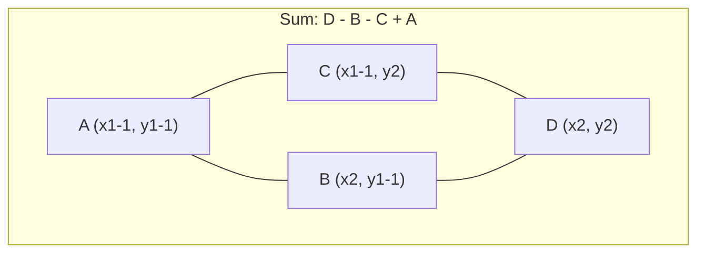

## What Is an Integral Image?

An **Integral Image**, also known as a **Summed Area Table**, is a data structure that allows **constant-time (O(1)) computation of pixel sums over any rectangular region** in an image.

## Table of Contents
- [What is an Integral Image?](#what-is-an-integral-image)
- [Why it matters in Computer Vision](#why-it-matters-in-computer-vision)
- [How the O(1) Rectangle Sum Works](#how-the-o1-rectangle-sum-works)
- [Where it’s used (practical CV)](#where-its-used-practical-cv)
- [C++ Implementation](#c-implementation)
- [Pitfalls & Best Practices](#pitfalls--best-practices)
- [Key Takeaways](#key-takeaways)

---

## What is an Integral Image?

An **integral image** (a.k.a. **summed area table**) stores cumulative sums so that each location `(x, y)` holds the sum of all pixels up-left of it. And An **Integral Image**, also known as a **Summed Area Table**, is a data structure that allows **constant-time (O(1)) computation of pixel sums over any rectangular region** in an image.

$$
S(x, y) = \sum_{x' \le x,\; y' \le y} I(x', y')
$$

### Intuition
Think of it as a 2D prefix sum table:
- 1D prefix sums make range sums fast  
- 2D prefix sums make **rectangle** sums fast

---

## Why it matters in Computer Vision

Many classic CV pipelines slide windows across an image and repeatedly compute local statistics.

### Complexity
- **Naive rectangle sum** over `W×H`: **O(W·H)**  
- **Integral image rectangle sum**: **O(1)**

> In CPU-bound systems, this is a massive win: fewer memory touches, fewer loops, and predictable latency.

---

## How the O(1) Rectangle Sum Works

Once you have the integral image, the sum of pixels inside a rectangle can be computed via corners:

$$
\text{Sum} = D - B - C + A
$$

Where:
- `A` = top-left exclusion corner  
- `B` = above-right exclusion  
- `C` = left-below exclusion  
- `D` = bottom-right corner  

### Diagram (Mermaid)



> This is branch-free math and great for optimisation (SIMD-friendly, cache-friendly).

---

## Where it’s used (practical CV)

### 1) Haar-like Features (Viola–Jones)
Integral images made it feasible to evaluate **thousands of rectangular features per window** quickly.

- face detection (classic)
- fast “feature scanning” detectors

### 2) Fast Local Statistics
Compute local mean/variance efficiently for:
- adaptive thresholding
- illumination normalisation
- local contrast features

### 3) Sliding Window & Multi-Scale Scans
When you scan many windows across multiple scales, O(1) region sums become a baseline building block.

### 4) Industrial / Embedded Vision (AU-friendly)
In industrial inspection and embedded deployments:
- GPU may be unavailable or undesirable
- latency determinism matters
- “simple + fast + explainable” often wins

Integral images fit well into **C++ vision libraries** and deterministic pipelines.

---

## C++ Implementation

### Build integral image (safe, simple)

```cpp
// img: uint8_t or uint16_t image
// integral: use 32-bit or 64-bit to avoid overflow
for (int y = 0; y < height; ++y) {
    long long rowSum = 0;
    for (int x = 0; x < width; ++x) {
        rowSum += img(y, x);
        integral(y, x) = rowSum + (y > 0 ? integral(y - 1, x) : 0);
    }
}
```

### O(1) rectangle sum

```cpp
auto at = [&](int y, int x) -> long long {
    if (x < 0 || y < 0) return 0;
    return integral(y, x);
};

// rectangle [x1..x2], [y1..y2] inclusive
long long sumRect(int x1, int y1, int x2, int y2) {
    return at(y2, x2) - at(y1 - 1, x2) - at(y2, x1 - 1) + at(y1 - 1, x1 - 1);
}
```

---

## Pitfalls & Best Practices

> **Overflow is the #1 bug** in integral images.

- **Use a wider type** for the integral table  
  - 8-bit input + big areas → easily exceeds 32-bit in large images  
- **Define rectangle boundaries clearly** (inclusive/exclusive)  
  - keep one convention and stick to it  
- **Padding can simplify boundary checks**  
  - store integral image with a 1-pixel zero border (`(H+1)×(W+1)`) to remove branches

### Optional: border-padded integral image
With a padded table, rectangle sum becomes pure 4-lookups without conditionals.

---

## Key Takeaways

- ✅ Integral images turn **rectangle sums into O(1)** operations  
- ✅ Great for **sliding window**, **fast local stats**, and **classical feature extraction**  
- ✅ Still practical in **industrial/embedded** CV pipelines (common constraints in AU deployments)  
- ✅ A clean example of “**algorithmic speed-up beats brute force**”

---

If you want, I can also provide:
- a **padded integral image** implementation (branch-free)
- an example of **local mean/variance map** using 2 integral images (sum and sum of squares)
- a short section comparing **integral image vs convolution / box filter**
