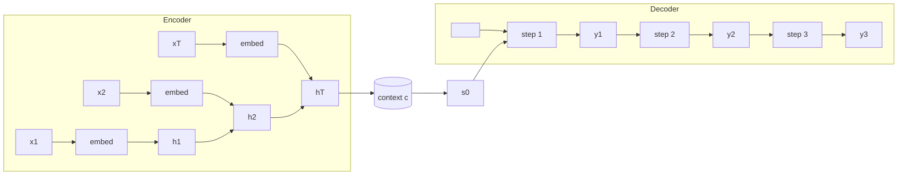

# 🚀 Seq2Seq (Encoder–Decoder) for Machine Translation  
> **Goal:** map a variable-length input sequence to a variable-length output sequence  
> **Key idea:** **encode** the input into a *context*, then **decode** tokens auto-regressively.

---

## 🧩 1) Why vanilla RNN many-to-many is not enough

A “synchronous” many-to-many RNN often assumes a rough **1:1** alignment:

- similar lengths:  $$T \approx T'$$  
- same step semantics:  $$x_t \leftrightarrow y_t$$  

But **machine translation** breaks these assumptions:

- ✅ input/output **lengths differ**
- ✅ words can appear in **different order**
- ✅ alignment is **non-monotonic** (a target word may depend on a far-away source word)

So we use an **Encoder–Decoder** model.

---

## 🏗️ 2) Encoder–Decoder overview

### 🧠 Encoder (many-to-one)
Reads source tokens and produces hidden states:

$$
x_1, x_2, \dots, x_T
\quad \longrightarrow \quad
h_1, h_2, \dots, h_T
$$

Then compresses everything into a single **context vector** (classic seq2seq):

$$
c = h_T
$$

### 🗣️ Decoder (one-to-many)
Generates target tokens one by one:

$$
y_1, y_2, \dots, y_{T'}
$$

and models the conditional probability

$$
P(y_{1:T'} \mid x_{1:T}).
$$

---

## 🧮 3) Encoder math (RNN form)

Let hidden size be \(d\). For a vanilla RNN:

$$
h_t = \phi\!\left(W_h h_{t-1} + W_x x_t + b\right),
\qquad
h_t \in \mathbb{R}^{d}.
$$

- \(x_t\): input embedding (or one-hot projected)
- \(W_h \in \mathbb{R}^{d\times d}\), \(W_x \in \mathbb{R}^{d\times d_x}\)
- \(\phi\): nonlinearity (e.g., \(\tanh\))

> ✅ In practice, **LSTM/GRU** are used to reduce vanishing-gradient issues, but the seq2seq *structure* remains the same.

---

## 🧠 4) Context vector (the bottleneck)

Classic seq2seq compresses the whole source sentence into one vector:

$$
c = h_T.
$$

This is a **fixed-size bottleneck**: as \(T\) grows, it becomes harder for \(c\) to retain all information.

> This bottleneck is exactly why **Attention** was introduced (later).

---

## 🔁 5) Decoder math (auto-regressive generation)

We add a special **start token** \(\langle SOS\rangle\) and optionally end token \(\langle EOS\rangle\).

### Decoder recurrence
Initialize decoder state from the encoder context:

$$
s_0 = g(c).
$$

Often, \(g\) is identity or a linear layer.  
Then for \(t \ge 1\):

$$
s_t = \phi\!\left(W_s s_{t-1} + W_y \, e(y_{t-1}) + b_s\right),
\qquad
s_t \in \mathbb{R}^{d}.
$$

- \(e(y_{t-1})\): embedding of previous output token
- \(W_s \in \mathbb{R}^{d\times d}\), \(W_y \in \mathbb{R}^{d\times d_e}\)

### Output logits and softmax
Compute logits:

$$
o_t = W_o s_t + b_o,
\qquad
o_t \in \mathbb{R}^{V},
$$

where \(V\) is target vocabulary size.

Softmax probability:

$$
P(y_t = k \mid y_{<t}, x) = 
\frac{\exp(o_{t,k})}{\sum_{j=1}^{V}\exp(o_{t,j})}.
$$

---

## 📦 6) Sequence probability factorization (core idea)

Seq2Seq is **auto-regressive**:

$$
P(y_{1:T'} \mid x_{1:T})
=
\prod_{t=1}^{T'} P(y_t \mid y_{<t}, x_{1:T}).
$$

Taking log:

$$
\log P(y_{1:T'} \mid x_{1:T})
=
\sum_{t=1}^{T'} \log P(y_t \mid y_{<t}, x_{1:T}).
$$

---

## 🎓 7) Training objective = Maximum Likelihood (Cross-Entropy)

For a dataset \(\{(x^{(n)}, y^{(n)})\}_{n=1}^N\), maximum likelihood:

$$
\theta^\star
=
\operatorname*{arg\,max}_{\theta}
\prod_{n=1}^{N} P\!\left(y^{(n)} \mid x^{(n)}; \theta\right).
$$

Equivalent to minimizing negative log-likelihood (NLL):

$$
\theta^\star
=
\operatorname*{arg\,min}_{\theta}
\left(
-\sum_{n=1}^{N} \log P\!\left(y^{(n)} \mid x^{(n)}; \theta\right)
\right).
$$

### Deriving per-token cross-entropy
Let the target at time \(t\) be one-hot \(y_t^{\text{true}}\in\{0,1\}^V\).  
Define predicted distribution \(p_t\in[0,1]^V\) where \((p_t)_k=P(y_t=k\mid \cdot)\).

Cross-entropy at step \(t\):

$$
\mathcal{L}_t
=
-\sum_{k=1}^{V} (y_{t,k}^{\text{true}})\, \log (p_{t,k}).
$$

Because \(y_t^{\text{true}}\) is one-hot, only the correct class \(k^\star\) has value 1:

$$
\mathcal{L}_t
=
-\log(p_{t,k^\star})
=
-\log P(y_t = k^\star \mid y_{<t}, x).
$$

Total loss for one sequence:

$$
\mathcal{L}
=
\sum_{t=1}^{T'} \mathcal{L}_t
=
-\sum_{t=1}^{T'} \log P(y_t^{\text{true}} \mid y_{<t}, x).
$$

---

## 🏃 8) Teacher forcing (training vs inference)

### ✅ Training (Teacher Forcing)
Use the **ground-truth** previous token as input:

$$
\text{input at step } t \;=\; y_{t-1}^{\text{true}}.
$$

Why it helps:
- stabilizes early training
- provides correct history so the model learns faster

### 🔮 Inference (Auto-regressive decoding)
Ground truth is unavailable, so use the model’s own prediction:

$$
\hat{y}_{t-1} = \operatorname*{arg\,max}_{k} \; P(y_{t-1}=k \mid y_{<t-1}, x),
\qquad
\text{input at step } t \;=\; \hat{y}_{t-1}.
$$

⚠️ **Exposure bias:** training sees true histories, inference sees predicted histories.

---

## 🧱 9) Visual structure (GitHub Mermaid)

---

## 🧰 10) Implementation notes (shape sanity)

Common PyTorch shapes (sequence-first):

- **Source**:  \((T, B)\) token ids  
- **Embedding**: \((T, B, E)\)  
- **Encoder hidden**: \((T, B, H)\) or final \((L, B, H)\) depending on API  
- **Decoder output logits** per step: \((B, V)\)  
- **All logits**: \((T', B, V)\)

> Tip 🧠: store the full encoder outputs \((T,B,H)\) if you plan to add **Attention** later.

---

## 🔥 11) The core limitation (why Attention appears next)

Classic seq2seq uses:

$$
c = h_T,
$$

a single vector for all source information.

For long sentences, this becomes the **information bottleneck** → leads to errors like:
- forgetting early content
- poor long-range alignment
- degraded translation quality

✅ Next step: **Attention** replaces the single \(c\) with a *dynamic* context per decoding step.

---

# ✅ Final Summary

- Seq2Seq models \(P(y\mid x)\) with an **encoder** + **auto-regressive decoder**  
- Training uses **teacher forcing** + **cross-entropy (NLL)**  
- Classic seq2seq has a **single-vector bottleneck** \(c=h_T\)  
- This motivates **Attention** (your next slides)

---
