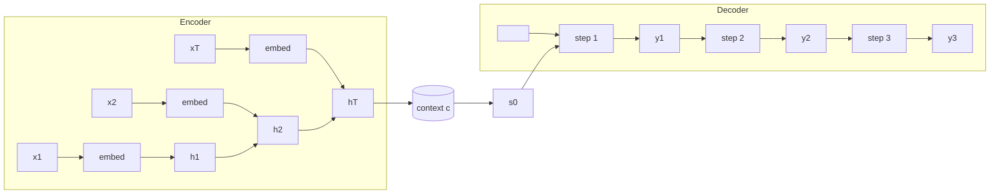

---
# <b>Seq2Seq</b>
---
### <b>Prerequisites</b>
    1. Recurrent Neural Network
<b>Recurrent Neural Network</b> have a problem that have rough 1:1 aligment. But machine translation breaks these assumptions. input/output lengths differ, different order, a target word may depend on a far-away source word.

---
## <b>What is Seq2Seq</b>

### 1. What is Seq2Seq?
- A <b>Model that use RNN model but additional method about we use Encoder–Decoder model</b>.
    
- <b>Structure</b>

    $$
    Input \rightarrow  ENCODER \rightarrow  DECODER \rightarrow  Softmax \rightarrow  Output
    $$

- Can be free of depency fixed length
- Encoder and Decoder is similar structure of RNN

### 2. Why use Seq2Seq?
     1. Encoder
     2. Decoder
     3. Auto-Regression Generation
     4. Teacher Forcing

### 🧠 Encoder (many-to-one)
Reads source tokens and produces hidden states:

$$
x_1, x_2, \dots, x_T
\quad \longrightarrow \quad
h_1, h_2, \dots, h_T
$$

Then compresses everything into a single **context vector** (classic seq2seq):

$$
c = h_T
$$

### 🗣️ Decoder (one-to-many)
Generates target tokens one by one:

$$
y_1, y_2, \dots, y_{T'}
$$

and models the conditional probability

$$
P(y_{1:T'} \mid x_{1:T}).
$$

Decoder use Auto-Regression Generation that is using previous output for the next input

Teacher Forcing
- stabilizes early training
- provides correct history so the model learns faster

At training, we use the ground truth as input, because the model needs to learn what to output from the correct inputs

At inference, we do not have access to the ground truth, so we actually feed the previous output, auto-regressively.

Cross-entropy at step \(t\):

$$
\mathcal{L}_t
=
-\sum_{k=1}^{V} (y_{t,k}^{\text{true}})\, \log (p_{t,k}).
$$

Because $y_t^{\text{true}}$ is one-hot, only the correct class $k^\star$ has value 1:

$$
\mathcal{L}_t
=
-\log(p_{t,k^\star})
=
-\log P(y_t = k^\star \mid y_{<t}, x).
$$

Total loss for one sequence:

$$
\mathcal{L}
=
\sum_{t=1}^{T'} \mathcal{L}_t
=
-\sum_{t=1}^{T'} \log P(y_t^{\text{true}} \mid y_{<t}, x).
$$

### 3. How use Seq2Seq?
    1. Encoder
    2. Decoder

- Encoder Goal is making Context vector (the bottleneck)

    - Classic seq2seq compresses the whole source sentence into one vector: $c = h_T$

    - This is a **fixed-size bottleneck**: as \(T\) grows, it becomes harder for \(c\) to retain all information.
- Decoder Goal is making the result with Encoder context vector

### 4. What is PROBLEM of Seq2Seq?
    Bottleneck

No matter how long the sentence, all of information is collected on just one context vector. 