# <b>AWS SageMaker</b>

---

### <b>Prerequisites</b>

---

## <b>1. What is `AWS SageMaker`</b>

AWS SageMaker is a **fully managed machine learning (ML) platform** that allows you to:

- build models  
- train models  
- deploy models  

all in one place, without managing infrastructure

## <b>2. Why `AWS SageMaker` exists</b>

In real-world ML, the problem is not just "making a model".

The real challenges are:

- setting up servers (CPU / GPU)
- scaling training
- deploying models as APIs
- managing versions
- handling traffic

SageMaker solves these problems.

> SageMaker = "ML + Infrastructure Automation"

Instead of this:

    Write model → Setup server → Install dependencies → Train → Deploy API → Maintain server

You do this:

    Write model → SageMaker handles everything else

## <b>3. What You Actually Use It For</b>

#### <b>3-1. Model Training</b>

You can train models using:

- your own code (PyTorch, TensorFlow)
- built-in algorithms
- pre-trained models

without setting up GPU machines manually

#### <b>3-2. Model Deployment</b>

SageMaker can turn your model into:

- a REST API
- real-time prediction service

no need to build backend servers

#### <b>3-3. Scalable Infrastructure</b>

- automatically uses powerful instances
- can scale up/down depending on workload

useful for large datasets or production traffic

#### <b>3-4. Experiment Management</b>

- track training jobs
- manage different model versions

helps when experimenting with multiple models

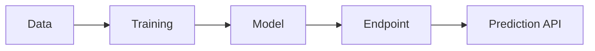

## <b>4. When You Should Use It</b>

#### <b>4-1. Good Use Cases</b>

- production ML service
- large-scale training
- cloud-based deployment
- team collaboration

#### <b>4-2. Not Necessary When</b>

- simple experiments
- learning ML basics
- small datasets

## <b>5. How to create</b>

#### <b>5-1. Set Network</b>

SageMaker is usually used on private subnect that can approach resource from air-gapped network for security. So we should build VPC, Subnet, NAT, IGW for the private network.

If it is not set, some aws servies like s3 can be approached

```
[SageMaker Studio]
        ↓
[Private Subnet]
        ↓
(NAT Gateway)
        ↓
Internet
```

#### How to build network in AWS 

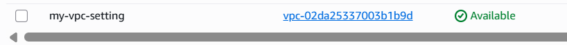
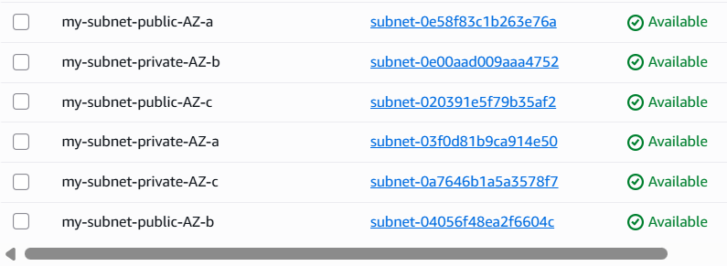

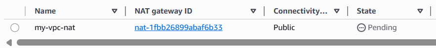
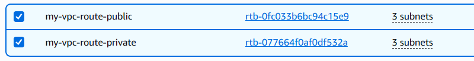

----------------------------

- How to build VPC    :  [VPC](2026-04-08-[AWS-04]VPC.md)
- How to build Subnet :  [Subnet](2026-04-08-[AWS-05]Subnet.md)
- How to build IGW    :  [Internet Gateway](<2026-04-08-[AWS-06]Internet Gateway.md>)
- How to build Route  :  [Route Table](<2026-04-08-[AWS-07]Route Table.md>)
- How to build NAT    :  [NAT Gateway](<2026-04-08-[AWS-08]NAT Gateway.md>)

----------------------------

#### <b>5-2. Search SageMaker</b>

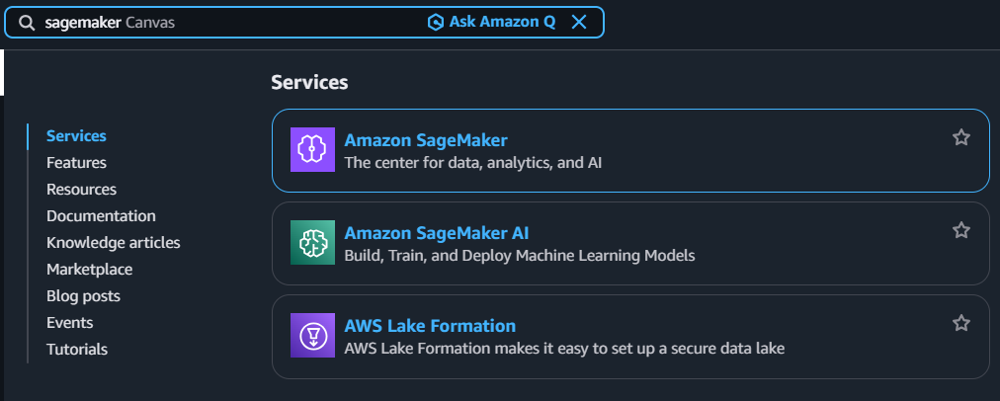

#### <b>5-3. Click Navigation pane → "Domains"</b>

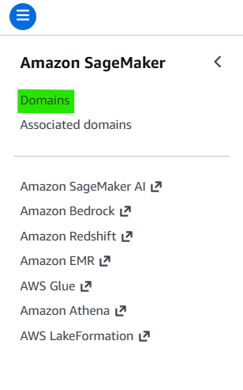

#### <b>5-4. Click Button → "Create Domain"</b>

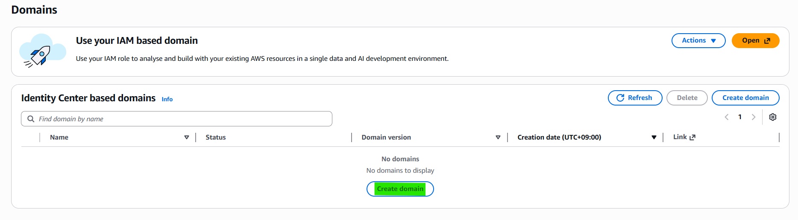

#### <b>5-5. Create an Amazon SageMaker Unified Studio domain</b>

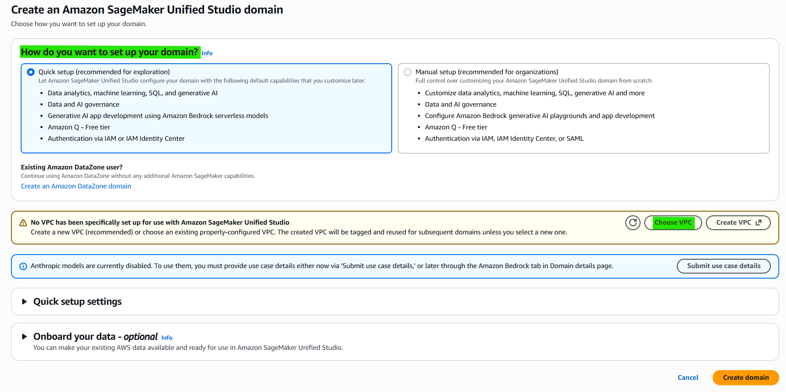
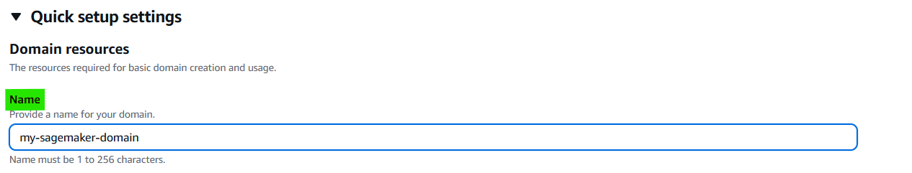
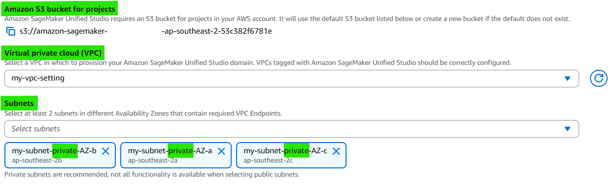

#### <b>5-6. Enter Domain management</b>

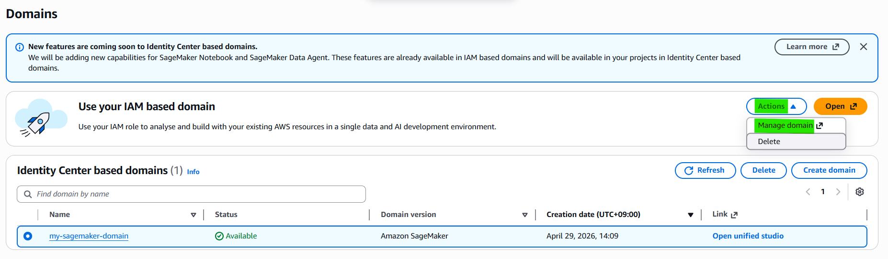

#### <b>5-7. Create Project on Domain</b>

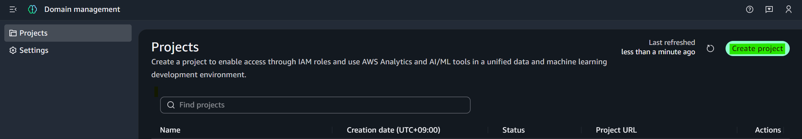
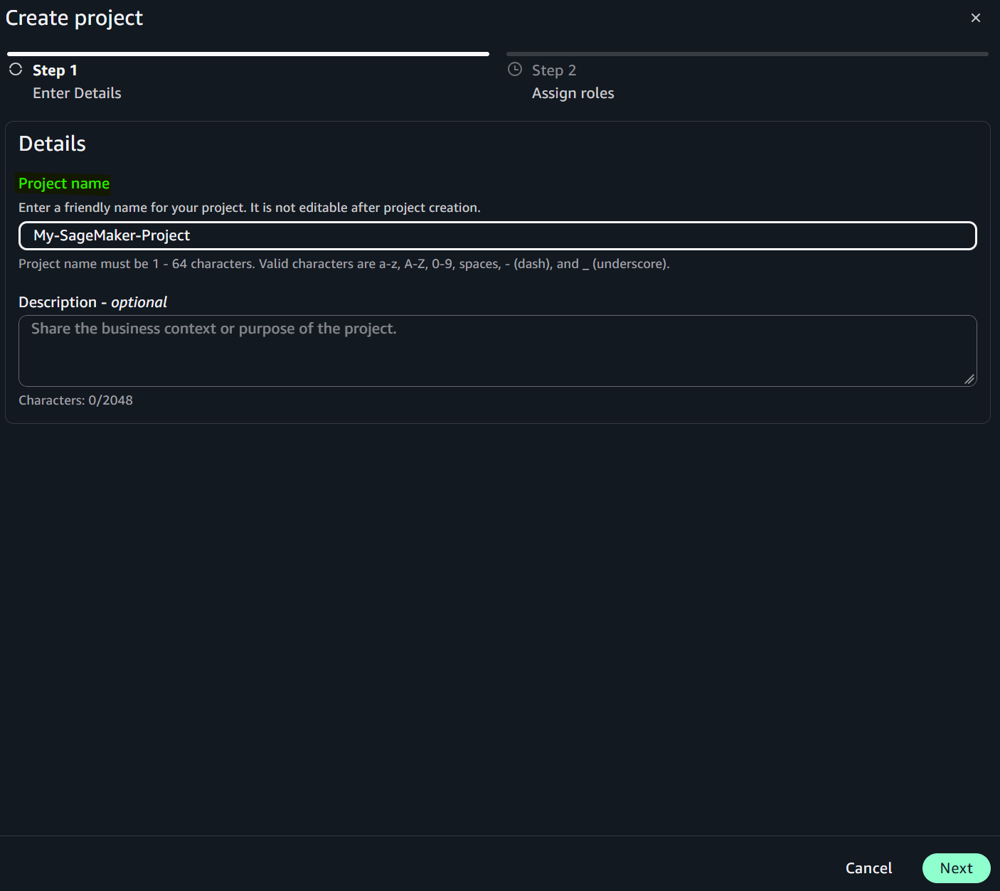
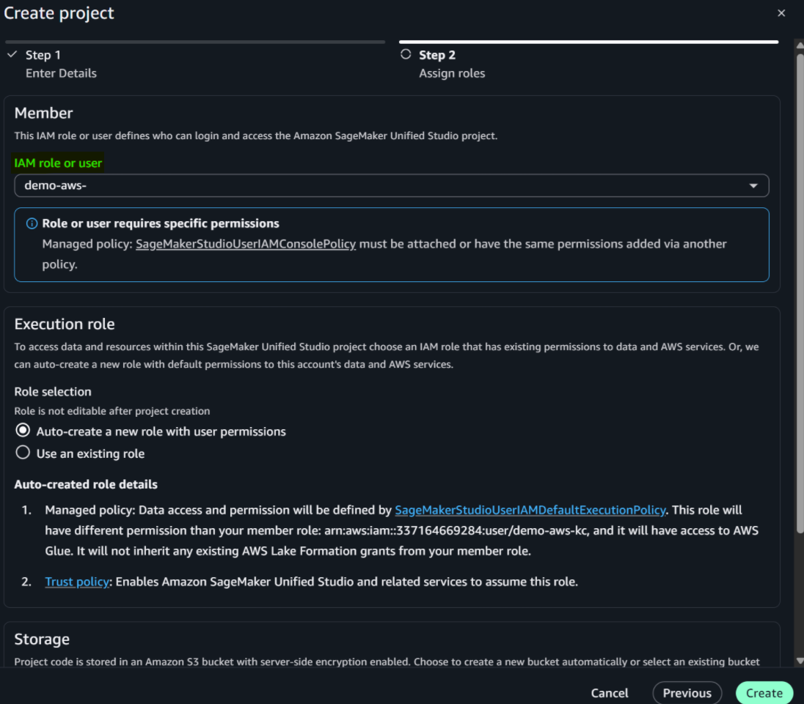

#### <b>5-8. Connect Project</b>

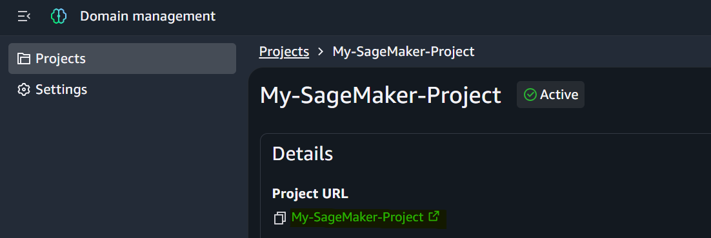
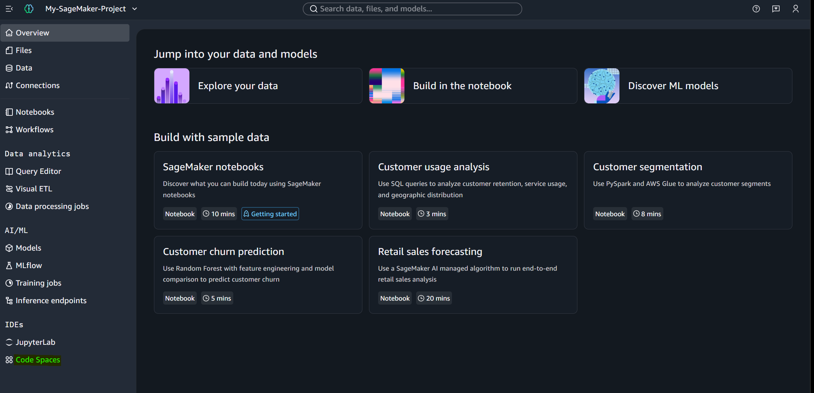

#### <b>5-9. Create Editor VS Code</b>

If you want to create VS Code Editor, you should use instance over 8GB RAM without `t` instance type.

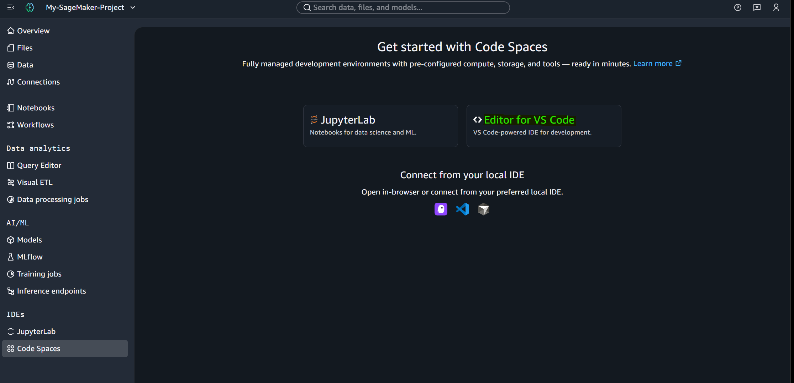
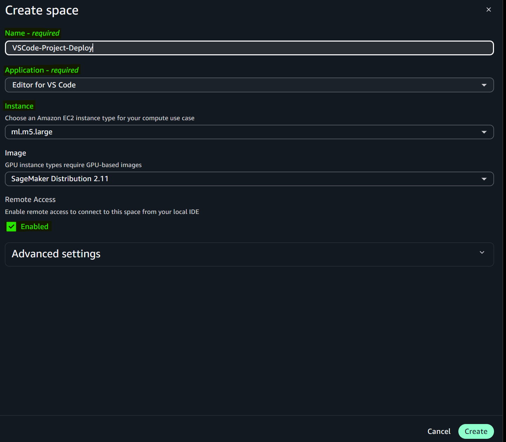
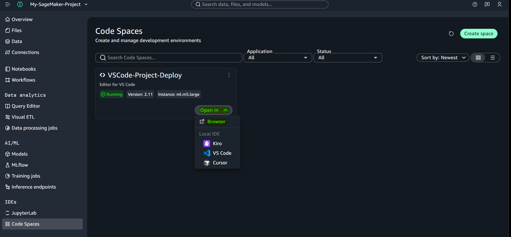

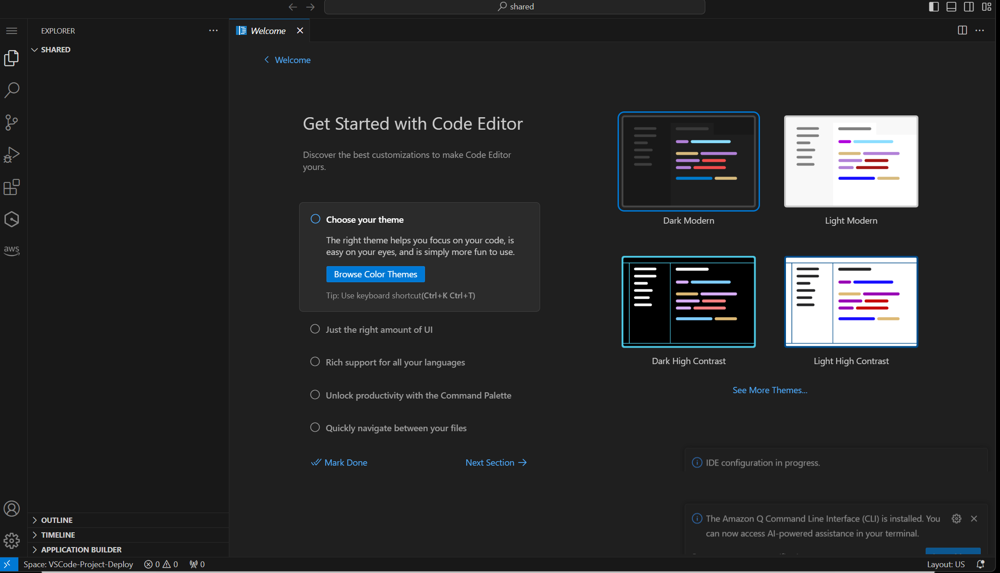
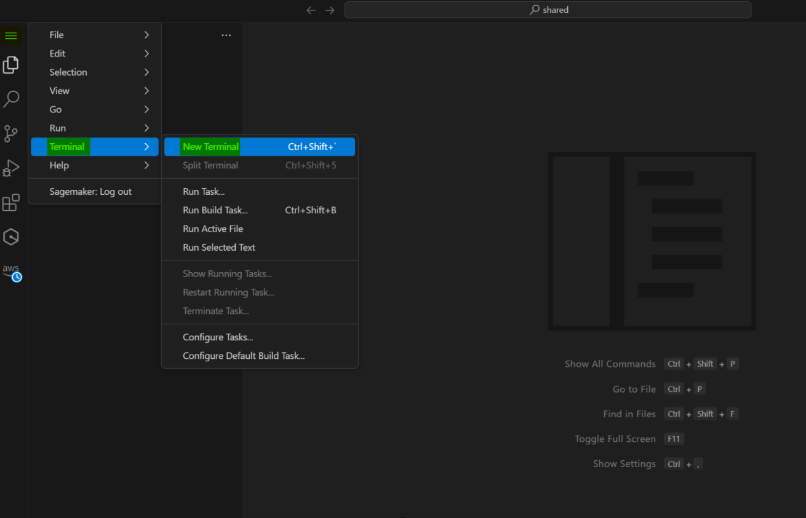
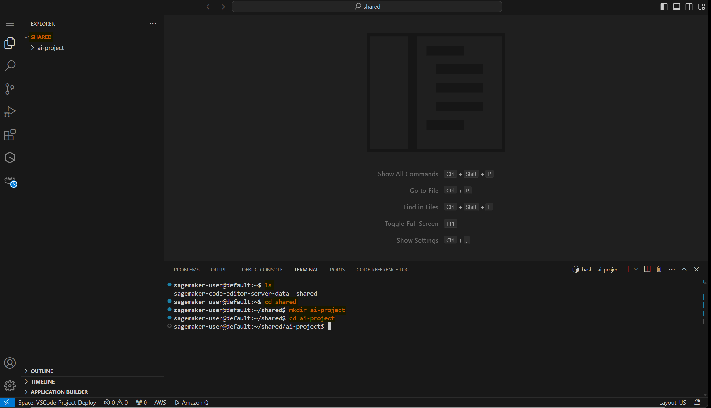
