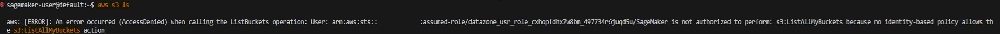
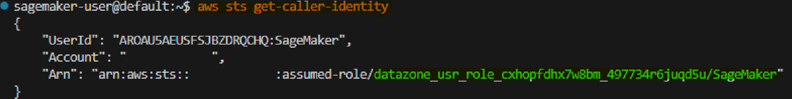
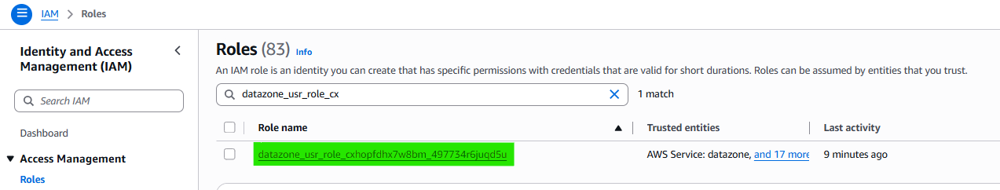
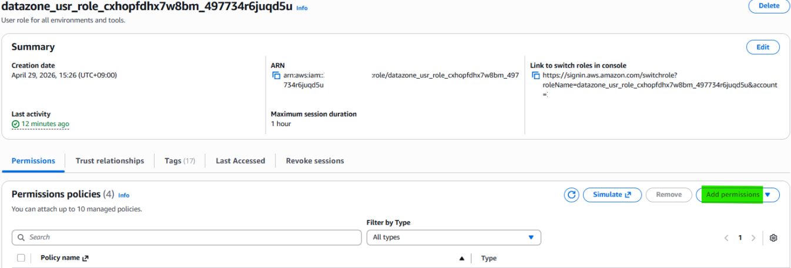
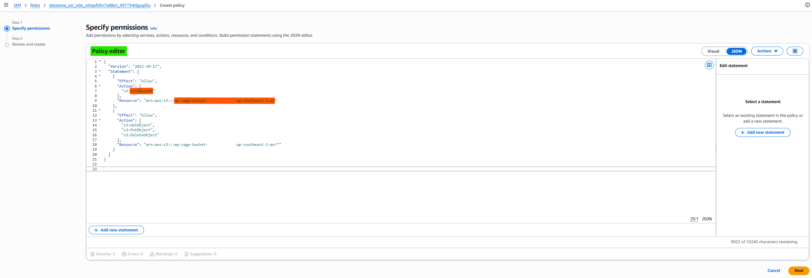
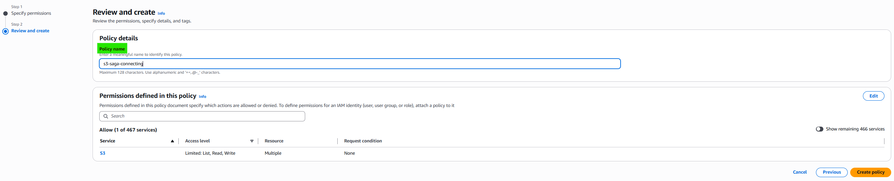
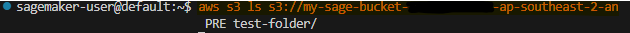

# <b>SageMaker VSCode Connecting S3</b>

---

### <b>Prerequisites</b>

---

## <b>1. Why we should set connecting S3</b>

If SageMake should create network with S3, because it is located in private subnet. That's why we're building the network, vpc, subnet, igw, nat network.



If we want to allow to authorize approaching S3, we should create Roles for it.

- STS timeout = Network issue
- S3 AccessDenied = IAM authorization issue

#### <b>1-1. Check role in SageMaker Project</b>

```bash
aws sts get-caller-identity
```



#### <b>1-2. Create S3</b>

How to create S3: https://kcnote.github.io/posts/AWS-18-S3/

In this case, I'll use name "my-sage-bucket-xxxxxxxx-ap-southeast-2-an"

And I make test-folder for test.

#### <b>1-3. Add policy on role</b>






#### <b>1-4. Check whether it is allowed to approach s3 or not</b>

