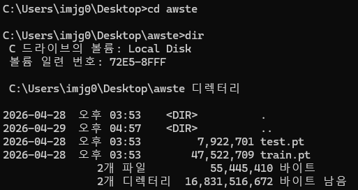
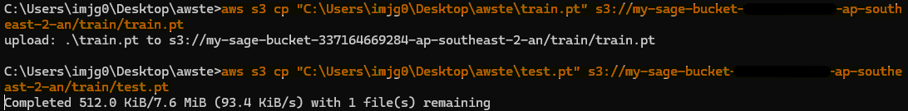
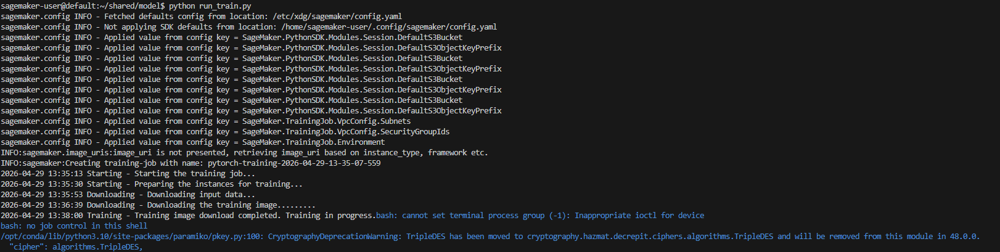
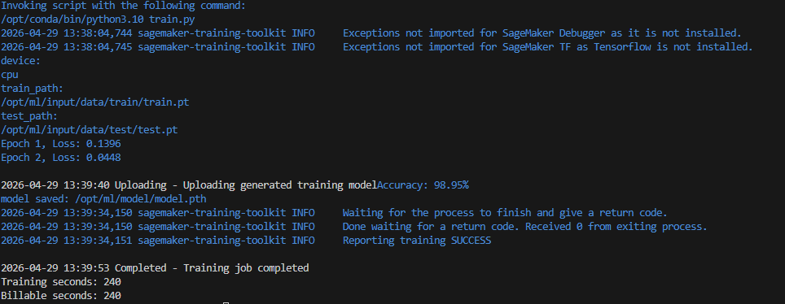
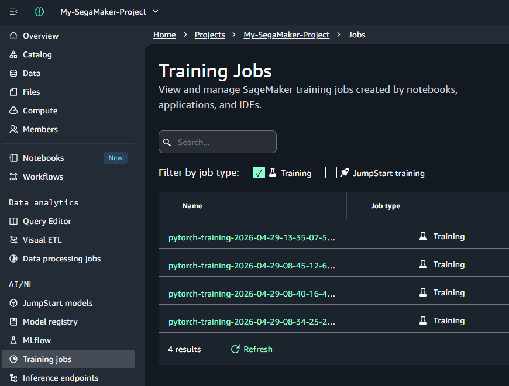
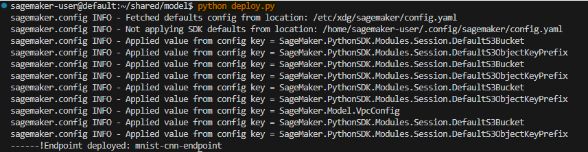
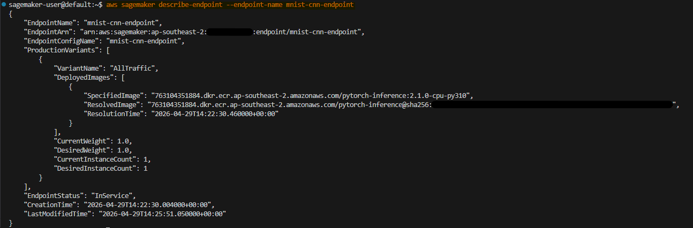

# <b>Deploy AI Model from the scratch</b>

---

### <b>Prerequisites</b>

---

## <b>1. Process from train to deploy</b>

- Preapring Data
  - MNIST
- Update Data to S3
- Model
- Train & Deploy
- Simple test

#### Check List

1. SegaMaker Project is located in private subnet
2. The Role of SegaMaker should be authorized to S3 access right

## <b>1. DATA</b>

#### <b>1-1. Preparing Data (MNIST)</b>

 - Bring data from Website or python code



```python
import os
import torch
from torchvision import datasets, transforms

os.makedirs("mnist_pt", exist_ok=True)

transform = transforms.Compose([
    transforms.ToTensor(),
    transforms.Normalize((0.1307,), (0.3081,))
])

train_dataset = datasets.MNIST(
    root="./data",
    train=True,
    download=True,
    transform=transform
)

test_dataset = datasets.MNIST(
    root="./data",
    train=False,
    download=True,
    transform=transform
)

torch.save(train_dataset, "mnist_pt/train.pt")
torch.save(test_dataset, "mnist_pt/test.pt")

print("saved mnist_pt/train.pt")
print("saved mnist_pt/test.pt")
```

#### <b>1-2. Copy data from local to S3</b>



```bash
aws s3 cp "C:\Users\imjg0\Desktop\awste\train.pt" s3://my-sage-bucket-xxxxxxx-ap-southeast-2-an/train/train.pt

aws s3 cp "C:\Users\imjg0\Desktop\awste\test.pt" s3://my-sage-bucket-xxxxxxx-ap-southeast-2-an/test/test.pt
```

## <b>2. Create Model(In this post, model itself is not important)</b>

> model.py

```python
import torch.nn as nn
import torch.nn.functional as F


class CNN(nn.Module):
    def __init__(self):
        super().__init__()

        self.conv1 = nn.Conv2d(1, 32, kernel_size=3)
        self.conv2 = nn.Conv2d(32, 64, kernel_size=3)
        self.pool = nn.MaxPool2d(2, 2)

        self.fc1 = nn.Linear(64 * 5 * 5, 128)
        self.fc2 = nn.Linear(128, 10)

    def forward(self, x):
        x = self.pool(F.relu(self.conv1(x)))
        x = self.pool(F.relu(self.conv2(x)))

        x = x.view(x.size(0), -1)

        x = F.relu(self.fc1(x))
        x = self.fc2(x)

        return x
```

## <b>3. Train </b>

> train.py

```python
import os
import argparse
import torch
import torch.nn as nn
import torch.optim as optim

from torch.utils.data import DataLoader
from model import CNN


def parse_args():
    parser = argparse.ArgumentParser()

    parser.add_argument("--epochs", type=int, default=2)        # Set parameter
    parser.add_argument("--batch-size", type=int, default=64)   # Set parameter
    parser.add_argument("--lr", type=float, default=0.001)      # Set parameter

    parser.add_argument(
        "--train-dir",
        type=str,
        default=os.environ.get("SM_CHANNEL_TRAIN")
    )   # Set parameter, SM_CHANNEL_TRAIN = /opt/ml/input/data/train

    parser.add_argument(
        "--test-dir",
        type=str,
        default=os.environ.get("SM_CHANNEL_TEST")
    )   # Set parameter, SM_CHANNEL_TEST = /opt/ml/input/data/test

    parser.add_argument(
        "--model-dir",
        type=str,
        default=os.environ.get("SM_MODEL_DIR")
    )   # Set parameter, SM_MODEL_DIR = /opt/ml/model

    return parser.parse_args()


def main():
    # Set Unit
    device = torch.device("cuda" if torch.cuda.is_available() else "cpu")
    print("device:", device)

    # Set Data Set
    args = parse_args()
    train_path = os.path.join(args.train_dir, "train.pt")
    test_path = os.path.join(args.test_dir, "test.pt")
    print("train_path:", train_path)
    print("test_path:", test_path)

    train_dataset = torch.load(train_path)
    test_dataset = torch.load(test_path)
    train_loader = DataLoader(train_dataset, batch_size=args.batch_size, shuffle=True)
    test_loader = DataLoader(test_dataset, batch_size=1000, shuffle=False)

    # Set Model
    model = CNN().to(device)
    criterion = nn.CrossEntropyLoss()
    optimizer = optim.Adam(model.parameters(), lr=args.lr)

    # Model Train
    for epoch in range(args.epochs):
        model.train()
        total_loss = 0

        for images, labels in train_loader:
            images = images.to(device)
            labels = labels.to(device)

            optimizer.zero_grad()
            outputs = model(images)
            loss = criterion(outputs, labels)

            loss.backward()
            optimizer.step()

            total_loss += loss.item()

        print(f"Epoch {epoch+1}, Loss: {total_loss/len(train_loader):.4f}")

    # Model Evalucation
    model.eval()
    correct = 0
    total = 0

    with torch.no_grad():
        for images, labels in test_loader:
            images = images.to(device)
            labels = labels.to(device)

            outputs = model(images)
            _, predicted = torch.max(outputs, 1)

            total += labels.size(0)
            correct += (predicted == labels).sum().item()

    print(f"Accuracy: {100 * correct / total:.2f}%")

    # Model Save
    model_path = os.path.join(args.model_dir, "model.pth")
    torch.save(model.state_dict(), model_path)
    print("model saved:", model_path)


if __name__ == "__main__":
    main()
```

> run_train.py 

With real train python files, it'll be running on SegaMaker.

```python
import sagemaker
from sagemaker.pytorch import PyTorch

region = "ap-southeast-2"
bucket = "my-sage-bucket-337164669284-ap-southeast-2-an"

session = sagemaker.Session()           # create Sagemaker
role = sagemaker.get_execution_role()   # bring IAM roles

estimator = PyTorch(
    entry_point="train.py",
    source_dir=".",
    role=role,
    framework_version="2.1.0",
    py_version="py310",
    instance_count=1,
    instance_type="ml.m5.large",
    output_path=f"s3://{bucket}/mnist/output",
)

estimator.fit({
    "train": f"s3://{bucket}/train/",
    "test": f"s3://{bucket}/test/"
})
```

```bash
python run_train.py
```





## <b>4. Deploy </b>

> inference.py

```python
import json
import torch
import numpy as np

from model import CNN

# set model
def model_fn(model_dir):
    model = CNN()
    model_path = f"{model_dir}/model.pth"

    model.load_state_dict(torch.load(model_path, map_location="cpu"))
    model.eval()

    return model

# set input
def input_fn(request_body, content_type):
    if content_type == "application/json":
        data = json.loads(request_body)
        array = np.array(data["inputs"], dtype=np.float32)
        return torch.tensor(array)

    raise ValueError(f"Unsupported content type: {content_type}")

# set predict
def predict_fn(input_data, model):
    with torch.no_grad():
        outputs = model(input_data)
        probabilities = torch.softmax(outputs, dim=1)
        prediction = torch.argmax(probabilities, dim=1)

    return {
        "prediction": prediction.numpy().tolist(),
        "probabilities": probabilities.numpy().tolist()
    }


# set output json
def output_fn(prediction, accept):
    return json.dumps(prediction), "application/json"
```

We should keep the name of function. When `PyTorchModel` will check `SageMaker PyTorch inference container`.

```python
if hasattr(user_module, "model_fn"):
    call model_fn()

if hasattr(user_module, "input_fn"):
    call input_fn()

if hasattr(user_module, "predict_fn"):
    call predict_fn()

if hasattr(user_module, "output_fn"):
    call output_fn()
```

It is for sageMaker environment.

> deploy.py

```python
import boto3
import sagemaker

from sagemaker.pytorch import PyTorchModel

REGION = "ap-southeast-2"
ENDPOINT_NAME = "mnist-cnn-endpoint"
MODEL_DATA = "s3://{Bucket-Name}/mnist/output/pytorch-training-2026-04-29-13-35-07-559/output/model.tar.gz"

session = sagemaker.Session(boto_session=boto3.Session(region_name=REGION))
role = sagemaker.get_execution_role()

model = PyTorchModel(
    model_data=MODEL_DATA,
    role=role,
    entry_point="inference.py",
    source_dir=".",
    framework_version="2.1.0",
    py_version="py310"
)

predictor = model.deploy(
    initial_instance_count=1,
    instance_type="ml.m5.large",
    endpoint_name=ENDPOINT_NAME
)

print("Endpoint deployed:", ENDPOINT_NAME)
```

```bash
python deploy.py
```

##### Add Policy: AddTag on The project Role

```json
{
	"Version": "2012-10-17",
	"Statement": [
		{
		  "Effect": "Allow",
		  "Action": [
		    "sagemaker:CreateModel",
		    "sagemaker:CreateEndpointConfig",
		    "sagemaker:CreateEndpoint",
		    "sagemaker:AddTags",
		    "sagemaker:DescribeEndpoint",
		    "sagemaker:ListEndpoints",
		    "sagemaker:UpdateEndpoint",
		    "sagemaker:DeleteEndpoint",
		    "sagemaker:DescribeEndpointConfig",
		    "sagemaker:DeleteEndpointConfig",
		    "sagemaker:DescribeModel",
		    "sagemaker:DeleteModel"
		  ],
		  "Resource": "*"
		}
	]
}
```



Check status of endpoint

```bash
aws sagemaker describe-endpoint --endpoint-name mnist-cnn-endpoint
```



If the name of endpoint exist, check this and delete it.

```bash
aws sagemaker describe-endpoint-config --endpoint-config-name mnist-cnn-endpoint
```

```bash
aws sagemaker delete-endpoint-config --endpoint-config-name mnist-cnn-endpoint
```

## <b>5. Simple test </b>

> test_endpoint.py

```python
import json
import boto3
import torch

REGION = "ap-southeast-2"
ENDPOINT_NAME = "mnist-cnn-endpoint"

# dummy MNIST shape: [batch, channel, height, width]
image = torch.randn(1, 1, 28, 28)

payload = {
    "inputs": image.numpy().tolist()
}

runtime = boto3.client("sagemaker-runtime", region_name=REGION)

response = runtime.invoke_endpoint(
    EndpointName=ENDPOINT_NAME,
    ContentType="application/json",
    Accept="application/json",
    Body=json.dumps(payload)
)

result = json.loads(response["Body"].read().decode("utf-8"))

print(result)
```

```bash
python test_endpoint.py
```

The payload will be in `request_body` on `input_fn` parameter.

```python
def input_fn(request_body, content_type):

->
data = json.loads(request_body)
array = np.array(data["inputs"])
```

and then call the `predict_fn`

```python
def predict_fn(input_data, model):

input_fn -> input_data 
```

and then call the `output_fn`

```python
def output_fn(prediction, accept):

predict_fn -> prediction
```

##### delete endpoint

```bash
aws sagemaker delete-endpoint --endpoint-name mnist-cnn-endpoint
aws sagemaker list-endpoint-configs | grep mnist
aws sagemaker list-models | grep mnist
```

----

### NEXT POST is DEPLOY WITH EC2

----
