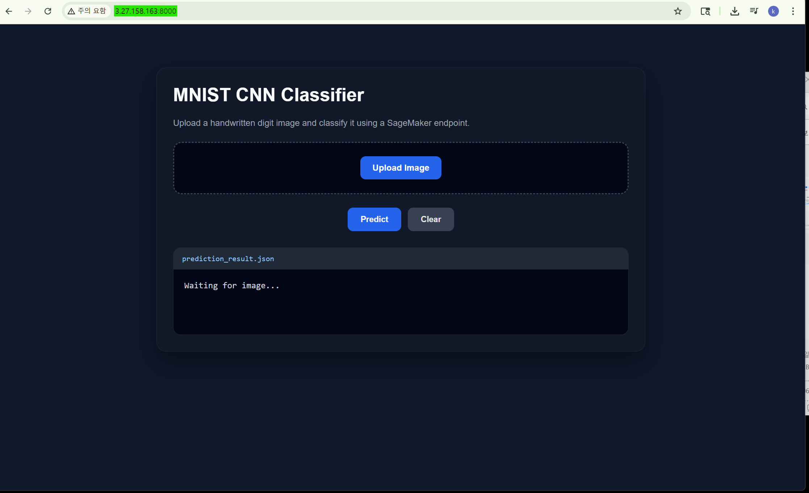
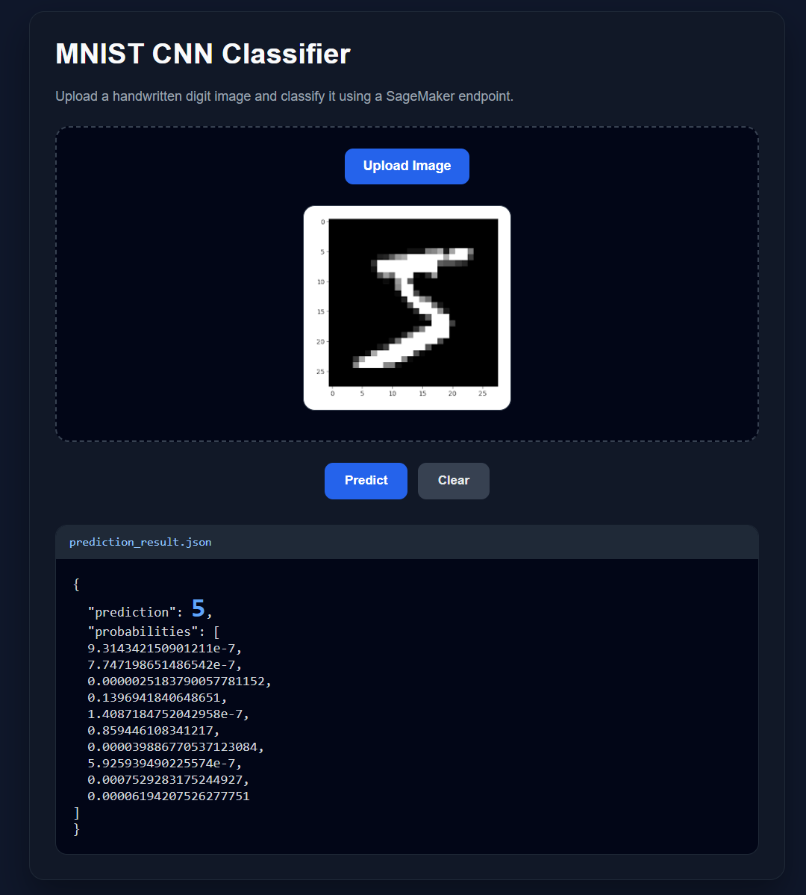

# <b>AI Model from deploy to EC2 Server with SageMaker</b>

---

### <b>Prerequisites</b>

    Deploy of endpoint from SageMaker 

---

## <b>1. Connection with endpoint and EC2</b>

#### <b>1-1. Check endpoint exist</b>

```bash
aws sagemaker describe-endpoint \
  --endpoint-name mnist-cnn-endpoint \
  --query EndpointStatus
```

Result: `InService`

#### <b>1-1. Create EC2</b>

- Key pair(login)
- VPC, public subnet
- Security Group 80/443/8000 allowance
- Add IAM rule on EC2 with InvokeEndpoint

```json
{
  "Effect": "Allow",
  "Action": "sagemaker:InvokeEndpoint",
  "Resource": "arn:aws:sagemaker:ap-southeast-2:337164669284:endpoint/mnist-cnn-endpoint"
}
```

#### <b>1-2. Connect EC2</b>

##### local bash1

```bash
cd where-is-path-at-pem
ssh -i your-key.pem ubuntu@<EC2_PUBLIC_IP>

--> ssh -i ec2-mnist-server.pem ubuntu@3.27.158.163

sudo apt update
sudo apt install -y python3-venv

python3 -m venv venv
source venv/bin/activate

pip install fastapi uvicorn boto3 pillow numpy python-multipart
```

##### another local bash2

```bash
cd where-is-path-at-pem-and-api-file
scp -i C:\\pair_key.pem api.py ubuntu@{EC2_PUBLIC_IP}:~

--> scp -i ec2-mnist-server.pem api.py ubuntu@3.27.158.163:~
```

> api.py

```python
import io
import json
import boto3
import numpy as np
from PIL import Image

from fastapi import FastAPI, UploadFile, File
from fastapi.responses import HTMLResponse

app = FastAPI()

REGION = "ap-southeast-2"
ENDPOINT_NAME = "mnist-cnn-endpoint"

runtime = boto3.client("sagemaker-runtime", region_name=REGION)

def preprocess_image(image_bytes):
    image = Image.open(io.BytesIO(image_bytes)).convert("L")
    image = image.resize((28, 28))

    array = np.array(image).astype("float32") / 255.0
    array = (array - 0.1307) / 0.3081
    array = array.reshape(1, 1, 28, 28)

    return array


@app.get("/", response_class=HTMLResponse)
def home():
    return """
<!DOCTYPE html>
<html>
<head>
    <title>MNIST Classifier</title>
    <style>
        body {
            margin: 0;
            font-family: Arial, sans-serif;
            background: #0f172a;
            color: #e5e7eb;
        }

        .container {
            max-width: 900px;
            margin: 50px auto;
            padding: 30px;
        }

        .card {
            background: #111827;
            border: 1px solid #1f2937;
            border-radius: 18px;
            padding: 30px;
            box-shadow: 0 20px 40px rgba(0, 0, 0, 0.35);
        }

        h1 {
            margin-top: 0;
            color: #f9fafb;
            font-size: 34px;
        }

        p {
            color: #9ca3af;
        }

        .upload-box {
            margin-top: 25px;
            padding: 25px;
            border: 2px dashed #374151;
            border-radius: 16px;
            text-align: center;
            background: #020617;
        }

        input[type="file"] {
            display: none;
        }

        .file-label {
            display: inline-block;
            padding: 12px 22px;
            background: #2563eb;
            color: white;
            border-radius: 10px;
            cursor: pointer;
            font-weight: bold;
        }

        .file-label:hover {
            background: #1d4ed8;
        }

        #preview {
            display: none;
            margin: 25px auto 10px;
            max-width: 320px;
            max-height: 320px;
            border-radius: 14px;
            border: 1px solid #374151;
            background: white;
            padding: 10px;
        }

        .button-row {
            margin-top: 25px;
            display: flex;
            gap: 12px;
            justify-content: center;
        }

        button {
            padding: 13px 24px;
            border: none;
            border-radius: 10px;
            cursor: pointer;
            font-weight: bold;
            font-size: 15px;
        }

        .predict-btn {
            background: #2563eb;
            color: white;
        }

        .predict-btn:hover {
            background: #1d4ed8;
        }

        .clear-btn {
            background: #374151;
            color: #e5e7eb;
        }

        .clear-btn:hover {
            background: #4b5563;
        }

        .result-panel {
            margin-top: 30px;
            background: #020617;
            border: 1px solid #1f2937;
            border-radius: 14px;
            overflow: hidden;
        }

        .result-header {
            background: #1f2937;
            padding: 12px 16px;
            color: #93c5fd;
            font-family: Consolas, monospace;
            font-size: 14px;
        }

        .result-body {
            padding: 20px;
            font-family: Consolas, monospace;
            font-size: 16px;
            white-space: pre-wrap;
            color: #d1d5db;
            min-height: 80px;
        }

        .prediction {
            color: #60a5fa;
            font-size: 32px;
            font-weight: bold;
        }

        .loading {
            color: #facc15;
        }

        .error {
            color: #f87171;
        }
    </style>
</head>

<body>
    <div class="container">
        <div class="card">
            <h1>MNIST CNN Classifier</h1>
            <p>Upload a handwritten digit image and classify it using a SageMaker endpoint.</p>

            <div class="upload-box">
                <label for="fileInput" class="file-label">Upload Image</label>
                <input type="file" id="fileInput" accept="image/*">

                <br>
                
            </div>

            <div class="button-row">
                <button class="predict-btn" onclick="predict()">Predict</button>
                <button class="clear-btn" onclick="clearImage()">Clear</button>
            </div>

            <div class="result-panel">
                <div class="result-header">prediction_result.json</div>
                <div id="result" class="result-body">
Waiting for image...
                </div>
            </div>
        </div>
    </div>

    <script>
        const fileInput = document.getElementById("fileInput");
        const preview = document.getElementById("preview");
        const result = document.getElementById("result");

        fileInput.addEventListener("change", () => {
            const file = fileInput.files[0];

            if (!file) {
                return;
            }

            const reader = new FileReader();

            reader.onload = function(e) {
                preview.src = e.target.result;
                preview.style.display = "block";
                result.className = "result-body";
                result.innerText = "Image loaded. Ready to predict.";
            };

            reader.readAsDataURL(file);
        });

        async function predict() {
            const file = fileInput.files[0];

            if (!file) {
                result.className = "result-body error";
                result.innerText = "Error: Please upload an image first.";
                return;
            }

            result.className = "result-body loading";
            result.innerText = "Calling SageMaker endpoint...";

            const formData = new FormData();
            formData.append("file", file);

            try {
                const response = await fetch("/predict", {
                    method: "POST",
                    body: formData
                });

                if (!response.ok) {
                    throw new Error("Prediction request failed.");
                }

                const data = await response.json();

                result.className = "result-body";
                result.innerHTML =
                    "{\\n" +
                    '  "prediction": <span class="prediction">' + data.prediction[0] + "</span>,\\n" +
                    '  "probabilities": ' + JSON.stringify(data.probabilities[0], null, 2) + "\\n" +
                    "}";

            } catch (err) {
                result.className = "result-body error";
                result.innerText = "Error: " + err.message;
            }
        }

        function clearImage() {
            fileInput.value = "";
            preview.src = "";
            preview.style.display = "none";
            result.className = "result-body";
            result.innerText = "Waiting for image...";
        }
    </script>
</body>
</html>
"""


@app.get("/health")
def health():
    return {"status": "ok"}


@app.post("/predict")
async def predict(file: UploadFile = File(...)):
    image_bytes = await file.read()
    image_array = preprocess_image(image_bytes)

    payload = {
        "inputs": image_array.tolist()
    }

    response = runtime.invoke_endpoint(
        EndpointName=ENDPOINT_NAME,
        ContentType="application/json",
        Accept="application/json",
        Body=json.dumps(payload)
    )

    result = json.loads(response["Body"].read().decode("utf-8"))

    return result
```

##### local bash1

```bash
ls
uvicorn api:app --host 0.0.0.0 --port 8000
```

#### <b>1-3. Connect the server</b>

##### Brower

```
http://<EC2_PUBLIC_IP>:8000/

--> http://3.27.158.163:8000/
```




