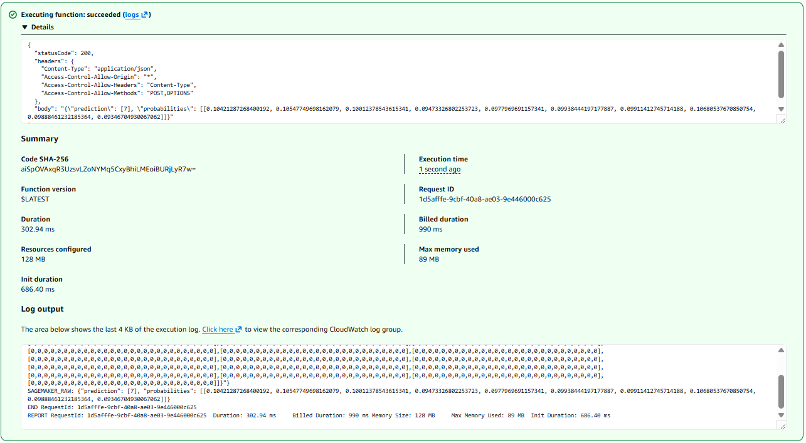
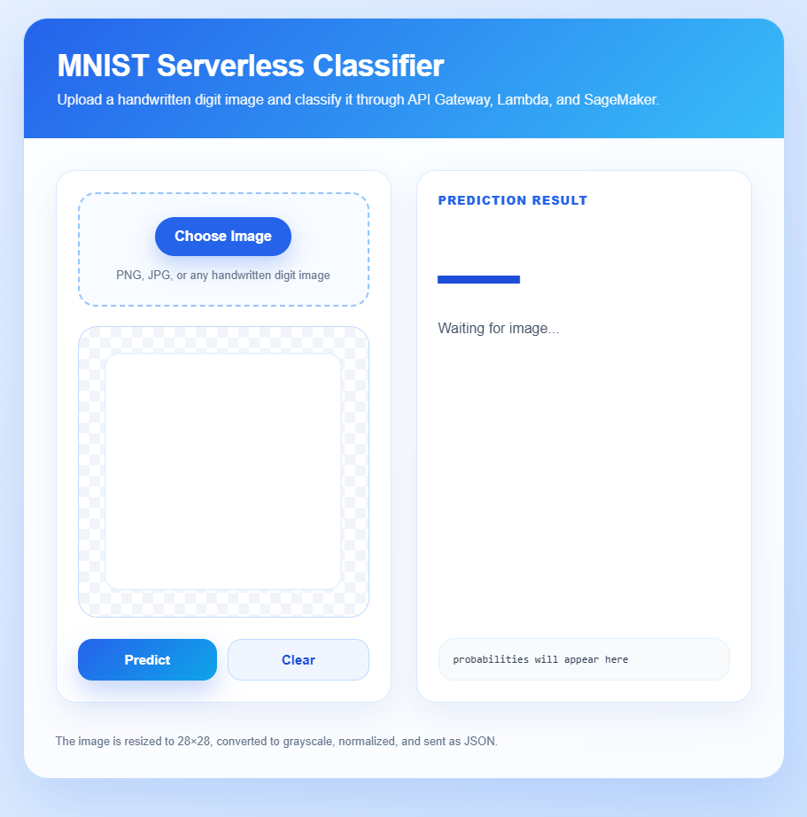
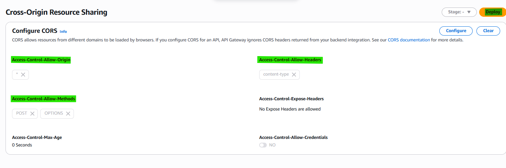
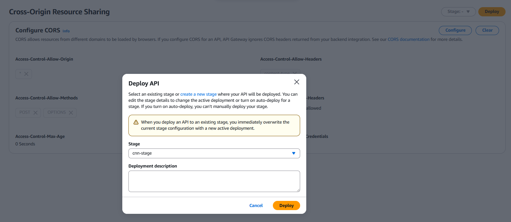
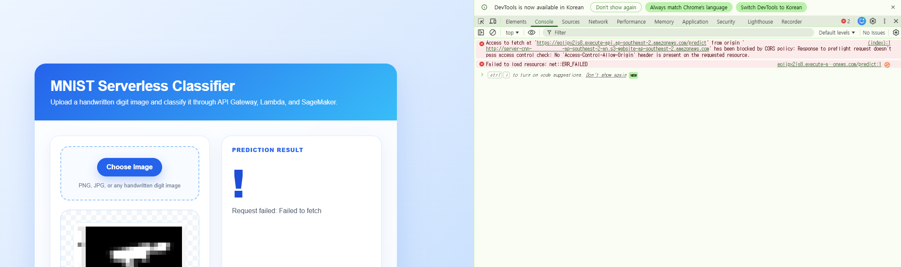

# <b>AI Model from deploy to Lambda + S3 with SageMaker</b>

---

### <b>Prerequisites</b>

    Deploy of endpoint from SageMaker 
    Lambda
    S3
    API Gateway

---

## <b>1. Connection with endpoint and Lambda</b>

#### <b>1-1. Check endpoint exist</b>

```bash
aws sagemaker describe-endpoint \
  --endpoint-name mnist-cnn-endpoint \
  --query EndpointStatus
```

Result: `InService`

#### <b>1-1. Create Lambda</b>
    Simple Connection with model and test

- Runtime: python
- Add Roles with InvokeEndpoint Policy

```json
{
  "Effect": "Allow",
  "Action": "sagemaker:InvokeEndpoint",
  "Resource": "arn:aws:sagemaker:ap-southeast-2:xxxxxx:endpoint/mnist-cnn-endpoint"
}
```

##### Test: Event JSON

```json
{
  "body": "{\"inputs\":[[0,0,0,0,0,0,0,0,0,0,0,0,0,0,0,0,0,0,0,0,0,0,0,0,0,0,0,0],[0,0,0,0,0,0,0,0,0,0,0,0,0,0,0,0,0,0,0,0,0,0,0,0,0,0,0,0],[0,0,0,0,0,0,0,0,0,0,0,0,0,0,0,0,0,0,0,0,0,0,0,0,0,0,0,0],[0,0,0,0,0,0,0,0,0,0,0,0,0,0,0,0,0,0,0,0,0,0,0,0,0,0,0,0],[0,0,0,0,0,0,0,0,0,0,0,0,0,0,0,0,0,0,0,0,0,0,0,0,0,0,0,0],[0,0,0,0,0,0,0,0,0,0,0,0,0,0,0,0,0,0,0,0,0,0,0,0,0,0,0,0],[0,0,0,0,0,0,0,0,0,0,0,0,0,0,0,0,0,0,0,0,0,0,0,0,0,0,0,0],[0,0,0,0,0,0,0,0,0,0,0,0,0,0,0,0,0,0,0,0,0,0,0,0,0,0,0,0],[0,0,0,0,0,0,0,0,0,0,0,0,0,0,0,0,0,0,0,0,0,0,0,0,0,0,0,0],[0,0,0,0,0,0,0,0,0,0,0,0,0,0,0,0,0,0,0,0,0,0,0,0,0,0,0,0],[0,0,0,0,0,0,0,0,0,0,0,0,0,0,0,0,0,0,0,0,0,0,0,0,0,0,0,0],[0,0,0,0,0,0,0,0,0,0,0,0,0,0,0,0,0,0,0,0,0,0,0,0,0,0,0,0],[0,0,0,0,0,0,0,0,0,0,0,0,0,0,0,0,0,0,0,0,0,0,0,0,0,0,0,0],[0,0,0,0,0,0,0,0,0,0,0,0,0,0,0,0,0,0,0,0,0,0,0,0,0,0,0,0],[0,0,0,0,0,0,0,0,0,0,0,0,0,0,0,0,0,0,0,0,0,0,0,0,0,0,0,0],[0,0,0,0,0,0,0,0,0,0,0,0,0,0,0,0,0,0,0,0,0,0,0,0,0,0,0,0],[0,0,0,0,0,0,0,0,0,0,0,0,0,0,0,0,0,0,0,0,0,0,0,0,0,0,0,0],[0,0,0,0,0,0,0,0,0,0,0,0,0,0,0,0,0,0,0,0,0,0,0,0,0,0,0,0],[0,0,0,0,0,0,0,0,0,0,0,0,0,0,0,0,0,0,0,0,0,0,0,0,0,0,0,0],[0,0,0,0,0,0,0,0,0,0,0,0,0,0,0,0,0,0,0,0,0,0,0,0,0,0,0,0],[0,0,0,0,0,0,0,0,0,0,0,0,0,0,0,0,0,0,0,0,0,0,0,0,0,0,0,0],[0,0,0,0,0,0,0,0,0,0,0,0,0,0,0,0,0,0,0,0,0,0,0,0,0,0,0,0],[0,0,0,0,0,0,0,0,0,0,0,0,0,0,0,0,0,0,0,0,0,0,0,0,0,0,0,0],[0,0,0,0,0,0,0,0,0,0,0,0,0,0,0,0,0,0,0,0,0,0,0,0,0,0,0,0],[0,0,0,0,0,0,0,0,0,0,0,0,0,0,0,0,0,0,0,0,0,0,0,0,0,0,0,0],[0,0,0,0,0,0,0,0,0,0,0,0,0,0,0,0,0,0,0,0,0,0,0,0,0,0,0,0],[0,0,0,0,0,0,0,0,0,0,0,0,0,0,0,0,0,0,0,0,0,0,0,0,0,0,0,0],[0,0,0,0,0,0,0,0,0,0,0,0,0,0,0,0,0,0,0,0,0,0,0,0,0,0,0,0]]}"
}
```



Should revise inference.py code for accepting various array shape

> `inference.py`

```python
def input_fn(request_body, content_type):
    import json
    import numpy as np
    import torch

    data = json.loads(request_body)

    array = np.array(data["inputs"], dtype=np.float32)

    # 28x28 -> 1x1x28x28
    if array.shape == (28, 28):
        array = array.reshape(1, 1, 28, 28)

    # 784 -> 1x1x28x28
    elif array.shape == (784,):
        array = array.reshape(1, 1, 28, 28)

    # 1x28x28 -> 1x1x28x28
    elif array.shape == (1, 28, 28):
        array = array.reshape(1, 1, 28, 28)

    tensor = torch.tensor(array, dtype=torch.float32)

    return tensor
```

#### <b>1-2. Create S3 as page</b>
    Simple page upload and test

- Block Public Access settings for this bucket: False
- Properties -> Static website hosting 
  - Static website hosting: Enable
  - Index document: index.html
- Permissions -> Bucket Policy

```json
{
  "Version": "2012-10-17",
  "Statement": [
    {
      "Sid": "PublicReadGetObject",
      "Effect": "Allow",
      "Principal": "*",
      "Action": "s3:GetObject",
      "Resource": "arn:aws:s3:::YOUR_BUCKET_NAME/*"
    }
  ]
}
```

- Upload index.html file

```html
<!DOCTYPE html>
<html lang="en">
<head>
  <meta charset="UTF-8" />
  <meta name="viewport" content="width=device-width, initial-scale=1.0" />
  <title>MNIST Serverless Classifier</title>

  <style>
    * {
      box-sizing: border-box;
    }

    body {
      margin: 0;
      min-height: 100vh;
      font-family: Arial, sans-serif;
      background: linear-gradient(135deg, #eff6ff, #dbeafe, #bfdbfe);
      color: #0f172a;
      display: flex;
      justify-content: center;
      align-items: center;
      padding: 32px;
    }

    .app {
      width: 100%;
      max-width: 860px;
      background: rgba(255, 255, 255, 0.88);
      border: 1px solid rgba(147, 197, 253, 0.55);
      border-radius: 28px;
      box-shadow: 0 24px 70px rgba(37, 99, 235, 0.18);
      overflow: hidden;
      backdrop-filter: blur(14px);
    }

    .header {
      padding: 34px 38px;
      background: linear-gradient(135deg, #2563eb, #38bdf8);
      color: white;
    }

    .header h1 {
      margin: 0;
      font-size: 34px;
      letter-spacing: -0.5px;
    }

    .header p {
      margin: 10px 0 0;
      opacity: 0.92;
      font-size: 16px;
    }

    .content {
      padding: 36px;
      display: grid;
      grid-template-columns: 1fr 1fr;
      gap: 28px;
    }

    .panel {
      background: #ffffff;
      border: 1px solid #dbeafe;
      border-radius: 22px;
      padding: 24px;
      box-shadow: 0 14px 35px rgba(30, 64, 175, 0.08);
    }

    .upload-box {
      border: 2px dashed #93c5fd;
      border-radius: 20px;
      padding: 26px;
      text-align: center;
      background: #f8fbff;
    }

    input[type="file"] {
      display: none;
    }

    .upload-label {
      display: inline-block;
      padding: 13px 22px;
      background: #2563eb;
      color: white;
      border-radius: 999px;
      font-weight: 700;
      cursor: pointer;
      box-shadow: 0 10px 24px rgba(37, 99, 235, 0.28);
      transition: 0.2s ease;
    }

    .upload-label:hover {
      transform: translateY(-1px);
      background: #1d4ed8;
    }

    .hint {
      margin-top: 14px;
      font-size: 13px;
      color: #64748b;
    }

    .preview-frame {
      margin-top: 22px;
      width: 100%;
      aspect-ratio: 1 / 1;
      border-radius: 22px;
      border: 1px solid #bfdbfe;
      background:
        linear-gradient(45deg, #f1f5f9 25%, transparent 25%),
        linear-gradient(-45deg, #f1f5f9 25%, transparent 25%),
        linear-gradient(45deg, transparent 75%, #f1f5f9 75%),
        linear-gradient(-45deg, transparent 75%, #f1f5f9 75%);
      background-size: 24px 24px;
      background-position: 0 0, 0 12px, 12px -12px, -12px 0;
      display: flex;
      justify-content: center;
      align-items: center;
      overflow: hidden;
    }

    canvas {
      width: 82%;
      height: 82%;
      image-rendering: pixelated;
      background: white;
      border-radius: 16px;
      border: 1px solid #e0f2fe;
      box-shadow: inset 0 0 0 1px rgba(37, 99, 235, 0.06);
    }

    .button-row {
      margin-top: 24px;
      display: flex;
      gap: 12px;
    }

    button {
      flex: 1;
      border: 0;
      border-radius: 16px;
      padding: 14px 18px;
      font-size: 15px;
      font-weight: 700;
      cursor: pointer;
      transition: 0.2s ease;
    }

    .predict-btn {
      color: white;
      background: linear-gradient(135deg, #2563eb, #0ea5e9);
      box-shadow: 0 14px 28px rgba(37, 99, 235, 0.25);
    }

    .predict-btn:hover {
      transform: translateY(-1px);
      box-shadow: 0 18px 36px rgba(37, 99, 235, 0.32);
    }

    .clear-btn {
      background: #eff6ff;
      color: #1d4ed8;
      border: 1px solid #bfdbfe;
    }

    .clear-btn:hover {
      background: #dbeafe;
    }

    .result-card {
      min-height: 100%;
      display: flex;
      flex-direction: column;
      justify-content: space-between;
    }

    .status-label {
      color: #2563eb;
      font-size: 13px;
      font-weight: 800;
      text-transform: uppercase;
      letter-spacing: 0.08em;
    }

    .result-main {
      margin-top: 22px;
    }

    .prediction-number {
      font-size: 92px;
      line-height: 1;
      font-weight: 900;
      color: #1d4ed8;
      letter-spacing: -5px;
    }

    .result-text {
      margin-top: 10px;
      color: #475569;
      font-size: 16px;
      line-height: 1.5;
      word-break: break-word;
    }

    .prob-box {
      margin-top: 22px;
      background: #f8fafc;
      border: 1px solid #e0f2fe;
      border-radius: 18px;
      padding: 16px;
      font-family: Consolas, monospace;
      font-size: 12px;
      color: #334155;
      max-height: 180px;
      overflow: auto;
      white-space: pre-wrap;
    }

    .footer {
      padding: 0 36px 34px;
      color: #64748b;
      font-size: 13px;
    }

    @media (max-width: 760px) {
      .content {
        grid-template-columns: 1fr;
      }

      .header h1 {
        font-size: 28px;
      }

      .prediction-number {
        font-size: 72px;
      }
    }
  </style>
</head>

<body>
  <main class="app">
    <section class="header">
      <h1>MNIST Serverless Classifier</h1>
      <p>Upload a handwritten digit image and classify it through API Gateway, Lambda, and SageMaker.</p>
    </section>

    <section class="content">
      <div class="panel">
        <div class="upload-box">
          <label for="fileInput" class="upload-label">Choose Image</label>
          <input type="file" id="fileInput" accept="image/*" />
          <div class="hint">PNG, JPG, or any handwritten digit image</div>
        </div>

        <div class="preview-frame">
          <canvas id="canvas" width="28" height="28"></canvas>
        </div>

        <div class="button-row">
          <button class="predict-btn" onclick="predict()">Predict</button>
          <button class="clear-btn" onclick="clearImage()">Clear</button>
        </div>
      </div>

      <div class="panel result-card">
        <div>
          <div class="status-label">Prediction Result</div>

          <div class="result-main">
            <div id="predictionNumber" class="prediction-number">—</div>
            <div id="result" class="result-text">Waiting for image...</div>
          </div>
        </div>

        <div id="probabilities" class="prob-box">probabilities will appear here</div>
      </div>
    </section>

    <div class="footer">
      The image is resized to 28×28, converted to grayscale, normalized, and sent as JSON.
    </div>
  </main>

  <script>
    const API_URL = "https://{ARN_API_Gateway_ID}.execute-api.ap-southeast-2.amazonaws.com/predict";

    const fileInput = document.getElementById("fileInput");
    const canvas = document.getElementById("canvas");
    const ctx = canvas.getContext("2d");
    const result = document.getElementById("result");
    const predictionNumber = document.getElementById("predictionNumber");
    const probabilities = document.getElementById("probabilities");

    let mnistInput = null;

    fileInput.addEventListener("change", () => {
      const file = fileInput.files[0];
      if (!file) return;

      const img = new Image();

      img.onload = () => {
        ctx.clearRect(0, 0, 28, 28);
        ctx.fillStyle = "white";
        ctx.fillRect(0, 0, 28, 28);
        ctx.drawImage(img, 0, 0, 28, 28);

        const imageData = ctx.getImageData(0, 0, 28, 28);
        const pixels = [];

        for (let i = 0; i < imageData.data.length; i += 4) {
          const r = imageData.data[i];
          const g = imageData.data[i + 1];
          const b = imageData.data[i + 2];

          let gray = (r + g + b) / 3.0 / 255.0;
          gray = (gray - 0.1307) / 0.3081;

          pixels.push(gray);
        }

        const rows = [];
        for (let i = 0; i < 28; i++) {
          rows.push(pixels.slice(i * 28, (i + 1) * 28));
        }

        mnistInput = [[rows]];

        predictionNumber.innerText = "—";
        result.innerText = "Image loaded. Ready to predict.";
        probabilities.innerText = "ready";
      };

      img.src = URL.createObjectURL(file);
    });

    async function predict() {
      if (!mnistInput) {
        result.innerText = "Please upload an image first.";
        return;
      }

      predictionNumber.innerText = "…";
      result.innerText = "Calling Lambda...";
      probabilities.innerText = "waiting for response...";

      try {
        const res = await fetch(API_URL, {
          method: "POST",
          headers: {
            "Content-Type": "application/json"
          },
          body: JSON.stringify({
            inputs: mnistInput
          })
        });

        const data = await res.json();

        if (!res.ok) {
          predictionNumber.innerText = "!";
          result.innerText = "Error: " + JSON.stringify(data);
          probabilities.innerText = "";
          return;
        }

        predictionNumber.innerText = data.prediction[0];
        result.innerText = "The model predicted digit " + data.prediction[0] + ".";
        probabilities.innerText = JSON.stringify(data.probabilities[0], null, 2);

      } catch (err) {
        predictionNumber.innerText = "!";
        result.innerText = "Request failed: " + err.message;
        probabilities.innerText = "";
      }
    }

    function clearImage() {
      fileInput.value = "";
      mnistInput = null;

      ctx.clearRect(0, 0, 28, 28);

      predictionNumber.innerText = "—";
      result.innerText = "Waiting for image...";
      probabilities.innerText = "probabilities will appear here";
    }
  </script>
</body>
</html>
```

##### Check Bucket website endpoint from Static website hosting



#### <b>1-3. Create API Gateway</b>

- HTTP API build
- Integration: lambda
- Configure routes
  - Method: POST
  - Name: /predict
- Configure stages
  - Add stage
  - Auto-deploy: false 
- CORS
  - Setting as follow:
  - Deploy to new stage you made




#### <b>1-4. Connect Lambda with API Gateway</b>
    Integrate Lambda and Gateway

Already you have: Integration - lambda

#### <b>1-5. Connect S3 with API Gateway</b>
    Integrate CORS S3 URL and API Gateway ARN

on `CORS`
```
Allow-Origin: *
Allow-Methods: POST, OPTIONS
Allow-Headers: content-type
Allow-Credentials: NO
```

revise `index.html`

``` 
const API_URL = "https://{ARN_API_Gateway_ID}.execute-api.{Region}.amazonaws.com/{Stage_Name}/{Route_Name}";
+
arn:aws:apigateway:ap-southeast-2::/apis/eolipx2is8/routes/ip1seyf
+
API Gateway/StageName: cnn-stage
=
const API_URL = "https://eolipx2is8.execute-api.ap-southeast-2.amazonaws.com/cnn-stage/predict";
```

If you fail predict button, on the s3 index.html website, press F12 and check console

