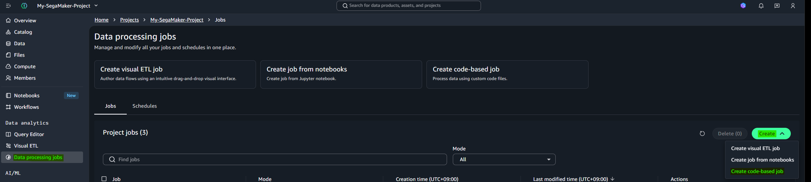
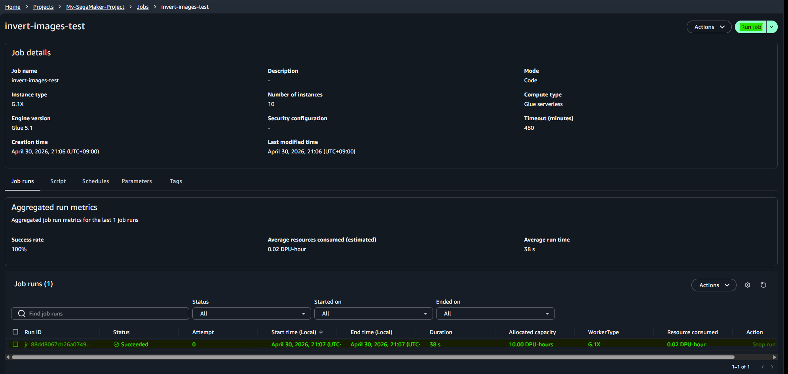

# <b>Data processing jobs with SageMaker</b>

---

### <b>Prerequisites</b>

    S3

---

## <b>1. Connection with endpoint and Lambda</b>

Data processing jobs are essential in modern machine learning pipelines because they separate data preparation from model training and inference. 

In real-world scenarios, raw data is often large, inconsistent, and unstructured, making it inefficient or even impossible to process on the fly during training or prediction. By introducing a dedicated data processing stage, we can clean, normalize, transform, and organize data in advance, ensuring that both training and inference use the exact same data format. 

This not only improves performance and reduces latency, but also eliminates inconsistencies that can degrade model accuracy. Additionally, processing jobs enable scalability by handling large datasets in distributed environments, and they support reusability by allowing preprocessed data to be stored and reused across multiple experiments. 

In production systems, this separation is critical for building reliable, maintainable, and automated pipelines where each stage—data processing, training, and deployment—can evolve independently.

## <b>2. How to use `Data processing jobs` pane</b>

#### <b>1-1. Click `Data processing jobs` pane</b>



#### <b>1-2. Upload `image_invert_processing.py` and create job</b>

```python
import io
import boto3
from PIL import Image
import numpy as np

s3 = boto3.client("s3")

INPUT_BUCKET = "amazon-sagemaker-xxxxxxx-ap-southeast-2-53c382f6781e"
INPUT_PREFIX = "raw/"
OUTPUT_PREFIX = "processed/"

response = s3.list_objects_v2(Bucket=INPUT_BUCKET, Prefix=INPUT_PREFIX)

for obj in response.get("Contents", []):
    key = obj["Key"]

    if not key.lower().endswith((".png", ".jpg", ".jpeg")):
        continue

    print("Processing:", key)

    img_obj = s3.get_object(Bucket=INPUT_BUCKET, Key=key)
    img_bytes = img_obj["Body"].read()

    image = Image.open(io.BytesIO(img_bytes)).convert("L")

    arr = np.array(image)

    inverted = 255 - arr

    new_img = Image.fromarray(inverted.astype(np.uint8))

    buffer = io.BytesIO()
    new_img.save(buffer, format="PNG")
    buffer.seek(0)

    output_key = key.replace(INPUT_PREFIX, OUTPUT_PREFIX)

    s3.put_object(
        Bucket=INPUT_BUCKET,
        Key=output_key,
        Body=buffer,
        ContentType="image/png"
    )

print("DONE")
```

#### <b>1-3. Add Policy authorized with s3</b>

{
	"Version": "2012-10-17",
	"Statement": [
		{
			"Effect": "Allow",
			"Action": [
				"s3:GetObject",
				"s3:PutObject",
				"s3:ListBucket"
			],
			"Resource": [
				"arn:aws:s3:::amazon-sagemaker-xxxxxx-ap-southeast-2-53c382f6781e",
				"arn:aws:s3:::amazon-sagemaker-xxxxxx-ap-southeast-2-53c382f6781e/*"
			]
		}
	]
}

#### <b>1-4. Run the job</b>



###### Result

