# <b>Glue,Lambda and EventBridge</b>

---

### <b>Prerequisites</b>

    S3

---

## <b>1. Glue,Lambda and EventBridge</b>

When building serverless setting, we use lambda. But lambda is event-driven when something happens and lambda just limited to a maximum execution time of 15 mins. Futhermore if we want to use parallelization for performance like image-preprocessing, we can utilize AWS Glue system

Order:

```
Run Glue
Automatically Call EventBridge
Automatically Call Lambda
```

## <b>2. Process</b>

#### <b>2-1. Create Lambda</b>

##### Deploy Code

```python
import boto3

glue = boto3.client("glue")

def lambda_handler(event, context):
    print("S3 trigger:", event)

    response = glue.start_job_run(
        JobName="invert-images-test"
    )

    print("Glue started:", response)
```

#### <b>2-2. Create Glue</b>

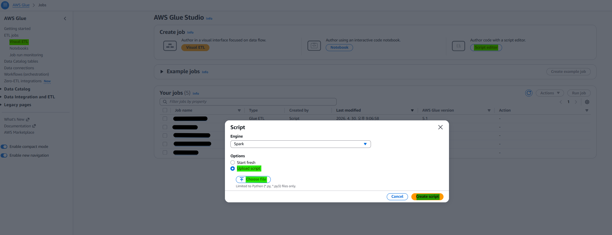

The python file that i already made is uploaded in glue script.

##### Add S3 Policy Approach on Glue IAM roles

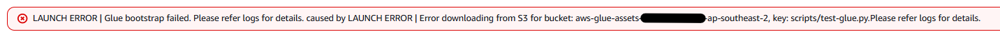

Even if the S3 bucket has not been created yet or is not explicitly connected, we still need to grant permissions in advance because AWS Glue executes jobs in a distributed environment where resources are dynamically accessed at runtime. Without proper permissions, the job may fail when it attempts to read from or write to S3.

```json
{
  "Effect": "Allow",
  "Action": [
    "s3:GetObject",
    "s3:PutObject",
    "s3:ListBucket"
  ],
  "Resource": [
    "arn:aws:s3:::aws-glue-assets-337164669284-ap-southeast-2",
    "arn:aws:s3:::aws-glue-assets-337164669284-ap-southeast-2/*"
  ]
}
```

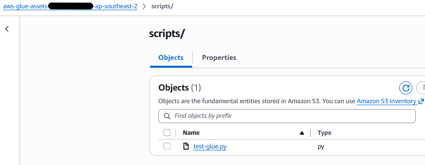

#### <b>2-3. Create EventBridge and Connect between Lambda and Glue</b>

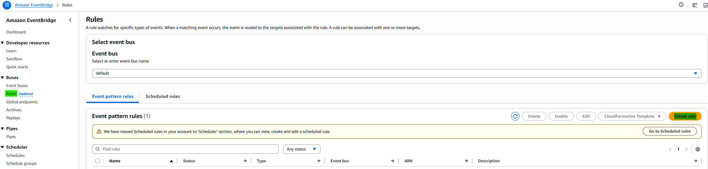
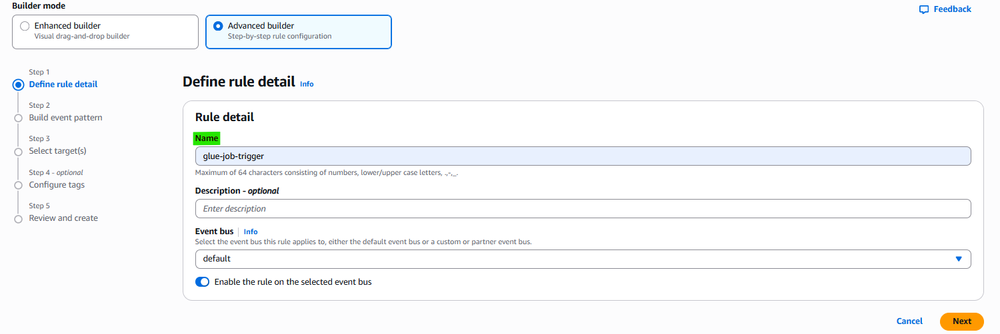
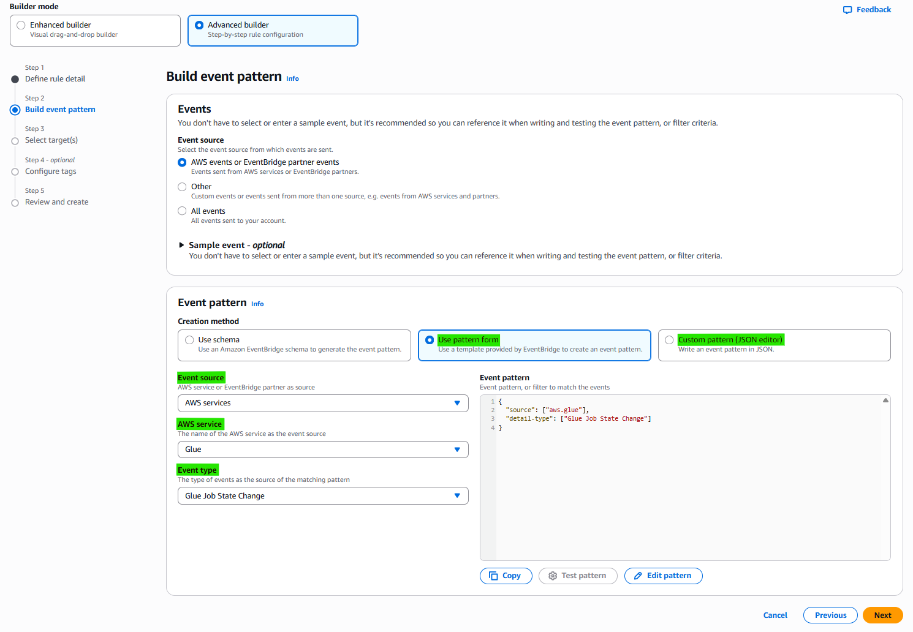
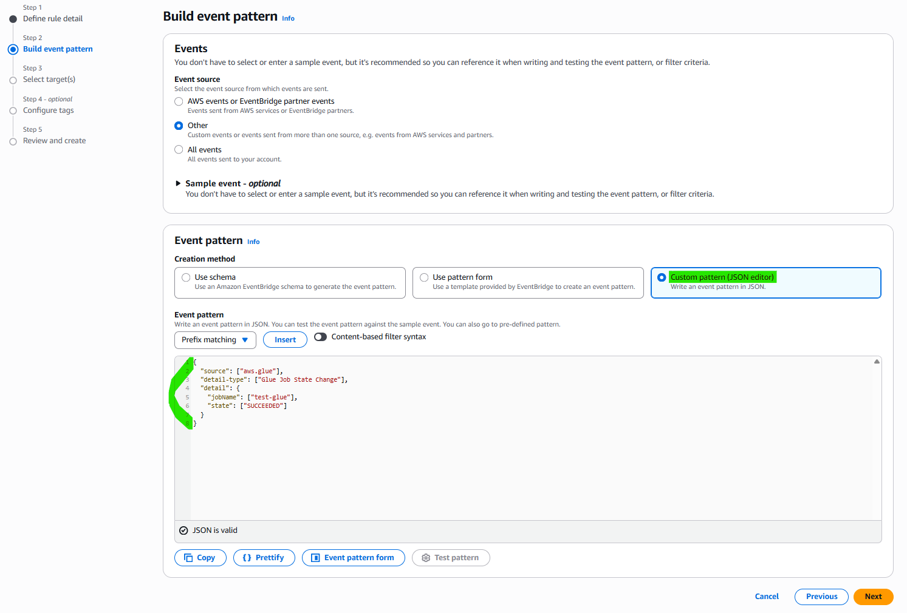
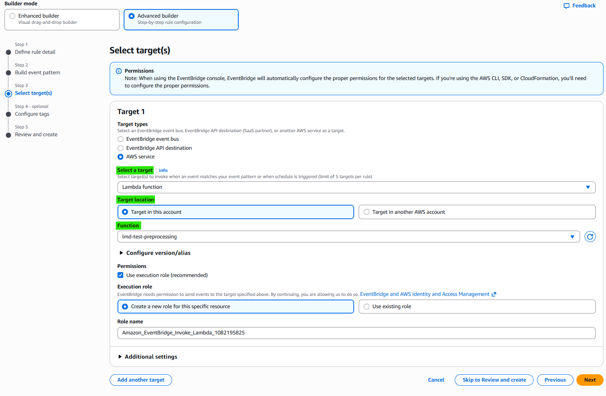

Result:

##### Condition1: trigger condition from specific glue to EventBridge

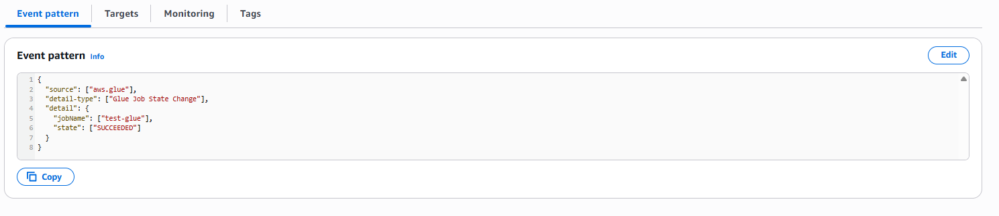

##### Condition2: trigger condition from EventBridge to Lambda 

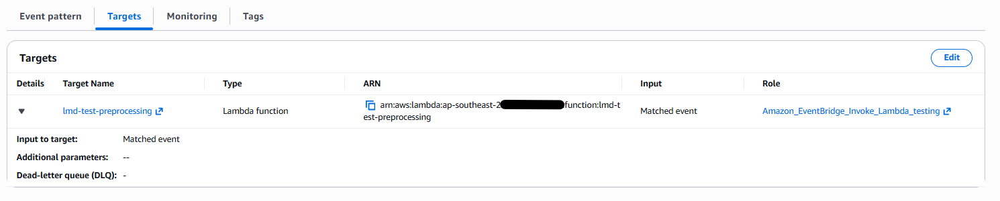

#### <b>2-4. Run Result</b>

##### Start Running Glue: SUCCEEDED

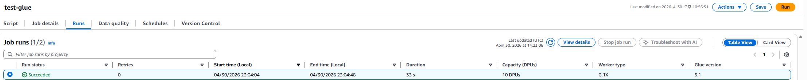

##### Trigger EventBridge

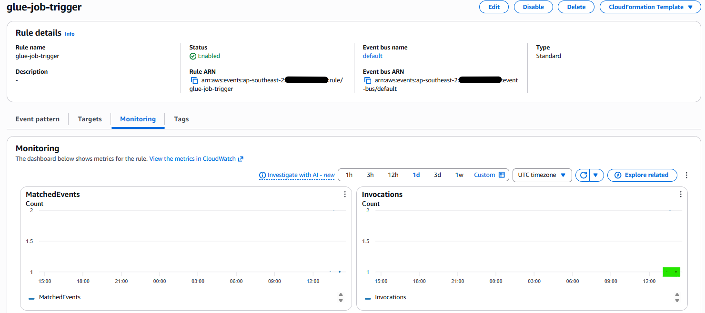

##### Trigger Lambda

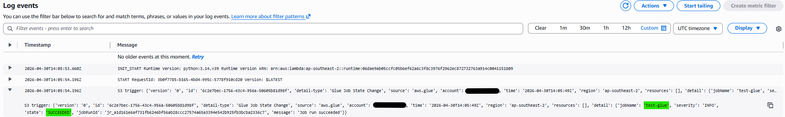
