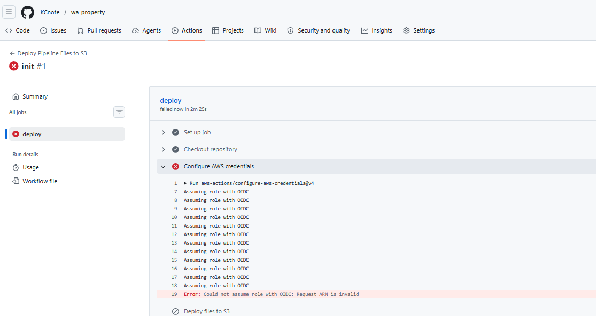
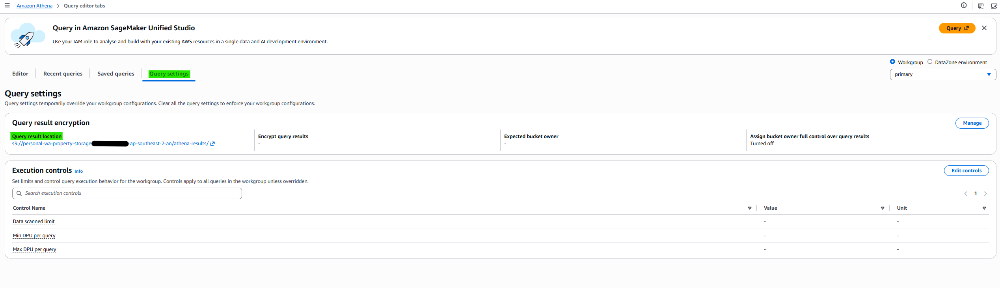
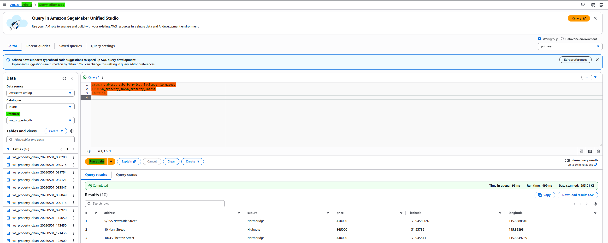
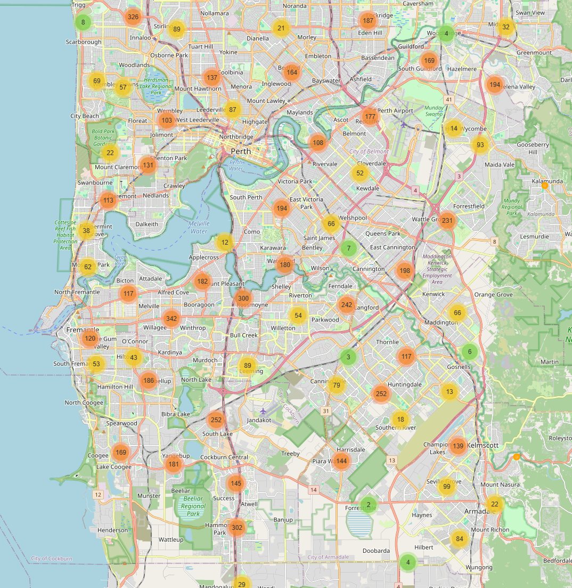

# <b>Automation: Git, Athena(SQL) and Deploy index.html to S3 Storage with CI/CD</b>

---

### <b>Prerequisites</b>

    S3
    Athena
    Git
    CI/CD

---

## <b>1. Overview: Git, Athena(SQL) and Deploy index.html to S3 Storage</b>

#### Processing pipeline

##### <1> Check point: init
- create git repository
  - folder: src(.py), sql(.sql), config, .github/workflows(.yml)
- create ci/cd
  - aws-action/configure-aws-credential
      - role(IAM), region
- create s3
  - attach policy for access s3
    - s3:function
  - deploy git local files to s3 with ci/cd

##### <2> Check point: Athena Preprocessing
- attach policy to role
  - athena:function
  - glue:function
  - s3:function(if necessary)
- create .sql files for execute on python
- create python execuation included .sql files
- Check the db on Athena
  - raw data
  - proceed data
  - test: raw data with query
- Add CI/CD process

##### <3> Check point: Anaylsis
- with db, analysis and derived results.
- using python

##### <4> Check point: Deploy on S3
- create another s3 for public deploy
  - attach policy for public
    - s3:function
- public access setting
- Add CI/CD process

#### CI/CD pipeline

- aws-action/configure-aws-credential
    - roles(IAM), region
- deploy git local files to s3
- python setting: version, pip install (with requirements.txt)
- run athena qurey(.py) (for sql): data preprocessing
- run map result(.py)

## <b>2. Check point: init</b>

#### <b>2-1. create git repository</b>

```
wa-property/
├── sql/
├── src/
├── config/
└── .github/workflows/
```

###### Build Hierarchy

```bash
mkdir wa-property
cd wa-property

mkdir sql src config .github .github/workflows

echo "SELECT 1;" > sql/test.sql
echo "{}" > config/schema.json
echo "print('hello pipeline')" > src/pipeline.py
```

###### git init

```bash
git init
git branch -M main
```

#### <b>2-2. create role</b>

In this post, the role name: GitHubActionsDeployRole (with empty policy)

If not:



#### <b>2-2. create s3</b>

  - attach policy to GitHubActionsDeployRole role for access s3
    - s3:function

###### Policy: s3-personal-wa-property-storage-allowance

```json
{
    "Version": "2012-10-17",
    "Statement": [
        {
            "Effect": "Allow",
            "Action": [
                "s3:ListBucket",
                "s3:GetBucketLocation"
            ],
            "Resource": "arn:aws:s3:::personal-wa-property-storage-xxxxxx-ap-southeast-2-an"
        },
        {
            "Effect": "Allow",
            "Action": [
                "s3:PutObject",
                "s3:DeleteObject",
                "s3:GetObject"
            ],
            "Resource": "arn:aws:s3:::personal-wa-property-storage-xxxxxx-ap-southeast-2-an/*"
        }
    ]
}
```

#### <b>2-3. ci/cd</b>

- aws-action/configure-aws-credential
    - connecting role(IAM), region
- -deploy git local files to s3 with ci/cd

````yml
name: Deploy Pipeline Files to S3

on:
  push:
    branches:
      - main

jobs:
  deploy:
    runs-on: ubuntu-latest

    permissions:
      id-token: write
      contents: read

    steps:
      - name: Checkout repository
        uses: actions/checkout@v4

      - name: Configure AWS credentials
        uses: aws-actions/configure-aws-credentials@v4
        with:
        # you make new role manually
          role-to-assume: arn:aws:iam::xxxxxx:role/GitHubActionsDeployRole
          aws-region: ap-southeast-2

      - name: Deploy files to S3
        run: |
          aws s3 sync sql/ s3://personal-wa-property-storage-xxxxxx-ap-southeast-2-an/app/sql/ --delete
          aws s3 sync src/ s3://personal-wa-property-storage-xxxxxx-ap-southeast-2-an/app/src/ --delete
          aws s3 sync config/ s3://personal-wa-property-storage-xxxxxx-ap-southeast-2-an/app/config/ --delete
````

## <b>3. Check point: Athena Preprocessing</b>

#### <b>3-1. attach policy to role</b>

- attach policy to role (GitHubActionsDeployRole)
  - athena:function
  - glue:function
  - s3:function(if necessary)

###### Policy: athena-allowance

```json
{
	"Version": "2012-10-17",
	"Statement": [
		{
			"Effect": "Allow",
			"Action": [
				"athena:StartQueryExecution",
				"athena:GetQueryExecution",
				"athena:GetQueryResults",
				"athena:StopQueryExecution"
			],
			"Resource": "*"
		}
	]
}
```

###### Policy: glue-allowance

```json
{
	"Version": "2012-10-17",
	"Statement": [
		{
			"Effect": "Allow",
			"Action": [
				"glue:CreateDatabase",
				"glue:GetDatabase",
				"glue:GetDatabases",
				"glue:GetTable",
				"glue:GetTables",
				"glue:CreateTable",
				"glue:UpdateTable",
				"glue:DeleteTable",
				"glue:GetPartitions",
				"glue:CreatePartition",
				"glue:BatchCreatePartition"
			],
			"Resource": "*"
		}
	]
}
```

If there has authorization issue:

```json
{
  "Effect": "Allow",
  "Action": [
    "s3:GetBucketLocation"
  ],
  "Resource": "arn:aws:s3:::personal-wa-property-storage-xxxxxxx-ap-southeast-2-an"
}
```

#### <b>3-2. sql processing pipline</b>

Make Preprocessing pipeline (the number is order when function is called)

sql/
├── 01_create_database.sql
├── 02_drop_raw_table.sql
├── 03_create_raw_table.sql
└── 04_clean_property.sql

The .sql file should have one command. If you wanna have command over two, making over two files.


##### 01_create_database.sql

```sql
CREATE DATABASE IF NOT EXISTS wa_property_db;
```

##### 02_drop_raw_table.sql
```sql
DROP TABLE IF EXISTS wa_property_db.wa_property_raw;
```

If you don't drop the same name db, it makes error.

##### 03_create_raw_table.sql
```sql
CREATE EXTERNAL TABLE wa_property_db.wa_property_raw (
  address string,
  suburb string,
  price int,
  bedrooms int,
  bathrooms int,
  garage int,
  land_area double,
  floor_area double,
  build_year int,
  cbd_dist double,
  nearest_stn string,
  nearest_stn_dist double,
  date_sold string,
  postcode int,
  latitude double,
  longitude double,
  nearest_sch string,
  nearest_sch_dist double,
  nearest_sch_rank int
)
ROW FORMAT SERDE 'org.apache.hadoop.hive.serde2.OpenCSVSerde'
WITH SERDEPROPERTIES (
  'separatorChar' = ',',
  'quoteChar' = '"'
)
STORED AS TEXTFILE
LOCATION 's3://personal-wa-property-storage-xxxxxx-ap-southeast-2-an/raw/property/'
TBLPROPERTIES (
  'skip.header.line.count'='1',
  'use.null.for.invalid.data'='true'
);
```

Files in `LOCATION` should have same variables.

##### 04_clean_property.sql
```sql
CREATE TABLE wa_property_db.{table_name}
WITH (
  format = 'PARQUET',
  external_location = '{output_path}'
) AS
SELECT
  address,
  suburb,
  price,
  bedrooms,
  bathrooms,
  garage,
  land_area,
  floor_area,
  cbd_dist,
  nearest_stn,
  nearest_stn_dist,
  date_sold,
  postcode,
  latitude,
  longitude,
  nearest_sch,
  nearest_sch_dist,
  nearest_sch_rank
FROM wa_property_db.wa_property_raw
WHERE bedrooms <= 5
  AND bathrooms <= 3
  AND garage <= 2
  AND land_area BETWEEN 400 AND 800
  AND date_parse(date_sold, '%m-%Y') >= DATE '2015-01-01'

ORDER BY postcode;
```

#### <b>3-3. execute python for call sql</b>

> run_athena_query.py

```python
import boto3
import time
from pathlib import Path
from datetime import datetime, timezone

athena = boto3.client("athena", region_name="ap-southeast-2")

DATABASE = "wa_property_db"
OUTPUT = "s3://personal-wa-property-storage-xxxxxxx-ap-southeast-2-an/athena-results/" # SQL result files

QUERY_FILES = [
    "sql/01_create_database.sql",
    "sql/02_drop_raw_table.sql",
    "sql/03_create_raw_table.sql",
    "sql/04_clean_property.sql",
]

def run_query(query, name=""):
    response = athena.start_query_execution(
        QueryString=query,
        QueryExecutionContext={"Database": DATABASE},
        ResultConfiguration={"OutputLocation": OUTPUT},
    )

    query_id = response["QueryExecutionId"]
    print(f"Running {name}: {query_id}")

    while True:
        result = athena.get_query_execution(QueryExecutionId=query_id)
        status_info = result["QueryExecution"]["Status"]
        status = status_info["State"]

        if status in ["SUCCEEDED", "FAILED", "CANCELLED"]:
            print(f"{name} status:", status)

            if status != "SUCCEEDED":
                reason = status_info.get("StateChangeReason", "")
                raise RuntimeError(f"{name} failed: {reason}")

            break

        time.sleep(2)


def main():
    # for escaping same name db and backup
    run_id = datetime.now(timezone.utc).strftime("%Y%m%d_%H%M%S")

    output_path = (
        "s3://personal-wa-property-storage-xxxxxxx-ap-southeast-2-an/"
        f"processed/property_clean/run_id={run_id}/"
    )

    table_name = f"wa_property_clean_{run_id}"

    print("Run ID:", run_id)
    print("Output path:", output_path)
    print("Table name:", table_name)

    # execuet sql process set
    for query_file in QUERY_FILES:
        query = Path(query_file).read_text()

        query = query.format(
            output_path=output_path,
            table_name=table_name,
        )

        run_query(query, query_file)

    # the name include version for escaping same name db and backup
    view_query = f"""
    CREATE OR REPLACE VIEW wa_property_db.wa_property_latest AS
    SELECT *
    FROM wa_property_db.{table_name}
    """

    run_query(view_query, "create_latest_view")

    print("✅ Latest view updated:", table_name)


if __name__ == "__main__":
    main()
```

#### <b>3-4. Check Athena and test</b>

- Check the db on Athena
  - raw data
  - proceed data
  - test: raw data with query




- Add CI/CD process

requirements.txt include just install package names

```yml
name: Deploy Pipeline Files to S3

on:
  push:
    branches:
      - main

jobs:
  deploy:
    runs-on: ubuntu-latest

    permissions:
      id-token: write
      contents: read

    steps:
      - name: Checkout repository
        uses: actions/checkout@v4

      - name: Configure AWS credentials
        uses: aws-actions/configure-aws-credentials@v4
        with:
          role-to-assume: arn:aws:iam::xxxxxxx:role/GitHubActionsDeployRole-wa-property
          aws-region: ap-southeast-2

      - name: Deploy files to S3
        run: |
          aws s3 sync sql/ s3://personal-wa-property-storage-xxxxxxx-ap-southeast-2-an/app/sql/ --delete
          aws s3 sync src/ s3://personal-wa-property-storage-xxxxxxx-ap-southeast-2-an/app/src/ --delete
          aws s3 sync config/ s3://personal-wa-property-storage-xxxxxxx-ap-southeast-2-an/app/config/ --delete

      - name: Set up Python
        uses: actions/setup-python@v5
        with:
          python-version: "3.11"

      - name: Install Python dependencies
        run: |
          python -m pip install --upgrade pip
          pip install -r requirements.txt

      - name: Run Athena SQL pipeline
        run: |
          python src/run_athena_query.py
```

## <b>4. Check point: Anaylsis</b>

> make_map.py

```python
import awswrangler as wr
import folium
from folium.plugins import MarkerCluster

DATABASE = "wa_property_db"
TABLE = "wa_property_latest"

ATHENA_OUTPUT = "s3://personal-wa-property-storage-xxxxxxx-ap-southeast-2-an/athena-results/"
DEPLOY_BUCKET = "personal-wa-property-server-xxxxxxx-ap-southeast-2-an"
OUTPUT_HTML = "index.html"

def load_data():
    sql = f"""
    SELECT
      address,
      suburb,
      price,
      bedrooms,
      bathrooms,
      garage,
      land_area,
      floor_area,
      date_sold,
      postcode,
      latitude,
      longitude,
      nearest_sch,
      nearest_sch_dist
    FROM {DATABASE}.{TABLE}
    WHERE latitude IS NOT NULL
      AND longitude IS NOT NULL
      AND price IS NOT NULL
    """

    return wr.athena.read_sql_query(
        sql=sql,
        database=DATABASE,
        s3_output=ATHENA_OUTPUT,
    )


def price_color(price):
    if price < 500000:
        return "green"
    if price < 800000:
        return "orange"
    return "red"


def create_map(df):
    if df.empty:
        raise RuntimeError("No data found from Athena.")

    center_lat = df["latitude"].mean()
    center_lon = df["longitude"].mean()

    m = folium.Map(
        location=[center_lat, center_lon],
        zoom_start=10,
        tiles="OpenStreetMap",
    )

    cluster = MarkerCluster().add_to(m)

    for _, row in df.iterrows():
        popup = f"""
        <b>{row["address"]}</b><br>
        Suburb: {row["suburb"]}<br>
        Price: ${row["price"]:,.0f}<br>
        Bedrooms: {row["bedrooms"]}<br>
        Bathrooms: {row["bathrooms"]}<br>
        Garage: {row["garage"]}<br>
        Land area: {row["land_area"]}<br>
        Floor area: {row["floor_area"]}<br>
        Sold: {row["date_sold"]}<br>
        School: {row["nearest_sch"]}<br>
        School dist: {row["nearest_sch_dist"]}
        """

        folium.CircleMarker(
            location=[row["latitude"], row["longitude"]],
            radius=5,
            color=price_color(row["price"]),
            fill=True,
            fill_color=price_color(row["price"]),
            fill_opacity=0.75,
            popup=folium.Popup(popup, max_width=350),
        ).add_to(cluster)

    return m


def upload_to_s3():
    wr.s3.upload(
        local_file=OUTPUT_HTML,
        path=f"s3://{DEPLOY_BUCKET}/{OUTPUT_HTML}",
        boto3_session=None,
        s3_additional_kwargs={
            "ContentType": "text/html; charset=utf-8",
            "CacheControl": "no-cache",
        },
    )

def main():
    df = load_data()

    print("Loaded rows:", len(df))
    print(df.head())

    m = create_map(df)
    m.save(OUTPUT_HTML)

    print(f"Generated {OUTPUT_HTML}")

    upload_to_s3()

    print(f"Uploaded to s3://{DEPLOY_BUCKET}/{OUTPUT_HTML}")


if __name__ == "__main__":
    main()
```

Local result:



## <b>5. Check point: Deploy on S3</b>

#### <b>5-1. create another s3 for public deploy</b>

- Block Public Access settings for this bucket: False
- Properties -> Static website hosting
  - Static website hosting: Enable
  - Index document: index.html
- Permissions -> Bucket Policy

```json
{
    "Version": "2012-10-17",
    "Statement": [
        {
            "Sid": "PublicReadForWebsite",
            "Effect": "Allow",
            "Principal": "*",
            "Action": "s3:GetObject",
            "Resource": "arn:aws:s3:::personal-wa-property-server-xxxxxxx-ap-southeast-2-an/*"
        }
    ]
}
```

#### <b>5-2. Add Policy to GitHubActionsDeployRole</b>

  - attach policy to GitHubActionsDeployRole role for access s3
    - s3:function

###### Policy: s3-personal-wa-property-server-allowance

```json
{
    "Version": "2012-10-17",
    "Statement": [
        {
            "Effect": "Allow",
            "Action": [
                "s3:ListBucket",
                "s3:GetBucketLocation"
            ],
            "Resource": "arn:aws:s3:::personal-wa-property-server-337164669284-ap-southeast-2-an"
        },
        {
            "Effect": "Allow",
            "Action": [
                "s3:PutObject",
                "s3:DeleteObject",
                "s3:GetObject"
            ],
            "Resource": "arn:aws:s3:::personal-wa-property-server-337164669284-ap-southeast-2-an/*"
        }
    ]
}
```

#### <b>5-3. Add CI/CD process</b>

```yml
name: Deploy Pipeline Files to S3

on:
  push:
    branches:
      - main

jobs:
  deploy:
    runs-on: ubuntu-latest

    permissions:
      id-token: write
      contents: read

    steps:
      - name: Checkout repository
        uses: actions/checkout@v4

      - name: Configure AWS credentials
        uses: aws-actions/configure-aws-credentials@v4
        with:
          role-to-assume: arn:aws:iam::337164669284:role/GitHubActionsDeployRole-wa-property
          aws-region: ap-southeast-2

      - name: Deploy files to S3
        run: |
          aws s3 sync sql/ s3://personal-wa-property-storage-337164669284-ap-southeast-2-an/app/sql/ --delete
          aws s3 sync src/ s3://personal-wa-property-storage-337164669284-ap-southeast-2-an/app/src/ --delete
          aws s3 sync config/ s3://personal-wa-property-storage-337164669284-ap-southeast-2-an/app/config/ --delete

      - name: Set up Python
        uses: actions/setup-python@v5
        with:
          python-version: "3.11"

      - name: Install Python dependencies
        run: |
          python -m pip install --upgrade pip
          pip install -r requirements.txt

      - name: Run Athena SQL pipeline
        run: |
          python src/run_athena_query.py

      - name: Generate and deploy map
        run: |
          python src/make_map.py
```

## <b>6. Tracking Not working the html file</b>

In this case, the process is good, but the index.html is not working on network even though the index.html is working on local.
Through s3 index.html is suddenly won't open and just closes immediately.

At the first time the `upload_to_s3` function is like:

```python
def upload_to_s3():
    wr.s3.upload(
        local_file=OUTPUT_HTML,
        path=f"s3://{DEPLOY_BUCKET}/{OUTPUT_HTML}",
        boto3_session=None,
        #s3_additional_kwargs={
        #    "ContentType": "text/html; charset=utf-8",
        #    "CacheControl": "no-cache",
        #},
    )
```

and then, check the head-object about index.html

```bash
aws s3api head-object --bucket personal-wa-property-server-337164669284-ap-southeast-2-an --key index.html
```

```bash
{
    "AcceptRanges": "bytes",
    "LastModified": "2026-05-01T12:29:34+00:00",
    "ContentLength": 10830,
    "ETag": "\"a07d09cb67044c8e1f3bb0893261b43f\"",
    "ContentType": "binary/octet-stream",
    "ServerSideEncryption": "AES256",
    "Metadata": {}
}
```

The problem is "ContentType" is not "text/html", but "binary/octet-stream". So the website is not working. It is just binary.

So when i revised the code `upload_to_s3` and working:

```bash
{
    "AcceptRanges": "bytes",
    "LastModified": "2026-05-01T13:07:15+00:00",
    "ContentLength": 20432098,
    "ETag": "\"bd28724c79a2d7976376f89007b5e20f-3\"",
    "CacheControl": "no-cache",
    "ContentType": "text/html; charset=utf-8",
    "ServerSideEncryption": "AES256",
    "Metadata": {}
}
```