# <b>Route 53, CloudFront and private S3</b>

---

### <b>Prerequisites</b>

    S3
    CloudFront
    Route53

---

## <b>1. How to publish your domain you buy from Route 53 and linked private S3 html</b>

We already see how to create s3 server with public s3. But it is not recommended because of security issue.

So, Now I post how to publish domain I buy from Route 53 with private s3.

#### <b>1-1. Change public s3 to private s3</b>

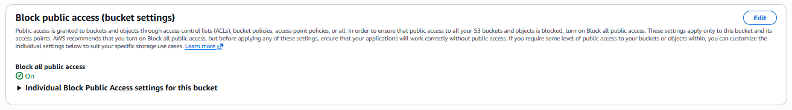
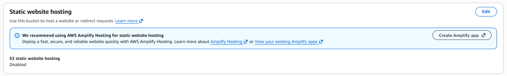

#### <b>1-2. Buy domain from AWS Route 53</b>

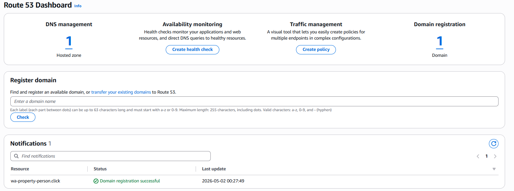

#### <b>1-3. Create CloudFront Distribution</b>

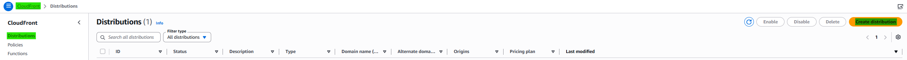

###### Link the Route 53 Domain
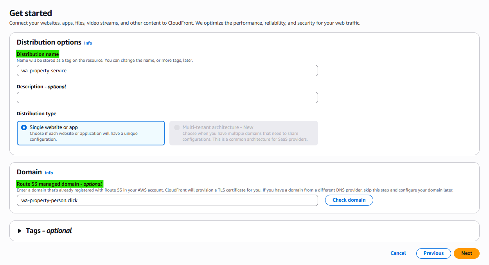

###### Link the S3 Domain
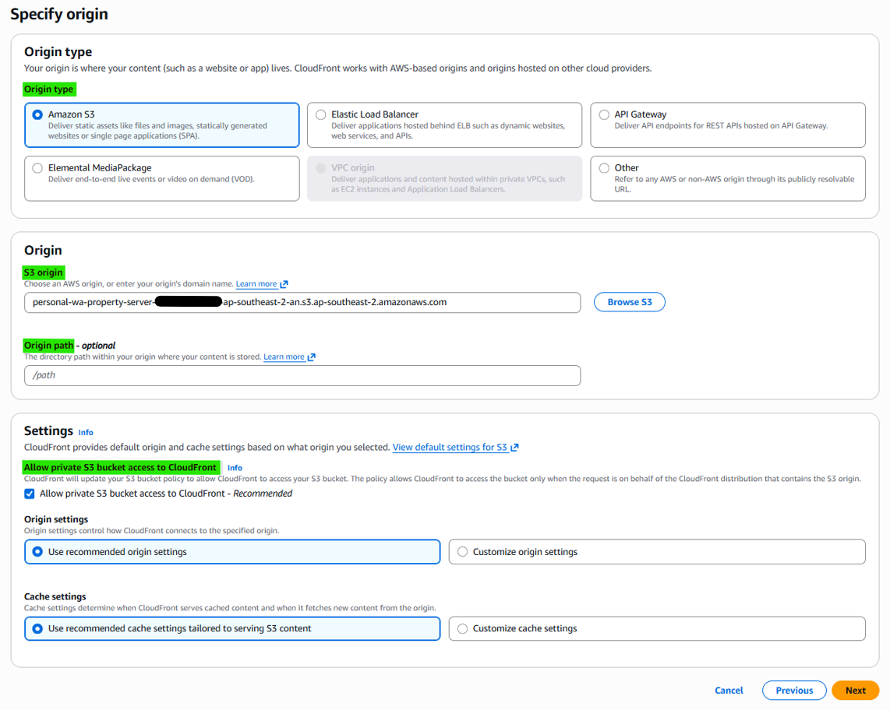

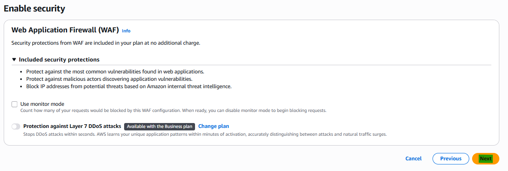

###### Create certificate
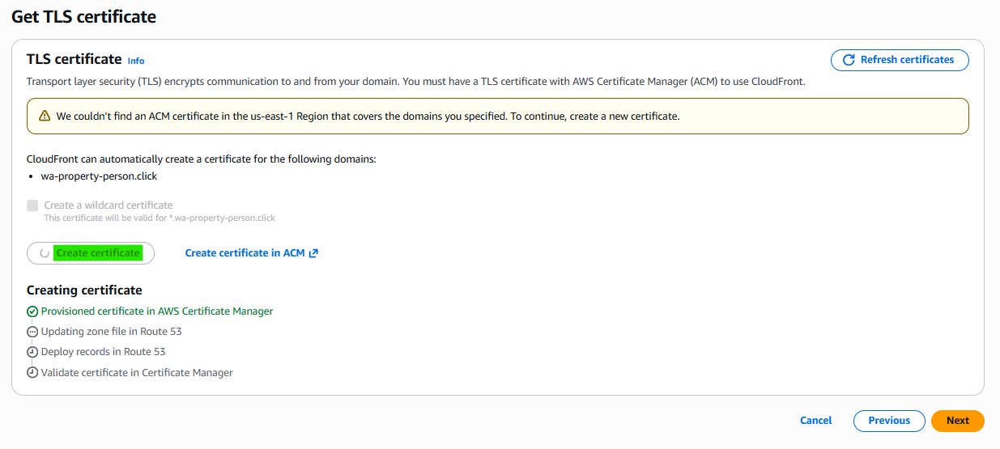

The certification is managed from just N. Virginia (us-east-1), So even though you create the certificate, it'll regist on N. Virginia region.

#### <b>1-4. Create Hosted zones from Route 53</b>
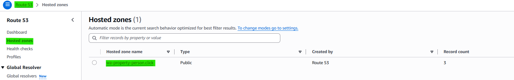
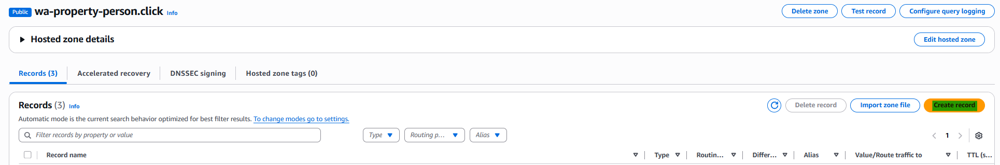
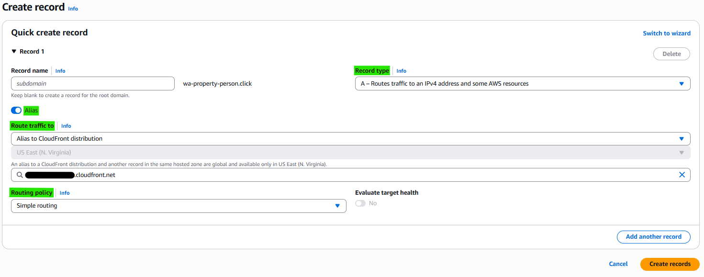

A hosted zone is a container in Amazon Route 53 that stores DNS records for a domain. It defines how traffic to that domain is routed to resources like CloudFront, S3, or servers.

CloudFront handles content delivery and serves requests, but it doesn’t decide where a domain should point. Route 53 acts as DNS, routing the domain to CloudFront, which then retrieves content from S3.

#### <b>1-5. Set S3 Policy</b>

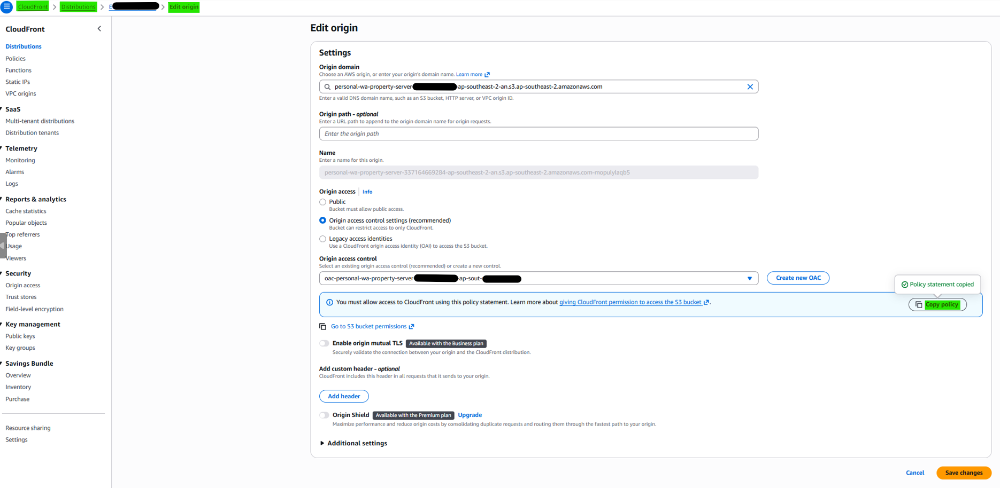
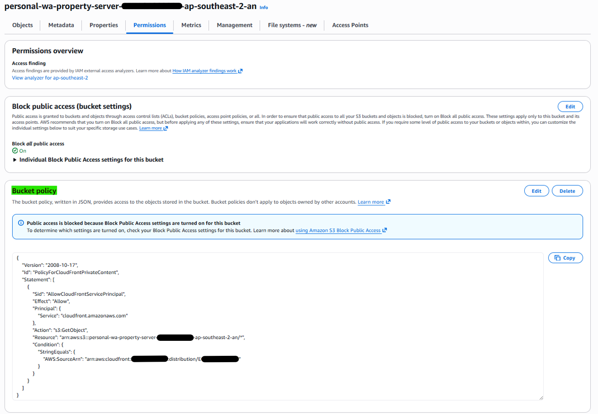

#### <b>1-6. Set default root</b>

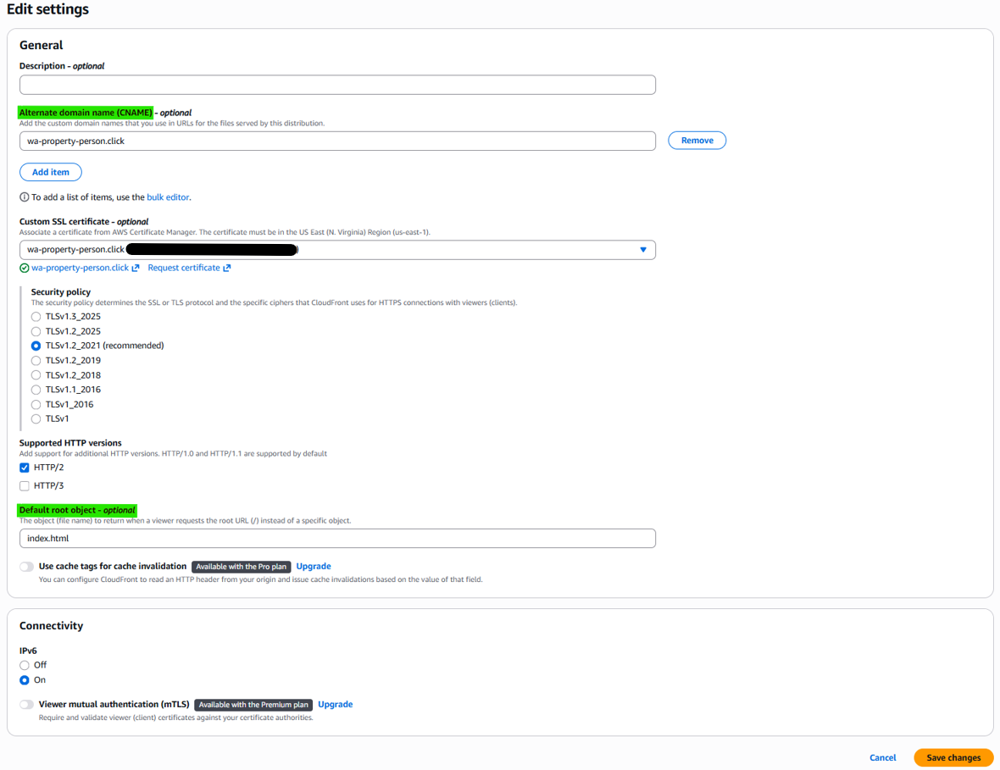

