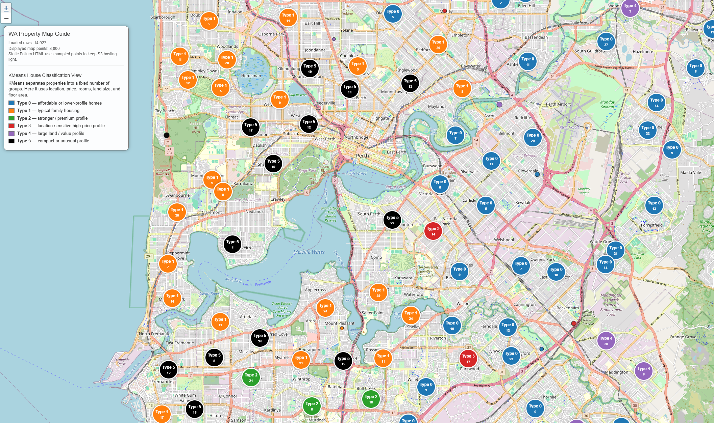

# <b>KMeans</b>

---

### <b>Prerequisites</b>

    KMeans

---

## <b>1. How to implement the real</b>

KMeans is kind of cluster. It should has parameters like variables you selected, count of clusters and numbers of implementation with another initialization.

Before we apply the tool, we have to control variable aspect to scale and so on. Because big number can overwhelm other features. So usually we transform the data with noralization. 

```python
import pandas as pd
from sklearn.cluster import MiniBatchKMeans
from sklearn.preprocessing import StandardScaler

RANDOM_STATE = 42

def add_kmeans_cluster(df, n_clusters=6):
    features = [
        "latitude", "longitude", "price",
        "bedrooms", "bathrooms", "garage",
        "land_area", "floor_area",
    ]

    model_df = df.dropna(subset=features).copy() # Drop rows involved NA

    # Condition check
    if len(model_df) < n_clusters:
        df = df.copy()
        df["house_group"] = 0
        return df

    # scaling feature ~ N(0,1)
    scaler = StandardScaler()
    X_scaled = scaler.fit_transform(model_df[features])

    kmeans = MiniBatchKMeans(
        n_clusters=n_clusters,
        random_state=RANDOM_STATE,
        batch_size=512,
        n_init="auto",
    )

    model_df["house_group"] = kmeans.fit_predict(X_scaled)

    df = df.copy()
    df["house_group"] = 0
    df.loc[model_df.index, "house_group"] = model_df["house_group"].astype(int)

    return df

df = pd.read_csv("data.csv")
df = add_kmeans_cluster(df, n_clusters=6)
```

#### <b>1-1. Data</b>

1. Select features you predicts effect the result
2. Check whether the data is sufficient to calculate KMeans with the given number of clusters.
3. Normalization for similar effect to result

```
[-31.95, 115.86, 750000, 4, 2, 2, 500, 180]
-> [-0.2, 0.5, 1.3, 0.7, -0.1, ...]
```

#### <b>1-2. KMeans</b>

1. Select the number of clusters manually.
2. Select method of init
3. Process as follow:
   1. Initialize 6 centroids using k-means++.
   2. Sample a batch of 512 data points.
   3. For each data point, compute the distance to all 6 centroids.
   4. Assign each point to the nearest centroid.
   5. Update the centroids slightly based on this batch.
   6. Repeat with the next batch.
4. Update Cluster information to data


