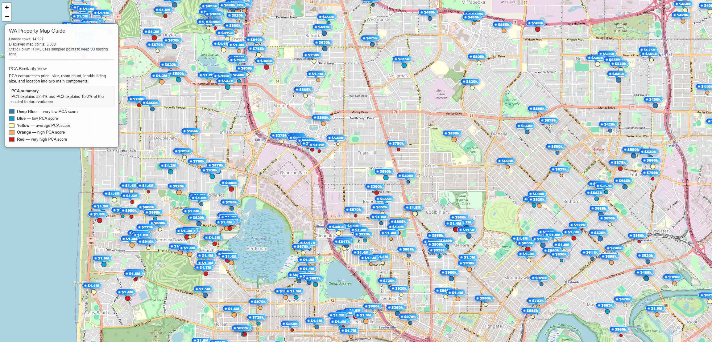

# <b>PCA</b>

---

### <b>Prerequisites</b>

    PCA

---

## <b>1. How to implement the real</b>

PCA transform the original diemension to reduced dimension that make high variance features. So there's no interpretable elements when it comes to transformation. We just get the axis of new dimension and try to cluster with manual division or interpret by ourselves.

But sometimes we can interpret the new coordination on PCA dimension with tendency. It is absolutely subjective however it is useful.

```python
import pandas as pd
import numpy as np
from sklearn.preprocessing import StandardScaler
from sklearn.decomposition import PCA

def add_pca_features(df):
    features = [
        "price", "bedrooms", "bathrooms", "garage",
        "land_area", "floor_area", "latitude", "longitude",
    ]

    model_df = df.dropna(subset=features).copy() # Drop rows involved NA

    # create result space
    df = df.copy()
    df["pca1"] = np.nan
    df["pca2"] = np.nan
    df["pca_score"] = np.nan

    if len(model_df) < 10:
        return df, {"explained_variance": []}

    # scaling feature ~ N(0,1)
    scaler = StandardScaler()
    X_scaled = scaler.fit_transform(model_df[features])

    pca = PCA(n_components=2)
    X_pca = pca.fit_transform(X_scaled)

    model_df["pca1"] = X_pca[:, 0]
    model_df["pca2"] = X_pca[:, 1]
    model_df["pca_score"] = model_df["pca1"] + model_df["pca2"]

    df.loc[model_df.index, ["pca1", "pca2", "pca_score"]] = model_df[["pca1", "pca2", "pca_score"]]

    return df, {
        "explained_variance": [float(v) for v in pca.explained_variance_ratio_],
        "features": features,
    }

df = pd.read_csv("data.csv")
df, pca_metrics = add_pca_features(df)
```

#### <b>1-1. Data</b>

1. Select features you predicts effect the result
2. Check whether the data is sufficient to calculate KMeans with the given number of clusters.
3. Normalization for similar effect to result

```
[-31.95, 115.86, 750000, 4, 2, 2, 500, 180]
-> [-0.2, 0.5, 1.3, 0.7, -0.1, ...]
```

#### <b>1-2. PCA</b>

1. Select the size of dimension manually.
2. Process as follow:
   1. calcuate covariance of features.
   2. calcuate eigenvalue and vector.
   3. select the eigenvalue starting from the largest and select that eigenvector
   4. dot product between eigenvector and normalized data
3. Get new coordination


#### <b>1.3 Try to interpret</b>



Above image, left side nearby offshore is more higher than right side. Maybe the features (`price`, `bedrooms`, `bathrooms`, `garage`, `land_area`, `floor_area`) are positive relationship that some variable is getting larger, the others are also larger in common.

So we can guess in this case, if the pca value is high meaning is expensive properties than low pca value properties.