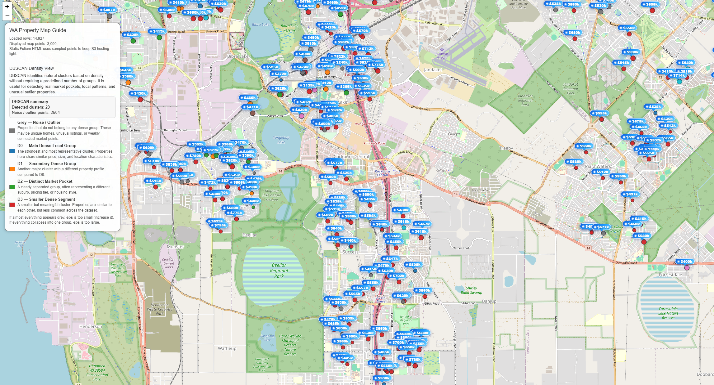

# <b>DBSCAN</b>

---

### <b>Prerequisites</b>

    DBSCAN

---

## <b>1. How to implement the real</b>

DBSCAN do not have manual number of clusters unlike KMeans. DBSCAN find another point from original point. It's extending continuously and sometimes there's no group and sometimes there's so many groups because of automatically being determined.

```python
import pandas as pd
import numpy as np
from sklearn.preprocessing import StandardScaler
from sklearn.cluster import DBSCAN

def add_dbscan_cluster(df, eps=0.85, min_samples=12):
    """
    DBSCAN groups dense areas automatically.

    dbscan_group:
      -1 = noise / outlier
       0,1,2... = density-based clusters

    If most rows become -1, increase eps.
    Example:
      eps=1.0
      eps=1.2
      eps=1.5
    """
    features = [
        "latitude", "longitude", "price",
        "bedrooms", "bathrooms", "garage",
        "land_area", "floor_area",
    ]

    model_df = df.dropna(subset=features).copy() # Drop rows involved NA

    df = df.copy()
    df["dbscan_group"] = -1

    if len(model_df) < min_samples:
        return df

    # scaling feature ~ N(0,1)
    scaler = StandardScaler()
    X_scaled = scaler.fit_transform(model_df[features])

    dbscan = DBSCAN(
        eps=eps,
        min_samples=min_samples,
        n_jobs=-1,
    )

    model_df["dbscan_group"] = dbscan.fit_predict(X_scaled)

    df.loc[model_df.index, "dbscan_group"] = model_df["dbscan_group"].astype(int)

    return df

df = pd.read_csv("data.csv")
df = add_dbscan_cluster(
        df,
        eps=0.85,
        min_samples=12,
    )
```

#### <b>1-1. Data</b>

1. Select features you predicts effect the result
2. Check whether the data is sufficient to calculate KMeans with the given number of clusters.
3. Normalization for similar effect to result

```
[-31.95, 115.86, 750000, 4, 2, 2, 500, 180]
-> [-0.2, 0.5, 1.3, 0.7, -0.1, ...]
```

#### <b>1-2. DBSCAN</b>

1. Set being group allowance standard as minimum samples group has.
2. Set the tolerance between points
3. Process as follow:
   1. select a data point (random)
   2. find all neighboring points within eps distance
   3. If the number of neighbors is larger than minimum samples, mark it as a core point and start a cluster
   4. Expand the cluster by checking neighbors of neighbors
   5. repeat until all points are processed
   6. label remaining points as noise (-1)


#### <b>1.3 Try to interpret</b>



The DBSCAN result shows several dense clusters of properties across different suburbs, along with a large number of noise points. The main cluster (D0) represents the most common group of properties because it contains the largest number of data points within a continuous high-density region. In DBSCAN, clusters are formed based on areas where many points are closely connected, so D0 emerges as the dominant cluster simply because a large portion of the market shares similar characteristics in terms of location, price, and property features.

Other clusters (D1, D2, D3) represent smaller but still meaningful segments of the market, likely corresponding to specific neighborhoods or distinct property profiles. A significant number of properties are labeled as noise (-1), meaning they do not belong to any dense group. These are typically outliers, such as uniquely priced homes, uncommon property types, or houses located in more isolated areas.

Overall, this result suggests that the housing market is largely centered around a dominant, typical property group (D0), while also containing several smaller sub-markets and many irregular or less common properties.