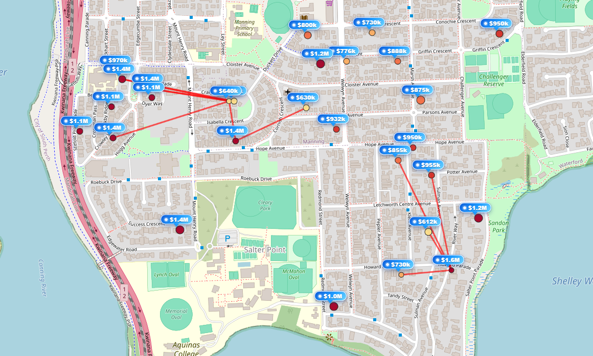

# <b>BallTree</b>

---

### <b>Prerequisites</b>

    BallTree

---

## <b>1. How to implement the real</b>

DBSCAN do not have manual number of clusters unlike KMeans. DBSCAN find another point from original point. It's extending continuously and sometimes there's no group and sometimes there's so many groups because of automatically being determined.

```python
import pandas as pd
import numpy as np
from sklearn.neighbors import BallTree

MAX_GAP_PAIRS = 200

def add_local_price_gap_zones(df, radius_m=500, min_price_gap=250000, max_pairs=MAX_GAP_PAIRS):

    # Drop rows involved NA
    work_df = df.dropna(subset=["latitude", "longitude", "price"]).copy()

    if work_df.empty:
        df["price_gap_zone"] = False
        return df, []

    coords_rad = np.radians(work_df[["latitude", "longitude"]].to_numpy())
    prices = work_df["price"].to_numpy()

    tree = BallTree(coords_rad, metric="haversine")

    earth_radius_m = 6371000
    radius_rad = radius_m / earth_radius_m

    neighbors = tree.query_radius(coords_rad, r=radius_rad)

    gap_pairs = []
    seen = set()

    for i, neighbor_indices in enumerate(neighbors):
        for j in neighbor_indices:
            if i == j:
                continue

            pair_key = tuple(sorted((i, j)))
            if pair_key in seen:
                continue

            seen.add(pair_key)

            price_gap = abs(float(prices[i]) - float(prices[j]))

            if price_gap >= min_price_gap:
                row_i = work_df.iloc[i]
                row_j = work_df.iloc[j]

                gap_pairs.append({
                    "i_index": row_i.name,
                    "j_index": row_j.name,
                    "lat1": row_i["latitude"],
                    "lon1": row_i["longitude"],
                    "lat2": row_j["latitude"],
                    "lon2": row_j["longitude"],
                    "price1": float(row_i["price"]),
                    "price2": float(row_j["price"]),
                    "gap": price_gap,
                })

    gap_pairs = sorted(gap_pairs, key=lambda x: x["gap"], reverse=True)[:max_pairs]

    df = df.copy()
    df["price_gap_zone"] = False

    for pair in gap_pairs:
        df.loc[pair["i_index"], "price_gap_zone"] = True
        df.loc[pair["j_index"], "price_gap_zone"] = True

    return df, gap_pairs


df = pd.read_csv("data.csv")
df_map, gap_pairs = add_local_price_gap_zones(df)
```

#### <b>1-1. Data</b>

1. Select independent and dependent features you wanna check
2. Check whether the data is sufficient to calculate BallTree.

#### <b>1-2. BallTree</b>

1. Set the tolerance between points
2. Process as follow:
   1. Build a spatial index (tree)
      1. Convert coordinates into a suitable mertric space
      2. Recursively split the dataset into smaller groups
      3. Each node represents a "ball" (center + radius) that contains a subset of points
      4. Continue splitting until leaf nodes conatin a small number of points
   2. Find
      1. Start froom the root node
      2. Check distance betwen query point and noe region
      3. Prune irrelevant nodes
      4. Traverse relevant child nodes
      5. Reach leaf nodes
      6. REturn nighbors


#### <b>1.3 In real</b>



## <b>2. How to work Balltree</b>

BallTree is a spatial data structure used to efficiently find nearby points.
Instead of comparing every point with every other point, it groups points into regions (balls) and skips irrelevant areas during search.

Complexity Comparison:

```
Naive search:   O(N²)
BallTree:       O(N log N)
```

#### <b>2-1. Build Process (Tree Construction)</b>

BallTree splits the dataset recursively using two distant points (pivots).

#### Example Data

```
Index : Position
0 : 1
1 : 2
2 : 3
3 : 4
4 : 5

5 : 20
6 : 21
7 : 22
8 : 23

9 : 50
```

We can visually see: (ideal)

```
[1~5]       [20~23]       [50]
Cluster A   Cluster B     Outlier
```

##### Step 1: Select initial pivot

Pick any point randomly.

```
A = 3
```

##### Step 2: Find a far point

Find the point farthest from A:

```
B = 50
```

##### Step 3: Find another far point

Find the point farthest from B:

```
C = 1
```

Now we use (B, C) as pivots: (Choice the furthest distance between A,B and C)

```
Pivot1 = 50
Pivot2 = 1
```

##### Step 4: Split data into two groups

Assign each point to the closer pivot:

```
Left  (closer to 1):  [1,2,3,4,5,20]
Right (closer to 50): [21,22,23,50]
```

##### Step 5: Recursively split

Repeat the same process:

```
Left:
  Pivot → (1,20)
  → [1,2,3,4,5] | [20]

Right:
  Pivot → (21,50)
  → [21,22,23] | [50]
```

##### Final Tree Structure

```
             Root
           /      \
   [1,2,3,4,5,20]   [21,22,23,50]
      /      \           /      \
 [1~5]      [20]   [21~23]     [50]
```

Each node represents a "ball" (center + radius).

#### <b>2-2. Query Process (Finding Neighbors)</b>

```
Find all points within distance = 3 from x = 2
```

##### Step 1: Start from root

Check both child nodes.

##### Step 2: Check left node

```
Center ≈ 3
distance(2, 3) = 1 → inside range
→ explore this node
```

##### Step 3: Check right node

```
Center ≈ 30
distance(2, 30) = 28 → too far
→ prune (skip entire node)
```

Important:

```
Points [20,21,22,23,50] are never checked individually
```

##### Step 4: Traverse leaf nodes

Check only relevant points:

```
distance(2,1) = 1 → include
distance(2,2) = 0 → include
distance(2,3) = 1 → include
distance(2,4) = 2 → include
distance(2,5) = 3 → include
```

##### Final Result

```
Neighbors = [1,2,3,4,5]
```
