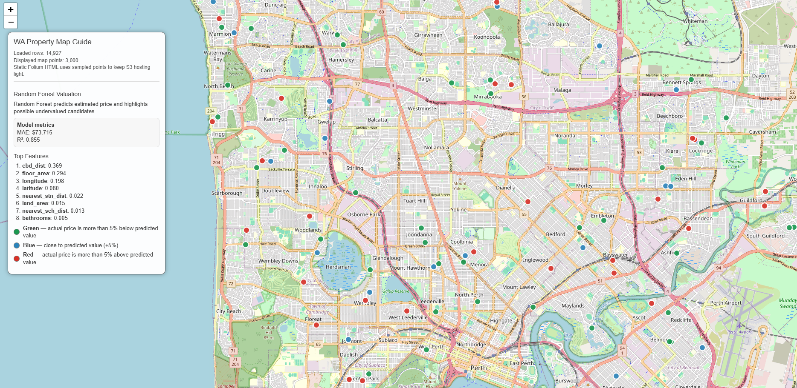

# <b>Isolation Forest</b>

---

### <b>Prerequisites</b>

    Isolation Forest

---

## <b>1. How to implement the real</b>

Isolation Forest is similar model with random forest. It is ensembling model and the main difference is where is focused when we inference.

This model main idea is if the data is isolation or anomal thing, the depth of tree about data on the decision tree is low than others. Because the unusal data is easily split by standard.

```python
import pandas as pd
import numpy as np

from sklearn.ensemble import IsolationForest
from sklearn.preprocessing import StandardScaler
from sklearn.neighbors import BallTree

RANDOM_STATE = 42


def add_isolation_forest(
    df,
    contamination=0.03,
    radius_m=1500,
    min_neighbors=10,
    cheap_threshold=-0.15,
    expensive_threshold=0.15,
):
    df = df.copy()

    df["isolation_flag"] = 1
    df["isolation_score"] = np.nan
    df["price_per_sqm"] = np.nan
    df["local_median_price"] = np.nan
    df["local_median_price_per_sqm"] = np.nan
    df["price_to_local_median_pct"] = np.nan
    df["price_per_sqm_to_local_median_pct"] = np.nan
    df["price_to_suburb_median_pct"] = np.nan
    df["price_per_sqm_to_suburb_median_pct"] = np.nan
    df["local_neighbor_count"] = 0
    df["local_price_anomaly_type"] = "normal"

    required = [
        "price",
        "land_area",
        "latitude",
        "longitude",
        "bedrooms",
        "bathrooms",
        "garage",
        "floor_area",
    ]

    # Select data without NA
    model_df = df.dropna(subset=required).copy()
    model_df = model_df[
        (model_df["price"] > 0) &
        (model_df["land_area"] > 0)
    ].copy()

    if len(model_df) < 50:
        return df

    # Preprocessing
    model_df["price_per_sqm"] = model_df["price"] / model_df["land_area"]

    if "suburb" in model_df.columns:
        suburb_price_median = model_df.groupby("suburb")["price"].transform("median")
        suburb_ppsqm_median = model_df.groupby("suburb")["price_per_sqm"].transform("median")
    else:
        suburb_price_median = pd.Series(
            np.nanmedian(model_df["price"]),
            index=model_df.index,
        )
        suburb_ppsqm_median = pd.Series(
            np.nanmedian(model_df["price_per_sqm"]),
            index=model_df.index,
        )

    model_df["price_to_suburb_median_pct"] = (
        model_df["price"] - suburb_price_median
    ) / suburb_price_median.replace(0, np.nan)

    model_df["price_per_sqm_to_suburb_median_pct"] = (
        model_df["price_per_sqm"] - suburb_ppsqm_median
    ) / suburb_ppsqm_median.replace(0, np.nan)

    coords_rad = np.radians(model_df[["latitude", "longitude"]].to_numpy())
    prices = model_df["price"].to_numpy(dtype=float)
    ppsqm = model_df["price_per_sqm"].to_numpy(dtype=float)

    # Build BallTree
    tree = BallTree(coords_rad, metric="haversine")
    earth_radius_m = 6371000
    radius_rad = radius_m / earth_radius_m
    neighbors = tree.query_radius(coords_rad, r=radius_rad)

    local_price_medians = np.full(len(model_df), np.nan)
    local_ppsqm_medians = np.full(len(model_df), np.nan)
    local_neighbor_counts = np.zeros(len(model_df), dtype=int)

    for i, neighbor_idx in enumerate(neighbors):
        neighbor_idx = neighbor_idx[neighbor_idx != i]
        local_neighbor_counts[i] = len(neighbor_idx)

        if len(neighbor_idx) >= min_neighbors:
            local_price_medians[i] = np.median(prices[neighbor_idx])
            local_ppsqm_medians[i] = np.median(ppsqm[neighbor_idx])

    model_df["local_neighbor_count"] = local_neighbor_counts
    model_df["local_median_price"] = local_price_medians
    model_df["local_median_price_per_sqm"] = local_ppsqm_medians

    model_df["price_to_local_median_pct"] = (
        model_df["price"] - model_df["local_median_price"]
    ) / pd.Series(
        model_df["local_median_price"],
        index=model_df.index,
    ).replace(0, np.nan)

    model_df["price_per_sqm_to_local_median_pct"] = (
        model_df["price_per_sqm"] - model_df["local_median_price_per_sqm"]
    ) / pd.Series(
        model_df["local_median_price_per_sqm"],
        index=model_df.index,
    ).replace(0, np.nan)

    features = [
        "price_to_local_median_pct",
        "price_per_sqm_to_local_median_pct",
        "price_to_suburb_median_pct",
        "price_per_sqm_to_suburb_median_pct",
    ]

    before_drop_df = model_df.copy()

    model_df = (
        model_df
        .replace([np.inf, -np.inf], np.nan)
        .dropna(subset=features)
        .copy()
    )

    useful_cols = [
        "price_per_sqm",
        "local_median_price",
        "local_median_price_per_sqm",
        "price_to_local_median_pct",
        "price_per_sqm_to_local_median_pct",
        "price_to_suburb_median_pct",
        "price_per_sqm_to_suburb_median_pct",
        "local_neighbor_count",
    ]

    df.loc[before_drop_df.index, useful_cols] = before_drop_df[useful_cols]

    if len(model_df) < 50:
        return df

    # Normalization
    scaler = StandardScaler()
    X_scaled = scaler.fit_transform(model_df[features])

    # Model
    iso = IsolationForest(
        n_estimators=300,
        contamination=contamination,
        random_state=RANDOM_STATE,
        n_jobs=-1,
    )

    model_df["isolation_flag"] = iso.fit_predict(X_scaled)
    model_df["isolation_score"] = iso.decision_function(X_scaled)

    local_gap = model_df["price_to_local_median_pct"]
    pp_gap = model_df["price_per_sqm_to_local_median_pct"]

    anomaly_mask = model_df["isolation_flag"] == -1

    cheap_mask = anomaly_mask & (
        (local_gap <= cheap_threshold) |
        (pp_gap <= cheap_threshold)
    )

    expensive_mask = anomaly_mask & (
        (local_gap >= expensive_threshold) |
        (pp_gap >= expensive_threshold)
    )

    model_df["local_price_anomaly_type"] = "normal"
    model_df.loc[anomaly_mask, "local_price_anomaly_type"] = "mixed_local_anomaly"
    model_df.loc[cheap_mask, "local_price_anomaly_type"] = "cheap_local_anomaly"
    model_df.loc[expensive_mask, "local_price_anomaly_type"] = "expensive_local_anomaly"

    both_mask = cheap_mask & expensive_mask
    model_df.loc[both_mask, "local_price_anomaly_type"] = "mixed_local_anomaly"

    copy_cols = [
        "isolation_flag",
        "isolation_score",
        "price_per_sqm",
        "local_median_price",
        "local_median_price_per_sqm",
        "price_to_local_median_pct",
        "price_per_sqm_to_local_median_pct",
        "price_to_suburb_median_pct",
        "price_per_sqm_to_suburb_median_pct",
        "local_neighbor_count",
        "local_price_anomaly_type",
    ]

    df.loc[model_df.index, copy_cols] = model_df[copy_cols]
    df["isolation_flag"] = df["isolation_flag"].astype(int)

    return df


df = pd.read_csv("data.csv")
df = add_isolation_forest(
    df,
    contamination=0.03,
    radius_m=1500,
    min_neighbors=10,
    cheap_threshold=-0.15,
    expensive_threshold=0.15,
)

isolation_summary = {
    "anomaly_count": int((df["isolation_flag"] == -1).sum()),
    "normal_count": int((df["isolation_flag"] == 1).sum()),
    "cheap_anomaly_count": int((df["local_price_anomaly_type"] == "cheap_local_anomaly").sum()),
    "expensive_anomaly_count": int((df["local_price_anomaly_type"] == "expensive_local_anomaly").sum()),
    "mixed_anomaly_count": int((df["local_price_anomaly_type"] == "mixed_local_anomaly").sum()),
    "radius_m": 1500,
}

print(isolation_summary)
```

#### <b>1-1. Data</b>

1. Set parameters

   * Number of estimators (number of trees)
   * Subsample size (data used per tree)
   * Contamination (expected anomaly ratio)
   * Maximum tree depth

2. Process as follows:
   1. Create an Isolation Tree
      1. Randomly select a subset of data (no replacement)
      2. At each node:
         * Randomly select **one feature**
         * Randomly choose a **split value (min ~ max)**
         * Split data based on this condition

      3. Repeat recursively until:
         * Only one sample remains, or
         * Maximum depth is reached

   2. Repeat tree creation

      * Build multiple trees independently using different random samples

   3. Compute path length

      * For each data point, measure how many splits are needed to isolate it

   4. Aggregate results

      * Compute average path length across all trees

   5. Determine anomaly

      * Short path → anomaly (isolated quickly)
      * Long path → normal

   6. Final output

      * Anomaly → -1
      * Normal → 1


#### <b>1.3 In real</b>



## <b>2. How to work Random Forest</b>

Isolation Forest is an unsupervised anomaly detection model.

The core idea is simple:

```
Anomalies are easier to isolate than normal data.
```

In other words:

```
Normal data → needs many splits to separate
Anomaly data → separated quickly with only a few splits
```

#### Example Data

Assume we have property data:

```
A: price = 500k, area = 450, cbd_dist = 12
B: price = 520k, area = 470, cbd_dist = 11
C: price = 550k, area = 500, cbd_dist = 10
D: price = 530k, area = 480, cbd_dist = 13
E: price = 1500k, area = 460, cbd_dist = 12
```

Visually:

```
A, B, C, D → normal similar houses
E          → possible anomaly
```

#### <b>2-1. Tree Construction</b>

Isolation Forest builds many random isolation trees.

Each tree is trained by:

```
1. Randomly sampling data
2. Randomly selecting a feature
3. Randomly choosing a split value
4. Repeating until each point is isolated
```

Unlike Random Forest:

```
Random Forest → chooses best split using MSE / Gini
Isolation Forest → chooses random split
```
\
##### > Tree 1

##### Step 1: Random Sampling

```
[A, B, C, D, E]
```

##### Step 2: Random Feature Selection

```
Selected feature:
price
```

##### Step 3: Random Split

```
price < 900k
```

##### Step 4: Split Result

```
Left:
A, B, C, D

Right:
E
```

##### Step 5: Isolation Check

```
E is isolated immediately
```

Result:

```
E path length = 1
```

##### > Tree 2

##### Step 1: Random Sampling

```
[A, B, C, D, E]
```

##### Step 2: Random Feature Selection

```
Selected feature:
area
```

##### Step 3: Random Split

```
area < 475
```

##### Step 4: Split Result

```
Left:
A, B, E

Right:
C, D
```

##### Step 5: Continue Splitting Left Group

Randomly select feature:

```
price
```

Random split:

```
price < 1000k
```

Split result:

```
Left:
A, B

Right:
E
```

##### Step 6: Isolation Check

```
E is isolated
```

Result:

```
E path length = 2
```

##### > Tree 3

##### Step 1: Random Sampling

```
[A, B, C, D, E]
```

##### Step 2: Random Feature Selection

```
Selected feature:
cbd_dist
```

##### Step 3: Random Split

```
cbd_dist < 11.5
```

##### Step 4: Split Result

```
Left:
B, C

Right:
A, D, E
```

##### Step 5: Continue Splitting Right Group

Randomly select feature:

```
price
```

Random split:

```
price < 800k
```

Split result:

```
Left:
A, D

Right:
E
```

##### Step 6: Isolation Check

```
E is isolated
```

Result:

```
E path length = 2
```

#### <b>2-2. Path Length Concept</b>

Path length means:

```
How many splits are needed to isolate one data point?
```

Example:

```
A path length = 5
B path length = 6
C path length = 5
D path length = 6
E path length = 1 or 2
```

Interpretation:

```
Long path length  → normal
Short path length → anomaly
```

#### <b>2-3. Prediction</b>

Now predict anomaly for:

```
E: price = 1500k, area = 460, cbd_dist = 12
```

##### Step 1: Run all trees

```
Tree 1 → path length = 1
Tree 2 → path length = 2
Tree 3 → path length = 2
```

##### Step 2: Average path length

```
Average path length = (1 + 2 + 2) / 3 = 1.67
```

##### Step 3: Convert to anomaly score

```
Short average path length
= high anomaly score
```

##### Step 4: Final decision

If contamination is:

```
contamination = 0.05
```

Then the model selects:

```
Top 5% most abnormal points
```

Final result:

```
E → anomaly
```

In scikit-learn:

```
isolation_flag = -1
```

#### <b>2-4. Normal Data Example</b>

Predict anomaly for:

```
B: price = 520k, area = 470, cbd_dist = 11
```

##### Step 1: Run all trees

```
Tree 1 → path length = 5
Tree 2 → path length = 6
Tree 3 → path length = 5
```

##### Step 2: Average path length

```
Average path length = (5 + 6 + 5) / 3 = 5.33
```

##### Step 3: Interpretation

```
B needs many splits to be isolated.
```

Final result:

```
B → normal
```

In scikit-learn:

```
isolation_flag = 1
```

## <b>3. Key Difference from Random Forest</b>

```
Random Forest:
- supervised learning
- needs target y
- chooses best split
- predicts price or class

Isolation Forest:
- unsupervised learning
- does not need target y
- chooses random split
- detects anomaly
```
