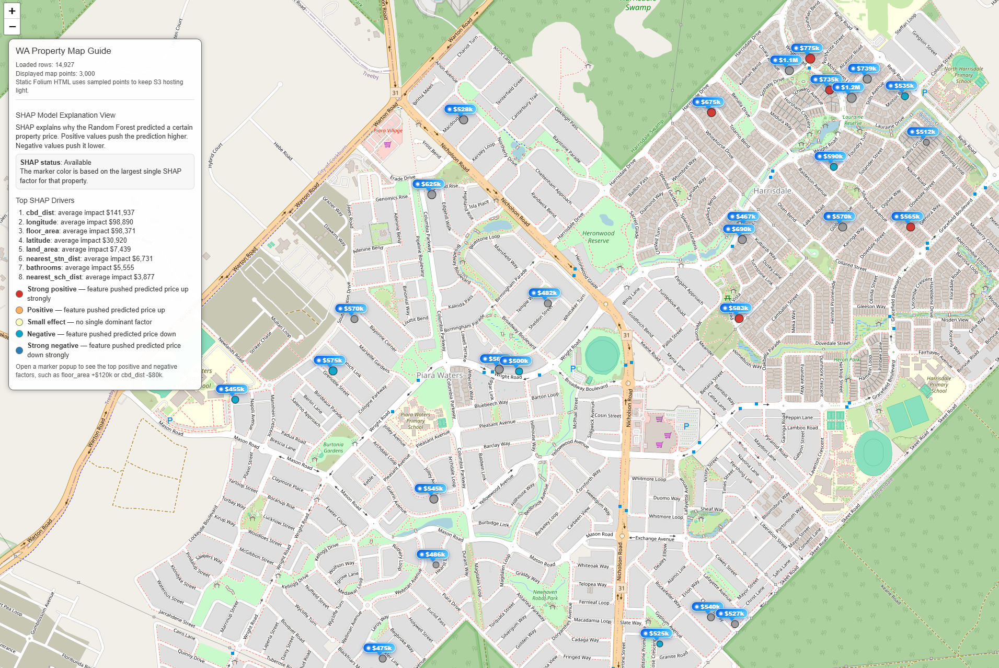

# <b>SHAP</b>

---

### <b>Prerequisites</b>

    SHAP

---

## <b>1. How to implement the real</b>

SHAP is a model interpretation algorithm.

The main idea is:

```text
Measure how much each feature contributed
to the final prediction.
```

In other words:

```text
Base prediction
+ feature contributions
= final prediction
```

```python
from sklearn.ensemble import RandomForestRegressor
import shap
import numpy as np
import pandas as pd

model_df = pd.DataFrame({
    "bedrooms": [3, 4, 3, 5, 4],
    "bathrooms": [2, 2, 1, 3, 2],
    "land_area": [500, 650, 420, 800, 700],
    "floor_area": [180, 240, 130, 320, 260],
    "cbd_dist": [12, 8, 20, 6, 10],
    "nearest_stn_dist": [1.2, 0.8, 2.5, 0.6, 1.0],
    "price": [720000, 950000, 560000, 1250000, 1050000],
})

RANDOM_STATE = 42
MAX_SHAP_EXPLANATION_ROWS = 1000

def money_effect(value):
    sign = "+" if value >= 0 else "-"
    return f"{sign}${abs(value):,.0f}"

available_features = [
    "bedrooms",
    "bathrooms",
    "land_area",
    "floor_area",
    "cbd_dist",
    "nearest_stn_dist",
]

X = model_df[available_features]
y = model_df["price"]

# Random Forest Training
model = RandomForestRegressor(
    n_estimators=100,
    max_depth=5,
    random_state=RANDOM_STATE,
)

model.fit(X, y)
model_df["predicted_price"] = model.predict(X)

#-----------------------------------------------------#

if len(model_df) > MAX_SHAP_EXPLANATION_ROWS:
    shap_index = model_df.sample(
        n=MAX_SHAP_EXPLANATION_ROWS,
        random_state=RANDOM_STATE,
    ).index
else:
    shap_index = model_df.index

X_shap = X.loc[shap_index]

explainer = shap.TreeExplainer(model) # SHAP for tree structure
shap_values = explainer.shap_values(X_shap) # features effect using SHAP
{
    if isinstance(shap_values, list):
        shap_values = shap_values[0]

    shap_values = np.asarray(shap_values)
}

mean_abs = np.abs(shap_values).mean(axis=0)

base_value = explainer.expected_value # base value of SHAP 
{
    if isinstance(base_value, (list, np.ndarray)):
        base_value = float(np.asarray(base_value).ravel()[0])
    else:
        base_value = float(base_value)
}

shap_summary_features = sorted(
    zip(available_features, mean_abs),
    key=lambda x: x[1],
    reverse=True,
)[:8]

shap_summary_features = [
    (name, float(value))
    for name, value in shap_summary_features
]

shap_result = pd.DataFrame(index=shap_index)

shap_result["shap_base_value"] = base_value
shap_result["shap_total_effect"] = shap_values.sum(axis=1)
shap_result["shap_top_positive"] = "N/A"
shap_result["shap_top_negative"] = "N/A"
shap_result["shap_explanation"] = "N/A"
shap_result["shap_dominant_feature"] = "N/A"
shap_result["shap_dominant_value"] = np.nan

for row_pos, idx in enumerate(shap_index):

    vals = shap_values[row_pos]

    pairs = list(zip(available_features, vals))

    pos = sorted(
        [p for p in pairs if p[1] > 0],
        key=lambda x: x[1],
        reverse=True,
    )[:3]

    neg = sorted(
        [p for p in pairs if p[1] < 0],
        key=lambda x: x[1],
    )[:3]

    dominant = max(
        pairs,
        key=lambda x: abs(x[1]),
    )

    pos_text = (
        "; ".join(
            [f"{name}: {money_effect(value)}" for name, value in pos]
        )
        if pos
        else "None"
    )

    neg_text = (
        "; ".join(
            [f"{name}: {money_effect(value)}" for name, value in neg]
        )
        if neg
        else "None"
    )

    explanation = (
        f"Base price: ${base_value:,.0f}<br>"
        f"Positive factors: {pos_text}<br>"
        f"Negative factors: {neg_text}"
    )

    shap_result.loc[idx, "shap_top_positive"] = pos_text
    shap_result.loc[idx, "shap_top_negative"] = neg_text
    shap_result.loc[idx, "shap_explanation"] = explanation
    shap_result.loc[idx, "shap_dominant_feature"] = dominant[0]
    shap_result.loc[idx, "shap_dominant_value"] = float(dominant[1])

shap_cols = [
    "shap_base_value",
    "shap_total_effect",
    "shap_top_positive",
    "shap_top_negative",
    "shap_explanation",
    "shap_dominant_feature",
    "shap_dominant_value",
]

model_df.loc[shap_result.index, shap_cols] = shap_result[shap_cols]
```

#### <b>1-1. Data</b>
1. Set parameters

   * Trained tree model (Random Forest / XGBoost / LightGBM)
   * Input data to explain
   * Feature list
   * Background / base prediction
   * Maximum rows for SHAP calculation

#### <b>1-2. SHAP Model</b>

2. Process as follows:

   1. Create a TreeExplainer

      1. Pass the trained tree model to SHAP

         ```python
         explainer = shap.TreeExplainer(model)
         ```

      2. SHAP reads the tree structure:

         * Split features
         * Split thresholds
         * Leaf prediction values
         * Tree paths

   2. Select data to explain

      * If the dataset is large, sample only part of it
      * This reduces computation time

      ```python
      X_shap = X.loc[shap_index]
      ```

   3. Compute base value

      * Base value means the model's average expected prediction
      * It is the starting point before feature effects are added

      ```python
      base_value = explainer.expected_value
      ```

      Example:

      ```text
      Base value = 650k
      ```

   4. Compute SHAP values

      * For each row, SHAP calculates how much each feature moves the prediction
      * Positive value → pushes prediction higher
      * Negative value → pushes prediction lower

      ```python
      shap_values = explainer.shap_values(X_shap)
      ```

   5. Explain one prediction

      Example:

      ```text
      Base value = 650k

      floor_area = +150k
      cbd_dist   = +100k

      Final prediction = 900k
      ```

      Calculation:

      ```text
      650k + 150k + 100k = 900k
      ```

   6. Repeat for all rows

      * For every house, SHAP calculates feature contribution values

      Example:

      ```text
      House A:
      floor_area = +120k
      cbd_dist   = +80k

      House B:
      floor_area = -60k
      cbd_dist   = -100k
      ```

   7. Aggregate feature importance

      * Compute average absolute SHAP value for each feature
      * Larger average absolute value means stronger overall model influence

      ```python
      mean_abs = np.abs(shap_values).mean(axis=0)
      ```

      Example:

      ```text
      cbd_dist   = 140k average impact
      floor_area = 120k average impact
      bathrooms  = 20k average impact
      ```

   8. Determine dominant feature

      * For each row, find the feature with the largest absolute SHAP value

      ```python
      dominant = max(pairs, key=lambda x: abs(x[1]))
      ```

      Example:

      ```text
      floor_area = +150k
      cbd_dist   = +100k

      Dominant feature = floor_area
      ```

   9. Final output

      * Base value
      * SHAP values for each feature
      * Positive factors
      * Negative factors
      * Dominant feature
      * Feature importance summary

      Example:

      ```text
      Base price: 650k

      Positive factors:
      floor_area: +150k
      cbd_dist: +100k

      Negative factors:
      None

      Final prediction:
      900k
      ```

3. Core rule

   ```text
   Final prediction
   =
   Base value
   +
   Sum of SHAP values
   ```

4. Interpretation

   * Positive SHAP value → feature increased the prediction
   * Negative SHAP value → feature decreased the prediction
   * Large absolute SHAP value → feature had strong influence
   * Small absolute SHAP value → feature had weak influence


#### <b>1.2 In real</b>



## <b>2. How to work Random Forest</b>

#### Example Data

Assume we trained a Random Forest model using:

```text
price
floor_area
cbd_dist
bathrooms
```

We want to predict:

```text
House E:
floor_area = 250
cbd_dist = 8
bathrooms = 2
```

Suppose the Random Forest predicts:

```text
Predicted price = 900k
```

Now SHAP asks:

```text
Why did the model predict 900k?
```

#### <b>2-1. Base Value</b>

SHAP first calculates the average prediction of the model.

Example:

```text
Average house prediction = 650k
```

This becomes:

```text
base_value = 650k
```

Meaning:

```text
Without knowing any feature,
the model predicts around 650k.
```

#### <b>2-2. Tree Contribution Calculation</b>

Suppose one decision tree looks like:

```text
                [floor_area < 200]

                 /             \
              YES               NO
           predict 500k      [cbd_dist < 10]

                              /          \
                           YES            NO
                        predict 900k   predict 700k
```

Our house:

```text
floor_area = 250
cbd_dist = 8
```

##### Step 1

```text
floor_area < 200 ?
```

Result:

```text
250 > 200
→ NO
```

Move right.

##### Step 2

```text
cbd_dist < 10 ?
```

Result:

```text
8 < 10
→ YES
```

Final prediction:

```text
900k
```

#### <b>2-3. SHAP Contribution Idea</b>

SHAP measures:

```text
How much each feature changed the prediction.
```

##### Step 1: Start from base value

```text
650k
```

##### Step 2: Add floor_area effect

Because:

```text
floor_area = 250
```

the model moves prediction upward:

```text
650k → 800k
```

Contribution:

```text
floor_area contribution = +150k
```

##### Step 3: Add cbd_dist effect

Because:

```text
cbd_dist = 8
```

the house is relatively close to CBD.

Prediction changes:

```text
800k → 900k
```

Contribution:

```text
cbd_dist contribution = +100k
```

#### <b>2-4. Final SHAP Values</b>

Final contributions:

| Feature | SHAP Value |
|---|---|
| floor_area | +150k |
| cbd_dist | +100k |

Now verify:

```text
base_value
+ all SHAP values
= final prediction
```

Calculation:

```text
650k
+150k
+100k
=
900k
```

Correct.

#### <b>2-5. Multiple Trees in Random Forest</b>

Random Forest contains many trees.

Example:

```text
120 trees
```

SHAP calculates contributions for:

```text
Tree 1
Tree 2
Tree 3
...
Tree 120
```

Then averages them.

| Tree | floor_area contribution |
|---|---|
| Tree 1 | +150k |
| Tree 2 | +120k |
| Tree 3 | +180k |

Average:

```text
(150 + 120 + 180) / 3
=
150k
```

Final SHAP value:

```text
floor_area = +150k
```

#### <b>2-6. Dominant Feature</b>

The dominant feature is:

```text
Feature with the largest absolute SHAP value.
```

Example:

| Feature | SHAP |
|---|---|
| floor_area | +150k |
| cbd_dist | +100k |
| bathrooms | +20k |

Dominant feature:

```text
floor_area
```

because:

```text
|150k| is the largest effect
```