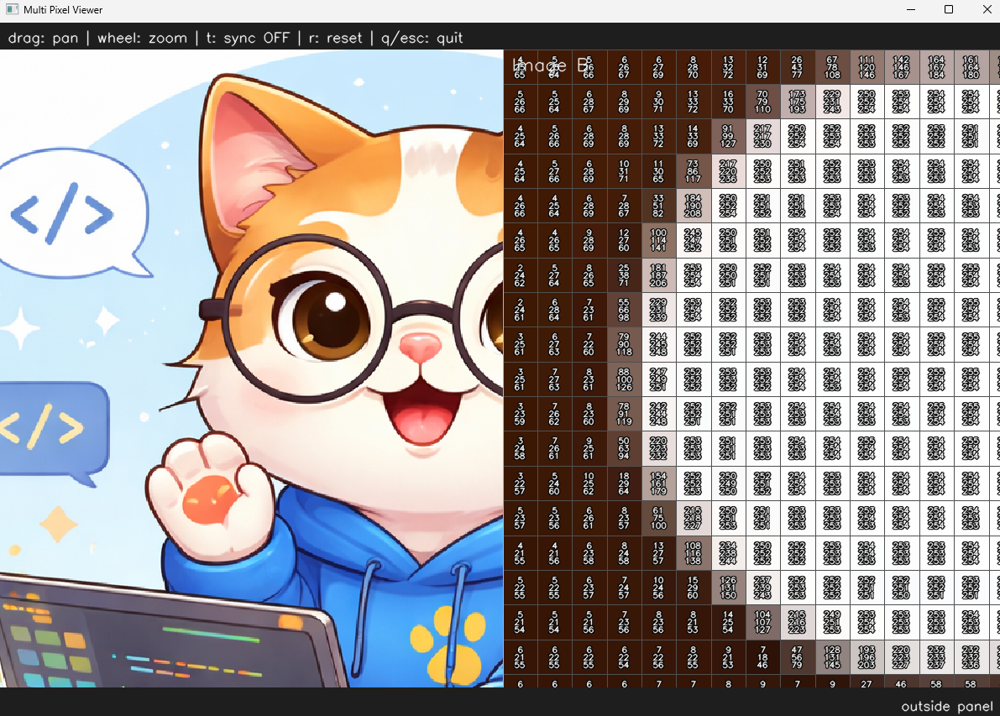

# <b>Image Viewer</b>

---

### <b>Prerequisites</b>

    python
    UI

---

## <b>1. Image Viewer</b>

The vision is related with visualization. When I was developing vision alogithms, the image as tensor is just numeric set. So it is not easy to understand what is wrong or how to solve the relationship between images. So more efficiently developing key is using UI Viewer

Implemented Features as follows:

#### 1. Multi-image viewer
   - Dual panel image comparison viewer
   - Side-by-side synchronized visualization

#### 2. Smooth panning
   - Left mouse drag panning
   - Real-time viewport movement

#### 3. Zoom system
   - Mouse wheel zoom in/out
   - Cursor-centered zoom behavior
   - Adjustable zoom limits

#### 4. Pixel inspection
   - Pixel grid visualization at high zoom levels
   - Per-pixel BGR value display
   - Vertical text layout inside each pixel

#### 5. Dynamic pixel rendering optimization
   - Pixel text rendering enabled only above a zoom threshold
   - Automatic clipping to visible viewport region only
   - Visible pixel count limitation for performance optimization

#### 6. Text readability improvements
   - Center-aligned pixel values
   - White text with black outline for visibility on all backgrounds

#### 7. Runtime synchronization system
   - Independent panel navigation mode
   - Synchronized navigation mode
   - Ctrl+Y runtime sync toggle
   - Active panel based synchronization

#### 8. Status bar UI
   - Bottom-right coordinate display
   - Current pixel BGR value display
   - Zoom level display
   - Synchronization state display

#### 9. Rendering optimization
   - Viewport-based rendering
   - Cropped region processing only
   - INTER_NEAREST scaling for pixel-accurate visualization
   - Reduced unnecessary redraw overhead

#### 10. User interaction controls
    - q / ESC : quit
    - r       : reset view
    - Ctrl+Y  : synchronization toggle
    - Mouse drag : panning
    - Mouse wheel : zoom

