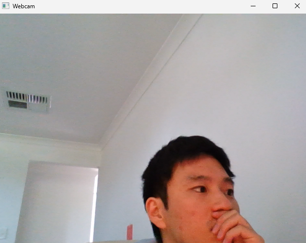

# <b>Video</b>

---

### <b>Prerequisites</b>

    python

---

## <b>1. Video</b>

On the vision field, there has tasks about image or video. Video is just set of images and display or save sequentially.

So What kind of data we use is just depended on what we want to solve and get results.

60 Frames(FPS) is 60 Frames per second. By means that is 60 images showed sequentially every second. So if we want to reduce overhead from video and there's no reason we should use high FPS, just reducing FPS. But Some tasks are need at least 30 FPS like AGV because the gap of 30/60 second can make big issue.


## <b>2. Video Code</b>

```python
import cv2 as cv
import os
import ImageUtils

def videoFromWebcam():
    cap = cv.VideoCapture(0)
    
    if not cap.isOpened():
        exit()
        
    while True:
        ret, frame = cap.read()
        
        if ret:
            cv.imshow('Webcam', frame)
            
        if cv.waitKey(1) == ord('q'):
            break
        
    cap.release()
    cv.destroyAllWindows()

def saveVideo(name, folder = 'output'):
    cap = cv.VideoCapture(0)

    if not cap.isOpened():
        print("Cannot open camera")
        return

    output_path = ImageUtils.getDataPathWithFile(f'{folder}/{name}')

    out = cv.VideoWriter(output_path, 
                         cv.VideoWriter_fourcc(*'XVID'), 
                         20.0, 
                         (640, 480))

    while True:
        ret, frame = cap.read()

        if not ret:
            break

        out.write(frame)
        cv.imshow('Webcam', frame)

        if cv.waitKey(1) & 0xFF == ord('q'):
            break

    cap.release()
    out.release()
    cv.destroyAllWindows()

def videoFromFile(name, folder = 'output'):
    video_path = ImageUtils.getDataPathWithFile(f'{folder}/{name}')
    cap = cv.VideoCapture(video_path)
    
    if not cap.isOpened():
        exit()
        
    while True:
        ret, frame = cap.read()
        
        if ret:
            cv.imshow('Video', frame)
            
        if cv.waitKey(30) == ord('q'):
            break
        
    cap.release()
    cv.destroyAllWindows()
```

```python
import cv2 as cv
import os
import ImageUtils
import VideoUtils
import MultiImageViewer as view

if __name__ == "__main__":
    VideoUtils.videoFromWebcam()
```


