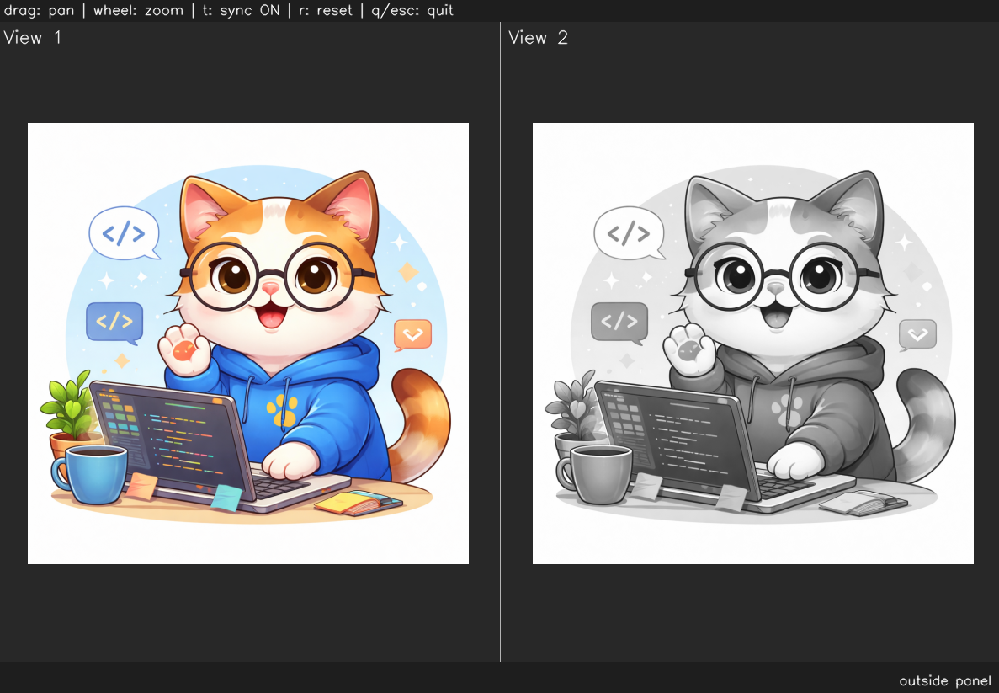
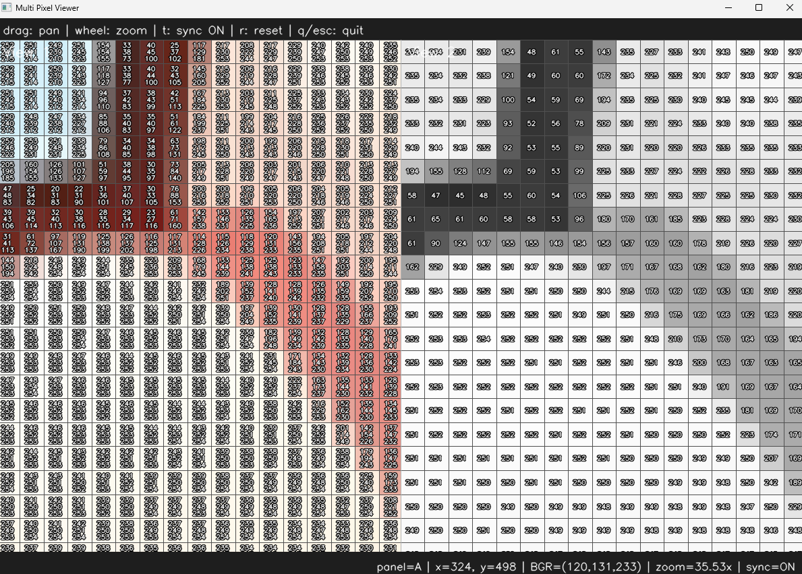

# <b>Image Format</b>

---

### <b>Prerequisites</b>

    python

---

## <b>1. Image Format</b>

Image havs several feature like width, height. And format per pixel has byte types and channels. So we should consider the format before we use. 

On production lines, there need high performance, so they use gray scale but mobile app and photo and so on, are needing the RGB format because there's colorful for customer.

## <b>2. Video Code</b>

```python
def convertColorSpace(img, colorCode = cv.COLOR_BGR2GRAY):
    return cv.cvtColor(img, colorCode)
```

```python
import cv2 as cv
import os
import ImageUtils
import MultiImageViewer as view

if __name__ == "__main__":
    img = ImageUtils.readImage(ImageUtils.getDataPathWithFile("cat.png"))
    img_gray = ImageUtils.convertColorSpace(img, cv.COLOR_BGR2GRAY)
    viewer = view.MultiImageViewer.from_images(img, img_gray, sync_view=False)
    viewer.run()
```



