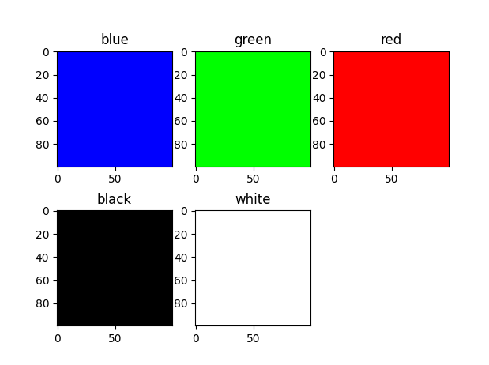
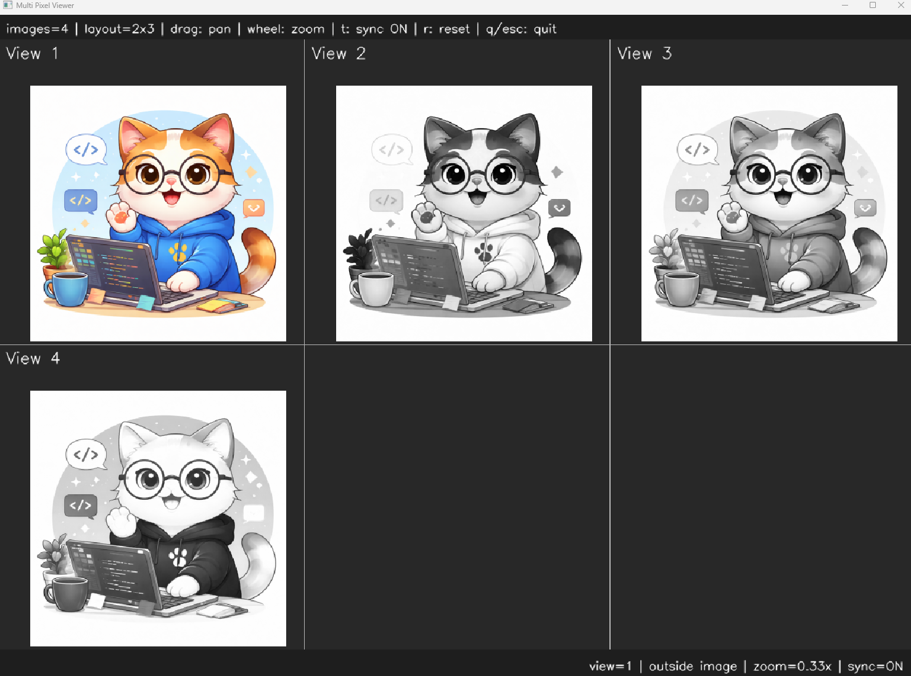

# <b>Channel Integrator and Extractor</b>

---

### <b>Prerequisites</b>

    python

---

## <b>1. Channel Integrator</b>

The channels are different level each channel. So sometimes we combine or extract the channels 

## <b>2. Image Convert Code</b>

#### <b>2-1. Integrator</b>

```python
zeros = np.zeros((100, 100))
ones = np.ones((100, 100))

bImg = cv.merge((zeros, zeros, 255 * ones)) # [B = 255, G = 0, R = 0]
gImg = cv.merge((zeros, 255 * ones, zeros)) # [B = 0, G = 255, R = 0]
rImg = cv.merge((255 * ones, zeros, zeros)) # [B = 0, G = 0, R = 255]

blackImg = cv.merge((zeros, zeros, zeros)) # [B = 0, G = 0, R = 0]
whiteImg = cv.merge((255 * ones, 255 * ones, 255 * ones)) # [B = 255, G = 255, R = 255]
```



#### <b>2-2. Extractor</b>

```python
if __name__ == "__main__":
    img = ImageUtils.readImage(ImageUtils.getDataPathWithFile("cat.png"))
    img_b,img_g,img_r = cv.split(img)
    viewer = view.MultiImageViewer.from_images(img, img_b,img_g,img_r, sync_view=False)
    viewer.run()
```


