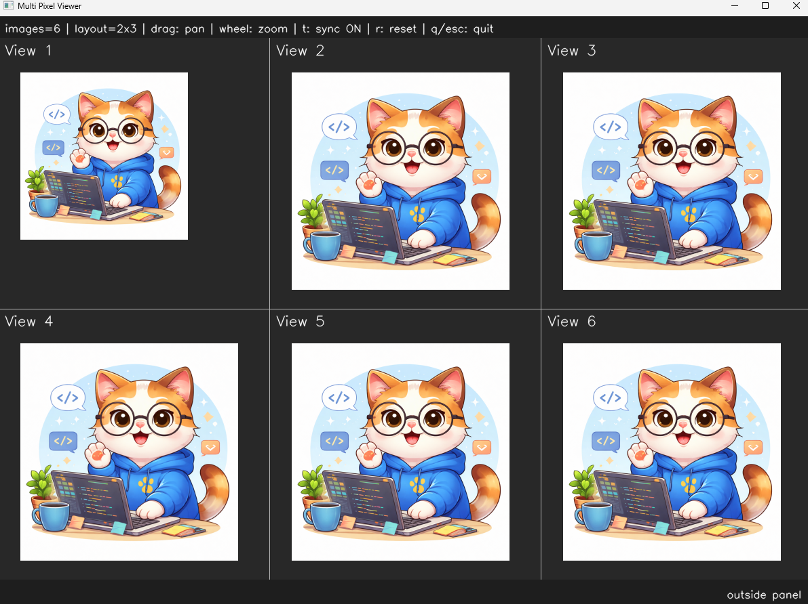
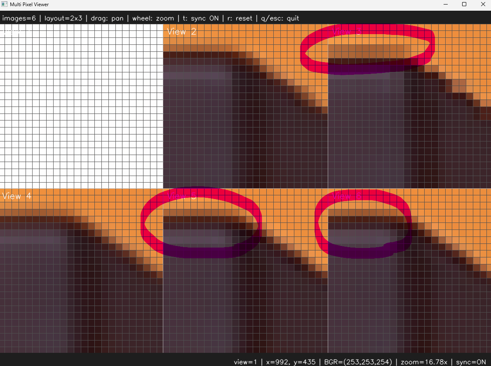

# <b>Resize and Interpolation</b>

---

### <b>Prerequisites</b>

    python

---

## <b>1. Resize and Interpolation</b>

Resize is simple algorithm. But this is very important part of process in computer vision programming. Because especially reducing complexity and fast processing speed can be derived from reducing resize.

And When we more checking the crack or something to do, zoom in the image is also related in resizing.

And this process is including interpolation methods. The method is how to adjust the new position from original pixels nearby the point. Neareast is very simple and fast but accuracy is bad. Bicubic is more better accuracy but more slower than linear and nearest.

```text
Nearest Neighbor
Linear
Bicubic

Area
Lanczos
```

## <b>2. Image Convert Code</b>

```python
def resizeImage(img, widthResize, heightResize, interpolation=cv.INTER_AREA):
    return cv.resize(img, (int(widthResize), int(heightResize)), interpolation=interpolation)
```

```python
if __name__ == "__main__":
    img = ImageUtils.readImage(ImageUtils.getDataPathWithFile("cat.png"))
    height, width = img.shape[:2]
    heightResize = height * 1.3
    widthResize = width * 1.3

    imgResizeArea = ImageUtils.resizeImage(img, int(widthResize), int(heightResize), interpolation=cv.INTER_AREA)
    imgResizeNearest = ImageUtils.resizeImage(img, int(widthResize), int(heightResize), interpolation=cv.INTER_NEAREST)
    imgResizeLinear = ImageUtils.resizeImage(img, int(widthResize), int(heightResize), interpolation=cv.INTER_LINEAR)
    imgResizeCubic = ImageUtils.resizeImage(img, int(widthResize), int(heightResize), interpolation=cv.INTER_CUBIC)
    imgResizeLanczos = ImageUtils.resizeImage(img, int(widthResize), int(heightResize), interpolation=cv.INTER_LANCZOS4)

    viewer = view.MultiImageViewer.from_images(img,imgResizeArea,imgResizeNearest,imgResizeLinear,imgResizeCubic,imgResizeLanczos, sync_view=False)
    viewer.run()
```




