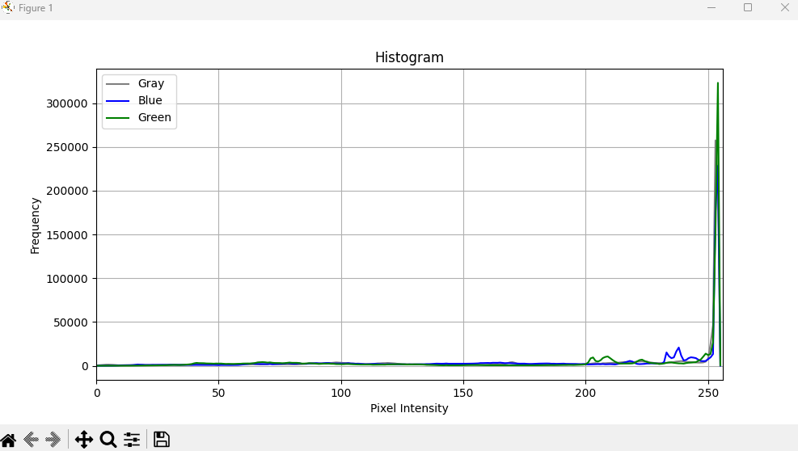

# <b>Histogram</b>

---

### <b>Prerequisites</b>

    python

---

## <b>1. Histogram</b>

Histogram is analysis tool about image pixels. There's no special functions but it'll make you good decision the more you know. For example, we can usually manually decide which value is good for threshold on a image.

## <b>2. Histogram Code</b>

```python
import cv2 as cv
import os
import matplotlib.pyplot as plt

def histogram(img):

    channels = img.shape[2] if len(img.shape) == 3 else 1

    colors = ['gray', 'blue', 'green', 'red']
    labels = ['Gray', 'Blue', 'Green', 'Red']

    plt.figure(figsize=(10, 5))

    if channels == 1:
        hist = cv.calcHist([img], [0], None, [256], [0, 256])
        plt.plot(hist, color='gray', label='Gray')

    else:
        for i in range(channels):
            hist = cv.calcHist([img], [i], None, [256], [0, 256])
            plt.plot(hist, color=colors[i], label=labels[i])

    plt.title('Histogram')
    plt.xlabel('Pixel Intensity')
    plt.ylabel('Frequency')
    plt.xlim([0, 256])
    plt.legend()
    plt.grid()
    plt.show()
```

```python
import ImageProcessing as ip
dddd
if __name__ == "__main__":
    img = ImageUtils.readImage(ImageUtils.getDataPathWithFile("cat.png"))
    ip.histogram(img)
```


