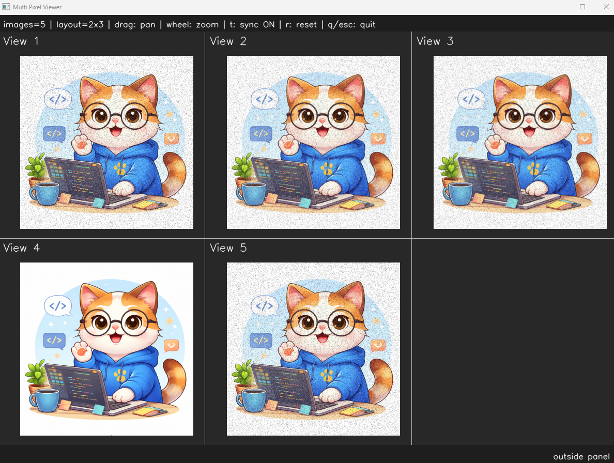
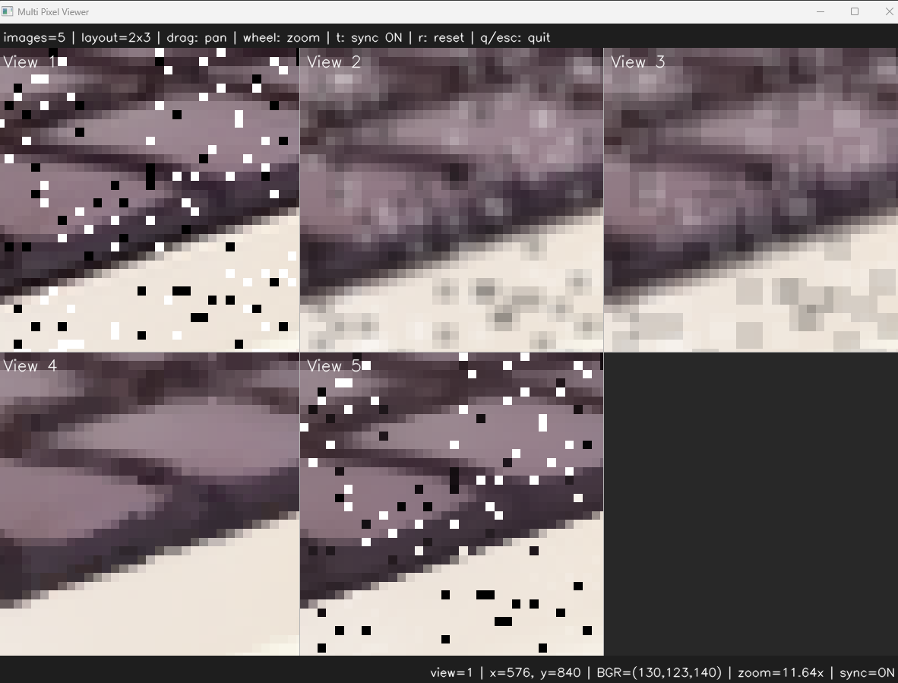

# <b>Filter</b>

---

### <b>Prerequisites</b>

    python

---

## <b>1. Filter</b>

Filter is an operation that transforms an input image according to a specific rules. Filters are commonly used to smooth noise, sharpen details, detect edge and so on.
Most filters operate by analyzing neighboring pixels around each pixel and computing a new value based on those surrounding pixels.

## <b>2. Filter Code</b>

```python
import cv2 as cv
import os
from enum import Enum

class BlurType(Enum):
    UNIFORM_BLUR = 0
    GAUSSIAN_BLUR = 1
    MEDIAN_BLUR = 2
    BILATERAL_FILTER = 3


def filter3x3(img, blur_type):
    if blur_type == BlurType.UNIFORM_BLUR:
        return cv.blur(img, (3, 3))
    elif blur_type == BlurType.GAUSSIAN_BLUR:
        return cv.GaussianBlur(img, (3, 3), 0)
    elif blur_type == BlurType.MEDIAN_BLUR:
        return cv.medianBlur(img, 3)
    elif blur_type == BlurType.BILATERAL_FILTER:
        return cv.bilateralFilter(img, 9, 75, 75)
```

```python
def saltPepperNoise(img, amount=0.05):
    noisy = img.copy()
    h, w = img.shape[:2]
    num_noise = int(h * w * amount)

    y = np.random.randint(0, h, num_noise)
    x = np.random.randint(0, w, num_noise)
    noisy[y, x] = 255

    y = np.random.randint(0, h, num_noise)
    x = np.random.randint(0, w, num_noise)
    noisy[y, x] = 0

    return noisy

if __name__ == "__main__":
    img = ImageUtils.readImage(ImageUtils.getDataPathWithFile("cat.png"))
    img = saltPepperNoise(img, 0.05)
    imgGaussian = ip.filter3x3(img, ip.BlurType.GAUSSIAN_BLUR)
    imgUniform = ip.filter3x3(img, ip.BlurType.UNIFORM_BLUR)
    imgMedian = ip.filter3x3(img, ip.BlurType.MEDIAN_BLUR)
    imgBilateral = ip.filter3x3(img, ip.BlurType.BILATERAL_FILTER)
        
    viewer = view.MultiImageViewer.from_images(img, imgGaussian, imgUniform, imgMedian, imgBilateral, sync_view=False)
    viewer.run()

```



