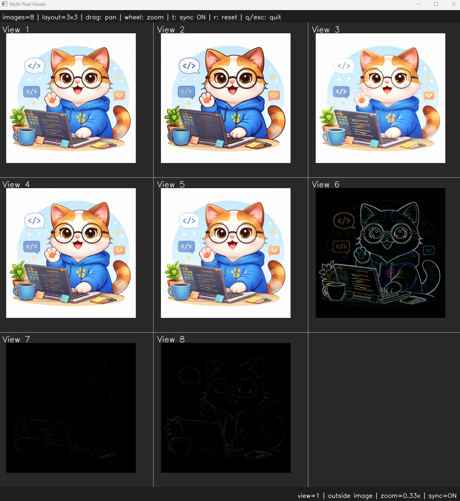

# <b>Morphology</b>

---

### <b>Prerequisites</b>

    python

---

## <b>1. Morphology</b>

Morphology is a group of image processing operations that focus on the shape and structure of objects within an image.
Common operations include erosion which shrink object and dilation which expands them. More advanced operations such as opening, closing, morpholgoical gradient, top-hat and black-hat are built from these basic operations. Morphology is widely used for noise removal, object separation, hole filling, edge extraction, and preprocessing in computer vision applications.

```
Opening = Erosion → Dilation
```

```
Closing = Dilation → Erosion
```

```
Gradient = Dilation - Erosion
```

```
TopHat = Original - Opening
```

```
BlackHat = Closing - Original
```

## <b>2. Morphology Code</b>

```python
def morphology3x3(img, morphology_type):

    kernel = cv.getStructuringElement(cv.MORPH_RECT, (3, 3))

    if morphology_type == MorphologyType.EROSION:
        return cv.erode(img, kernel, iterations=1)
    elif morphology_type == MorphologyType.DILATION:
        return cv.dilate(img, kernel, iterations=1)
    elif morphology_type == MorphologyType.OPENING:
        return cv.morphologyEx(img, cv.MORPH_OPEN, kernel)
    elif morphology_type == MorphologyType.CLOSING:
        return cv.morphologyEx(img, cv.MORPH_CLOSE, kernel)
    elif morphology_type == MorphologyType.MORPH_GRADIENT:
        return cv.morphologyEx(img, cv.MORPH_GRADIENT, kernel)
    elif morphology_type == MorphologyType.TOP_HAT:
        return cv.morphologyEx(img, cv.MORPH_TOPHAT, kernel)
    elif morphology_type == MorphologyType.BLACK_HAT:
        return cv.morphologyEx(img, cv.MORPH_BLACKHAT, kernel)
```

```python
if __name__ == "__main__":
    img = ImageUtils.readImage(ImageUtils.getDataPathWithFile("cat.png"))
    imgErode = ip.morphology3x3(img, ip.MorphologyType.EROSION)
    imgDilate = ip.morphology3x3(img, ip.MorphologyType.DILATION)
    imgOpen = ip.morphology3x3(img, ip.MorphologyType.OPENING)
    imgClose = ip.morphology3x3(img, ip.MorphologyType.CLOSING)
    imgGradient = ip.morphology3x3(img, ip.MorphologyType.MORPH_GRADIENT)
    imgTopHat = ip.morphology3x3(img, ip.MorphologyType.TOP_HAT)
    imgBlackHat = ip.morphology3x3(img, ip.MorphologyType.BLACK_HAT)

    viewer = view.MultiImageViewer.from_images(img, imgErode, imgDilate, imgOpen, imgClose, imgGradient, imgTopHat, imgBlackHat, sync_view=False)
    viewer.run()
```


