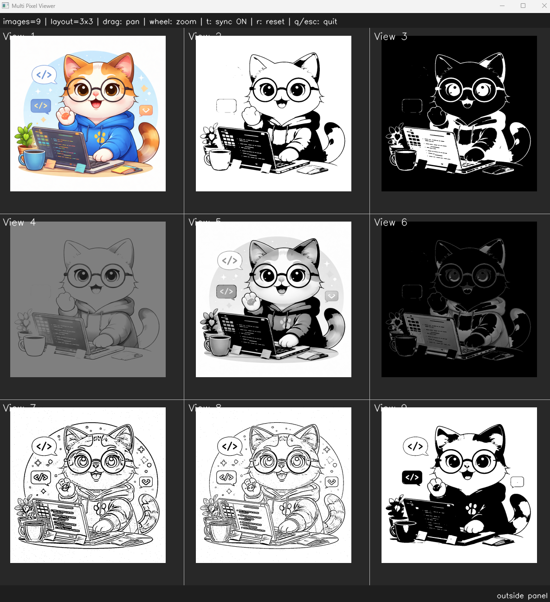

# <b>Threshold</b>

---

### <b>Prerequisites</b>

    python

---

## <b>1. Threshold</b>

Thresholding is one of the most fundamental techniques in image processing used to separate objects from the background. The basic idea is to compare each pixel value with a threshold value and decide whether the pixel should become black or white. 
Thresholding is commonly used for segmentation, object detection, contour extraction, and preprocessing in computer vision systems. More advanced methods such as adaptive thresholding and Otsu’s thresholding automatically determine local or optimal threshold values under varying lighting conditions.

## <b>2. Threshold Code</b>

```python
class ThresholdType(Enum):
    BINARY = 0
    BINARY_INV = 1
    TRUNC = 2
    TOZERO = 3
    TOZERO_INV = 4

    OTSU = 5
    ADAPTIVE_MEAN = 6
    ADAPTIVE_GAUSSIAN = 7


def thresholding(img, threshold_type, thresh=127, max_value=255, block_size=11, c=2):
    # Adaptive threshold requires grayscale
    if len(img.shape) == 3:
        gray = cv.cvtColor(img, cv.COLOR_BGR2GRAY)
    else:
        gray = img

    if threshold_type == ThresholdType.BINARY:
        _, result = cv.threshold(gray, thresh, max_value, cv.THRESH_BINARY)
    elif threshold_type == ThresholdType.BINARY_INV:
        _, result = cv.threshold(gray, thresh, max_value, cv.THRESH_BINARY_INV)
    elif threshold_type == ThresholdType.TRUNC:
        _, result = cv.threshold(gray, thresh, max_value, cv.THRESH_TRUNC)
    elif threshold_type == ThresholdType.TOZERO:
        _, result = cv.threshold(gray, thresh, max_value, cv.THRESH_TOZERO)
    elif threshold_type == ThresholdType.TOZERO_INV:
        _, result = cv.threshold(gray, thresh, max_value, cv.THRESH_TOZERO_INV)
    elif threshold_type == ThresholdType.OTSU:
        _, result = cv.threshold(gray, 0, max_value, cv.THRESH_BINARY | cv.THRESH_OTSU)
    elif threshold_type == ThresholdType.ADAPTIVE_MEAN:
        result = cv.adaptiveThreshold(gray, max_value, cv.ADAPTIVE_THRESH_MEAN_C, cv.THRESH_BINARY, block_size, c)
    elif threshold_type == ThresholdType.ADAPTIVE_GAUSSIAN:
        result = cv.adaptiveThreshold(gray, max_value, cv.ADAPTIVE_THRESH_GAUSSIAN_C, cv.THRESH_BINARY, block_size, c)

    return result
```

```python
if __name__ == "__main__":
    img = ImageUtils.readImage(ImageUtils.getDataPathWithFile("cat.png"))
    imgThresholdBinary = ip.thresholding(img, ip.ThresholdType.BINARY)
    imgThresholdBinaryInv = ip.thresholding(img, ip.ThresholdType.BINARY_INV)
    imgThresholdTrunc = ip.thresholding(img, ip.ThresholdType.TRUNC)
    imgThresholdToZero = ip.thresholding(img, ip.ThresholdType.TOZERO)
    imgThresholdToZeroInv = ip.thresholding(img, ip.ThresholdType.TOZERO_INV)
    imgThresholdAdaptiveMean = ip.thresholding(img, ip.ThresholdType.ADAPTIVE_MEAN, block_size=11, c=2)
    imgThresholdAdaptiveGaussian = ip.thresholding(img, ip.ThresholdType.ADAPTIVE_GAUSSIAN, block_size=11, c=2)
    imgThresholdOtsu = ip.thresholding(img, ip.ThresholdType.OTSU)

    viewer = view.MultiImageViewer.from_images(img, imgThresholdBinary, imgThresholdBinaryInv, imgThresholdTrunc, imgThresholdToZero, imgThresholdToZeroInv, imgThresholdAdaptiveMean, imgThresholdAdaptiveGaussian, imgThresholdOtsu, sync_view=False)
    viewer.run()
```


