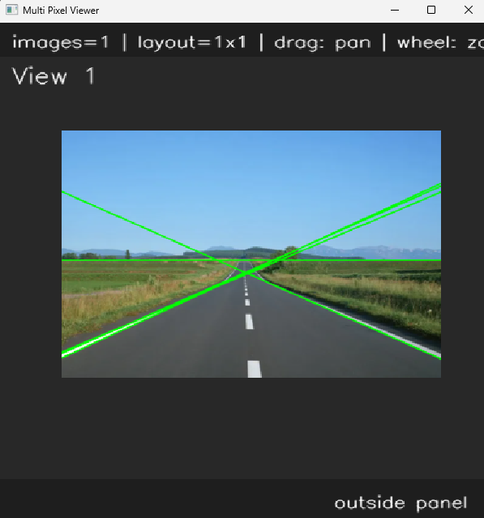
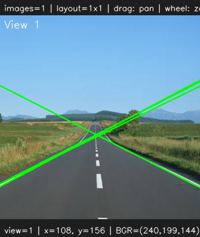

# <b>Hough Transform</b>

---

### <b>Prerequisites</b>

    python

---

## <b>1. Hough Transform</b>

The Hough Transform is a feature extraction technique used in computer vision to detect geometric shapes such as lines and circles. In OpenCV, it is most commonly used for line detection after edge extraction using algorithm like the Canny Edge Detector. Instead of directly searching for lines in the image space.

Each edge point votes for possible lines that could pass through it.

```
rho = x cost(theta) + y sin(theta)
```

rho represents the perpendicular distance from the origin to the line, while theta represents the angle of the line’s normal vector. Every edge point in the image contributes votes to different (rho, theta) combinations. When many edge points vote for the same parameters, the algorithm considers it a valid line.

## <b>2. Hough Code</b>

```python
def HoughLines(img, rho=1, theta=np.pi/180, threshold=100):
    gray = cv.cvtColor(img, cv.COLOR_BGR2GRAY) if len(img.shape) == 3 else img
    edges = cv.Canny(gray, 50, 150, apertureSize=3)
    lines = cv.HoughLines(edges, rho, theta, threshold)

    return lines
```

```python
if __name__ == "__main__":
    img = ImageUtils.readImage(ImageUtils.getDataPathWithFile("road.png"))
    imgGauss = ip.convolution3x3(img, ip.KernelType.GAUSSIAN_BLUR)
    lines = ip.HoughLines(imgGauss)

    if lines is not None:
        for line in lines:
            rho, theta = line[0]
            a = np.cos(theta)
            b = np.sin(theta)
            x0 = a * rho
            y0 = b * rho
            x1 = int(x0 + 1000 * (-b))
            y1 = int(y0 + 1000 * (a))
            x2 = int(x0 - 1000 * (-b))
            y2 = int(y0 - 1000 * (a))
            cv.line(img, (x1, y1), (x2, y2), (0, 255, 0), 2)

    viewer = view.MultiImageViewer.from_images(img, sync_view=False)
    viewer.run()
```



If you want to remove unexpected lines, for example we want to find road lanes

```python
slope = (y2 - y1) / (x2 - x1)

if abs(slope) < 0.3:
    continue

cv.line(img, (x1, y1), (x2, y2), (0, 255, 0), 2)
```


