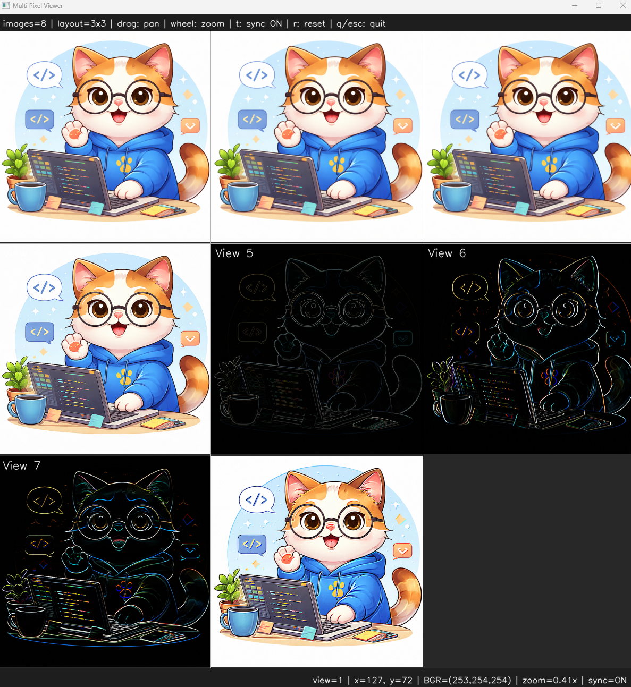

# <b>Harris Corner</b>

---

### <b>Prerequisites</b>

    python

---

## <b>1. Harris Corner</b>

Harris Corner is edge detecting algorithm. It use the derivative information, dx, dy. The relationship of dx, dy can check direction of the point.  

The direction come from gradient process like sobel and make a matrix about dx, dy. 

```
M =
[ Ix²    IxIy ]
[ IxIy   Iy²  ]

R = det(M) - k(trace(M))²
```

If the R value is closed to 0, it means flat. If R value is large, it means corner or edge.
But there's no standard how much large R is. So, the value is relative in image

## <b>2. Harris Corner Code</b>

```python
if __name__ == "__main__":
    img = ImageUtils.readImage(ImageUtils.getDataPathWithFile("cat.png"))

    gray = cv.cvtColor(img, cv.COLOR_BGR2GRAY)
    imgF32 = np.float32(gray)
    harrisInfo = cv.cornerHarris(imgF32, 2, 3, 0.04)
    harris = cv.dilate(harrisInfo, None)

    img[harris > 0.01 * harris.max()] = [0, 0, 255]
    harrisMap = harris / harris.max() * 255

    viewer = view.MultiImageViewer.from_images(img, harrisMap, sync_view=False)
    viewer.run()
```

The right image is rescaling pixel value on harris corner result map.

