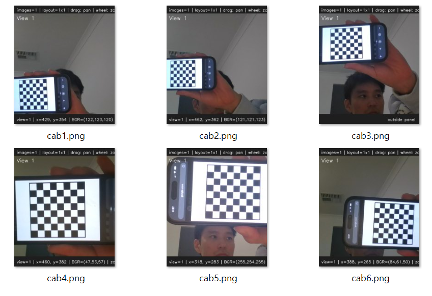
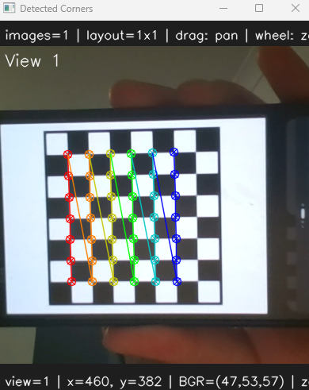
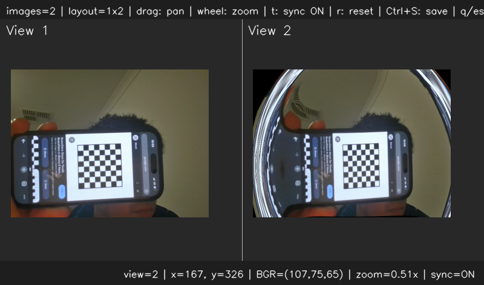
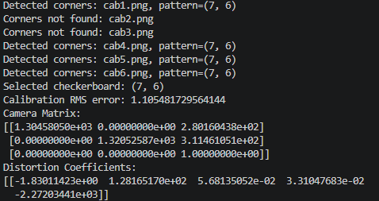

# <b>Camera Calibration</b>

---

### <b>Prerequisites</b>

    python

---

## <b>1. Camera Calibration</b>

Camera calibration is the process of estimating a camera’s internal parameters and lens distortion characteristics so that the relationship between a 3D real-world point and its 2D image projection can be accurately modeled. In computer vision, calibration is important because real cameras are not ideal pinhole cameras. 

The most common calibration method uses a chessboard pattern because its corner points are easy to detect precisely. 

One of the most important outputs is the camera matrix, also called the intrinsic matrix. It is usually represented as:

```
[ fx   0   cx ]
[ 0   fy   cy ]
[ 0    0    1 ]
```

Here, fx and fy are the focal lengths measured in pixel units along the x and y directions. cx and cy are the principal point coordinates, which represent the optical center of the camera image. The camera matrix describes how 3D rays project onto the 2D image plane.

Another important output is the distortion coefficients. Real camera lenses introduce radial and tangential distortion. Radial distortion causes straight lines to appear curved, especially near the image edges, while tangential distortion occurs when the lens is not perfectly aligned with the image sensor.

```
k1, k2, p1, p2, k3
```

where k1, k2, and k3 are radial distortion parameters, and p1 and p2 are tangential distortion parameters.


## <b>2. Camera Calibration Code</b>

```python
import cv2 as cv
import os
import ImageUtils
import VideoUtils
import numpy as np
import MultiImageViewer as view
import Viewers
import ImageProcessing as ip
import glob

def calibrate_camera_from_images(img_path):
    checkerboard_candidates = [(9, 6),(8, 6),(7, 6),(6, 5),(5, 4),(8, 5),(7, 5),(10, 7)]

    criteria = (cv.TERM_CRITERIA_EPS + cv.TERM_CRITERIA_MAX_ITER,30,0.001)

    objpoints = []
    imgpoints = []
    img_size = None
    selected_checkerboard = None

    for i in range(1, 7):
        img = cv.imread(ImageUtils.getDataPathWithFile(f"{img_path}\\cab{i}.png"))

        if img is None:
            continue

        gray = cv.cvtColor(img, cv.COLOR_BGR2GRAY)
        img_size = gray.shape[::-1]

        found_any = False

        for checkerboard in checkerboard_candidates:
            found, corners = cv.findChessboardCorners(gray,checkerboard,cv.CALIB_CB_ADAPTIVE_THRESH + cv.CALIB_CB_NORMALIZE_IMAGE)

            if not found:
                continue

            print(f"Detected corners: cab{i}.png, pattern={checkerboard}")

            objp = np.zeros((checkerboard[0] * checkerboard[1], 3), np.float32)
            objp[:, :2] = np.mgrid[0:checkerboard[0],0:checkerboard[1]].T.reshape(-1, 2)
            corners_refined = cv.cornerSubPix(gray,corners,(11, 11),(-1, -1),criteria)

            objpoints.append(objp)
            imgpoints.append(corners_refined)

            debug = img.copy()
            cv.drawChessboardCorners(debug,checkerboard,corners_refined,found)
            cv.imshow("Detected Corners", debug)
            cv.waitKey(300)

            selected_checkerboard = checkerboard
            found_any = True
            break

        if not found_any:
            print(f"Corners not found: cab{i}.png")

    cv.destroyAllWindows()

    if len(objpoints) == 0:
        raise RuntimeError("No chessboard corners detected. Check inner-corner count, blur, lighting, or whether the full board is visible.")

    ret, camera_matrix, dist_coeffs, rvecs, tvecs = cv.calibrateCamera(objpoints,imgpoints,img_size,None,None)

    print("Selected checkerboard:", selected_checkerboard)
    print("Calibration RMS error:", ret)
    print("Camera Matrix:")
    print(camera_matrix)
    print("Distortion Coefficients:")
    print(dist_coeffs)

    return camera_matrix, dist_coeffs

def undistort_image(img, camera_matrix, dist_coeffs, new_camera_matrix=None):
    if img is None:
        return

    h, w = img.shape[:2]
    
    if new_camera_matrix is None:
        new_camera_matrix, roi = cv.getOptimalNewCameraMatrix(camera_matrix,dist_coeffs,(w, h),alpha=1,newImgSize=(w, h))

    undistorted = cv.undistort(img,camera_matrix,dist_coeffs,None,new_camera_matrix)
    return undistorted
```

```python
if __name__ == "__main__":
    camera_matrix, dist_coeffs = calibrate_camera_from_images("calib")
    cap = cv.VideoCapture(0)

    if not cap.isOpened():
        exit()

    ret, frame = cap.read()
    viewer = view.MultiImageViewer([frame, frame])

    while True:
        ret, frame = cap.read()

        if not ret:
            break

        undistorted = undistort_image(frame, camera_matrix, dist_coeffs)

        viewer.update_images(frame, undistorted)
        viewer.draw()
        
        key = cv.waitKey(1) & 0xFF

        if key == ord("q") or key == 27:
            break

    cap.release()
    cv.destroyAllWindows()
```





